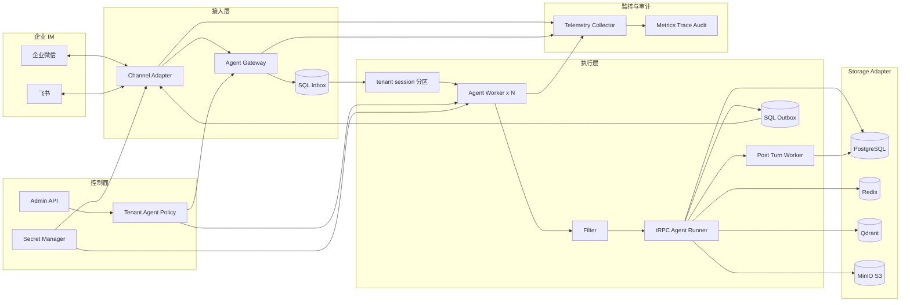
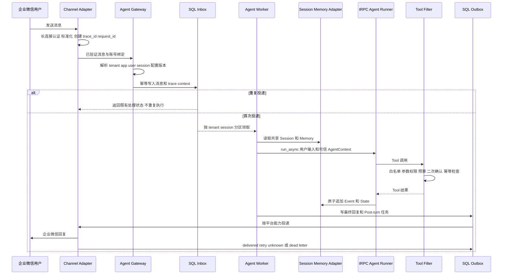

# 多租户节点化 Agent 平台架构设计与验收报告

## 1 验收结论与实现范围

本仓库已经把 tRPC-Agent-Python 的单 Agent 运行能力扩展为多租户、可水平扩展、可接入企业 IM 的平台服务。tRPC-Agent-Python 继续负责 `LlmAgent`、`Runner`、Tool 与 MCP、Session、Memory、Summary、Knowledge、Artifact 接口以及 Filter 和 Trace 扩展点；平台层已经实现租户控制面、可信路由、企业微信与飞书 Channel Adapter、共享状态、Inbox/Outbox、跨节点写保护、后端选择与迁移、预算、审计、配置灰度和故障恢复。

本次验收只按已落库代码和已保存测试证据陈述结果。企业微信与飞书两类真实 IM 已接入并完成端到端验证。生产数据后端使用 PostgreSQL、Redis、Qdrant 和 MinIO；InMemory 仅用于本地测试。仓库实现位于 [GitHub 项目](https://github.com/k0mondor/trpc-agent-service)，本报告对应代码基线为 `fa6b13d`。

## 2 多租户模型与节点部署实现

租户配置由 [`TenantConfig`](../trpc_service/tenant/models.py) 表达，并以不可变版本发布。每个版本包含 `tenant_id`、租户状态、Agent 应用及指令、模型 provider/model 与 `SecretRef`、工具白名单和二次确认策略、企业微信或飞书 ChannelBinding、Session/Memory/Summary/Knowledge/Artifact/Audit 后端绑定、并发与队列配额、预算和审计策略。一次执行固定 `config_version` 与 `storage_revision`，灰度或回滚不会在运行中替换配置。

### 2.1 系统架构图

Agent Gateway 不接受外部请求直接指定 `tenant_id`。Channel Adapter 完成连接认证后，Gateway 用服务端保存的 `channel + webhook_public_id/external_account_id` 查询 ChannelBinding，解析出 `tenant_id`、`agent_app_id`、配置版本和凭据引用，再由 [`MessageRouter`](../trpc_service/tenant/routing.py) 生成可信 Route。Inbox 的 `partition_key` 为 `tenant_id:session_id`；同一 Session 串行领取，不同 Session 可并发分配给任意 Worker。

Worker 不需要 sticky session。Session、Memory、Summary、执行状态、工具结果和回复状态均位于共享后端，Worker 只持有本次执行的临时对象。节点崩溃后，其他 Worker 以相同 `execution_id` 重新领取任务并从共享状态恢复；旧节点的 lease generation 或 fencing token 已失效，不能继续提交。

### 2.2 租户隔离

- 配置隔离：配置按 `tenant_id + config_version + storage_revision` 精确解析，不存在“找不到版本就回退最新版”的路径。
- 数据隔离：SQL 主键或唯一键包含租户；Session 与 Memory 的 app namespace 包含租户；Qdrant 的物理 ID、payload filter、knowledge base 和 index version 都带租户范围；MinIO key 以 `tenants/{tenant_id}/` 开头。
- 工具隔离：平台按租户和 Agent 应用装配 Tool，默认拒绝；参数不能自行携带权限，危险工具必须经过持久化二次确认。
- 身份隔离：外部用户和群标识经租户密钥 HMAC 生成内部 ID，同一外部用户跨群、跨话题、跨绑定或跨租户不会共享 Session。
- 日志和成本隔离：指标按低基数 tenant 标签聚合，用户和 Session 明细只进入受控 SQL；模型预留、结算和审计均带 `tenant_id`。
- 密钥隔离：配置只保存 `env://`、`vault://`、`kms://` 等 `SecretRef`，明文凭据在模型校验阶段即被拒绝。

## 3 核心数据模型设计

实际 SQLAlchemy 表位于 [`persistence/models.py`](../trpc_service/persistence/models.py)。下面是用于验收的最小关系模型；生产表还包含租约、投递尝试、工具账本、迁移检查点和预算账户。

| 表 | 主键或唯一键 | 核心字段与关系 |
|---|---|---|
| `tenants` | `tenant_id` | status、active_config_version；所有租户数据的根 |
| `tenant_config_versions` | tenant_id、config_version | status、config_json、content_hash、created_by、published_at；storage_revision 保存在不可变配置中 |
| `agent_apps` | tenant_id、app_id、config_version | enabled、config_json；Agent、模型、指令和 Tool policy 保存在版本化配置中 |
| `channel_bindings` | tenant_id、binding_id | channel、external_account_id、webhook_public_id、agent_app_id、credential_ref、enabled |
| `sessions` | tenant_id、app_id、user_id、session_id | state_json、revision、next_event_seq、last_fencing_token |
| `session_events` | tenant_id、session_id、event_id | seq_no、execution_id、author、event_type、content_json、state_delta_json；按 Session 有序追加 |
| `memories` | tenant_id、user_id、memory_id | source_event_id、memory_type、content_json、metadata_json、embedding_ref、status |
| `session_summaries` | tenant_id、session_id、version | summary_id、covered_event_seq、summary_text、model_version、replaces_version |
| `inbound_messages` | tenant_id、binding_id、external_message_id 唯一 | payload_hash、request_id、trace_id、execution_id、partition_key、status |
| `outbox_messages` | tenant_id、inbound_message_id、part_no 唯一 | payload_json、status、attempt、delivery_id；稳定发送键由该复合键导出 |
| `artifact_metadata` | tenant_id、artifact_id、version | object_uri、content_hash、size、status |
| `knowledge_bases/documents/index_versions` | tenant_id 与各资源 ID | source artifact、embedding model、dimensions、index_version、status |
| `audit_logs` | audit_id | tenant_id、channel、user_id、session_id、agent/tool、decision、latency、error、cost、trace/request ID |

关系为 `tenant -> config version -> agent app -> channel binding`，入站消息经 binding 定位 app，再经 Route 定位 Session。Session 对应多条 Event、一条当前 Summary 和多条 Memory；Artifact 和 Knowledge 通过租户范围引用；Audit Log 以 `trace_id/request_id/execution_id` 关联整条运行链路。

## 4 统一数据访问与多后端适配

平台使用 `ResourceType`、`BackendProfile`、`TenantBackendBinding` 和 Storage Resolver 统一解析后端。发布配置必须为 Session、Memory、Summary、Knowledge、Artifact、Audit 六类资源指定 profile revision 和 tenant namespace；Worker 只通过解析后的服务接口访问数据。多 Worker 生产模式会拒绝 InMemory，Summary 必须与 Session 使用同一 profile，从配置阶段避免读写分叉。

| 后端 | 已实现用途 | 一致性与取舍 |
|---|---|---|
| InMemory | 单元测试、单进程演示 | 延迟最低，无跨节点可见性和持久化，不进入多节点生产配置 |
| PostgreSQL | 租户配置、Agent/Binding、Inbox/Outbox、预算、审计、可靠 Session/Memory/Summary、迁移状态 | 事务和查询能力强；写延迟与运维成本高于缓存，但适合作为平台事实源 |
| Redis | 热 Session、共享状态、Session lease 与低延迟 CAS | Lua 原子操作、跨 Worker 立即可见；需 AOF、noeviction、主从切换策略，复杂查询能力弱 |
| Qdrant | Knowledge chunk 和语义检索数据 | 检索高效，按 tenant/kb/index version 过滤；索引更新按版本最终切换，不承担事务事实 |
| MinIO 或 S3 | 图片、文件、Artifact、Knowledge 原文、审计归档 | 大对象成本低；采用“对象上传并校验后再发布 SQL 元数据”，避免半成品可见 |
| External Memory | 可选托管长期记忆 | 受供应商一致性和延迟约束，写失败进入 Post-turn 重试，不阻塞 Session 事实提交 |

Session 与 Event 由 tRPC Session 接口及平台保护适配器保存；Memory 通过 Memory 接口写入，并以 `source_event_id` 去重；Summary 记录 `covered_event_seq`；Artifact 的二进制进入对象存储、元数据进入 SQL；Knowledge 原文引用 Artifact，向量进入 Qdrant；Audit Log 先进入 SQL，达到保留期后加密归档到对象存储。

## 5 数据同步和幂等策略

### 5.1 同一 Session 并发写入

[`ProtectedSessionService`](../trpc_service/storage/protected_session.py) 对 SQL 和 Redis 提供相同写保护。SQL 使用短事务、Session lease、单调递增 fencing token 和 revision CAS；Redis 使用同一 hash tag 下的 Lua 脚本比较 owner、generation 和 revision 后原子提交。模型和工具执行期间不占用数据库事务。旧 Worker、过期 lease、旧快照或重复但正文不同的 Event 都会被拒绝。

### 5.2 Event State Summary Memory 顺序

一次 Runner 执行先读取共享 Session/Memory，再运行模型与工具；原始 Event 和 State 原子提交后，平台在完成协议中写 Inbox 结果、Outbox 与 Post-turn 任务。Summary 和 Memory 由持久 Post-turn Worker 异步处理：Summary 仅推进 `covered_event_seq`，Memory 以 `source_event_id` 幂等写入。派生任务失败不会伪造主执行失败，也不会丢失原始 Event；重试后可追平水位。提交成功后，新 Worker 从共享后端立即读取到 SQL/Redis 的新状态，向量索引等派生数据采用版本化最终一致。

### 5.3 IM 和工具幂等

IM 去重键为 `(tenant_id, channel_binding_id, external_message_id)`。同一消息 ID 和相同 payload 返回既有回执，不重复运行；同一 ID 对应不同 payload 直接拒绝。工具使用 `execution_id + tool_call_id` 及稳定 `idempotency_key` 保存 invocation/result；存在外部副作用且结果未知时先查询供应商或转人工，不盲目重放。回复以 `(tenant_id, inbound_message_id, part_no)` 记账，成功分片不重发，明确的可重试结果才按退避策略重试。

### 5.4 后端迁移

Redis 到 SQL 的迁移由 [`migration`](../trpc_service/migration) 模块执行：启用租户维护屏障，排空在途任务，按分区复制快照，记录 checkpoint，增量追平，校验 Event、State、revision 和摘要，发布新的 `storage_revision`，再由独立读取器验证；旧后端保留到 rollback deadline。Local 向量库到 Qdrant 使用 `tenant + knowledge_base + index_version` 复制、tombstone 和查询等价校验。embedding 模型或维度改变时，从对象存储原文重新切片和向量化，不复制不兼容向量。切换失败时旧版本继续服务，回滚只需重新发布上一不可变配置版本。

## 6 企业微信与飞书接入实现

两个 Channel Adapter 都把平台事件转换为 [`NormalizedInboundMessage`](../trpc_service/channels/models.py)，再将 Agent Event 投影为 `OutboundMessage`。思考过程和内部错误不会发送到 IM；当前对外输出以最终安全文本为主，企业微信使用官方智能机器人流式完成语义，飞书使用异步文本发送并支持话题回复。图片和文件先鉴权下载、检查大小、计算 SHA-256、写入租户 Artifact，再把内部 URI 交给 Agent。

实际部署使用官方长连接，因此没有暴露公网 HTTP webhook。`webhook_public_id` 是平台内部路由标识；平台侧不接收由调用方填写的 `tenant_id`。企业微信使用 Bot ID/Secret 完成长连接认证，飞书使用 App ID/Secret 和 tenant token，并校验事件企业身份。凭据只以 SecretRef 配置。若以后增加 HTTP 回调，必须在标准化和路由前完成 token/secret 验签；当前长连接入口由官方 SDK 握手、连接身份和账号租约承担等价的可信边界。

| 差异项 | 企业微信智能机器人 | 飞书企业自建应用机器人 |
|---|---|---|
| 连接与认证 | 官方长连接 SDK，Bot ID/Secret | 官方 SDK WebSocket，App ID/Secret、企业身份核对 |
| 接收范围 | 单聊、群聊及 SDK 提供的媒体下载 | 单聊、群 @、群媒体、普通回复链和原生 thread |
| 回复方式 | stream/final 完成语义 | 异步最终文本；话题使用 reply API |
| 长文本与限频 | 超出当前单 stream 能力时明确失败并记录 | 按 3000 UTF-8 字节分片；429 尊重 Retry-After |
| 图片与文件 | 官方 SDK 加密下载后写 Artifact | 固定消息资源 API，20 MiB 上限后写 Artifact |
| 撤回 | 当前官方 SDK 未提供等价事件 | 已处理 `im.message.recalled_v1`；未完成任务取消，已完成输入写审计标记 |
| 失败重试 | 按 SDK 回执分类 | 5xx、网络未知或缺少 message_id 标记 unknown，不盲目重发 |

单聊 Session 对 `tenant + binding + app + external_user` 做 HMAC；群聊再加入 `external_chat_id`，话题或回复链再加入 `thread_id/root_id`。群 `per_user` 模式同时隔离群和成员，`shared` 模式只共享会话存储，审批与审计仍保留真实操作者。跨群、跨通道、跨租户必然生成不同 Session。

### 6.1 企业微信完整消息时序图

`trace_id` 在 Channel callback 创建并随 Inbox 持久化；Worker 领取后恢复 trace context，贯穿 Runner、模型、Tool、Session/Memory、Outbox 和 IM 回复。`request_id` 标识本次入站，`execution_id` 在重试和节点接管时保持不变。

## 7 治理监控与安全实现

[`governance`](../trpc_service/governance) 模块通过 Filter 和持久策略执行租户治理。Ingress Filter 校验租户、Binding、IM 成员权限、重复消息和并发配额；Agent Filter 固定应用和工具集合；Model Filter 执行模型白名单、预算预留与结算、超时和敏感信息处理；Tool Filter 默认拒绝，验证参数租户归属，并把危险工具转为 PendingAction。IM 或 Admin API 确认时再次核对用户、Session、策略版本、授权 epoch 和 revision，避免旧确认越权执行。

监控指标已经覆盖请求量、重复率、队列深度、活跃 Session、Runner/模型/工具耗时、Session/Memory 后端延迟和冲突、IM 投递成功率与重试、错误率、token、每租户成本、Post-turn/Outbox 积压。Prometheus 不使用 user/session/request 等高基数字段作为标签；明细写入授权 SQL。

平台通过 OpenTelemetry 或等价 Trace 串联 `im.callback -> worker.execute -> sdk.run_runner -> sdk.run_agent -> sdk.call_llm -> tool.invoke/sdk.execute_tool -> session.get/append/update -> memory.search/store -> summary.generate -> im.reply`。Collector 接收各进程 span，并在 Exporter 再做一次内容清洗。审计字段至少包括 `tenant_id`、`channel`、`user_id`、`session_id`、`agent_name`、`tool_name`、`decision`、`latency_ms`、`error_type`、`cost`、`trace_id`，同时保存 `request_id`、config/policy version、currency 和 redacted 标志。

IM token、模型 API key、数据库密码和对象存储凭据不会进入配置正文、日志、Trace 或错误报告。SDK 日志只导出连接生命周期与固定错误类型；Authorization、URL 签名参数、原始 payload、prompt/response 正文和 DSN 在源头被禁止，在日志与 Trace Exporter 再次脱敏。密钥轮换通过新 SecretRef/profile revision 发布，不原地覆盖已运行版本。

## 8 故障恢复发布容量与部署

### 8.1 降级和恢复

- Worker 或节点故障：lease 到期后由其他 Worker 接管，旧 fencing token 禁止写入；执行从 Inbox、Session 和工具账本恢复。
- IM 重试或断线：入站唯一键抑制重复执行；账号 lease generation 防止两个 Channel 实例同时消费；断线后有界退避重连。
- PostgreSQL 暂时不可用：未持久化的消息不 ACK，不启动模型或副作用；健康检查恢复后重新接收和领取。
- Redis Session 不可用：在模型和 Tool 之前失败，避免没有上下文的执行；可按租户维护流程切换到已验证 SQL 版本。
- 模型超时：按明确失败、限频和未知结果分类；预算预留保留到对账，不把超时记录为成功。
- Tool 失败：只读且明确可重试的调用使用有界重试；副作用未知时保存状态、查询外部 operation id 或转人工。
- IM 回复失败：Outbox 按分片保存结果；429/明确可重试错误退避，unknown 不盲重发，耗尽后进入 dead letter。

### 8.2 灰度和回滚

Admin API 先保存 draft，再进行后端能力、密钥引用、通道和生产安全校验，最后以 expected-version CAS 发布不可变版本。`TenantRolloutRow` 保存按租户的 canary 版本和比例；一次入站固定命中一个版本。回滚发布上一版本，不修改历史配置；后端迁移期间同时检查 storage revision 和 rollback deadline。

### 8.3 容量评估

容量按 `峰值消息率 × 平均 Agent 耗时 = 平均在途 Session` 估算，并同时核算模型 RPM/TPM、每消息平均 token、Tool 轮数、SQL statements、Redis commands、IM 回调峰值、平台发送限频和 Outbox 积压。基准测试使用真实 Runner、PostgreSQL/Redis 与 Inbox/Outbox，模型和 IM 为可控模拟：48 条消息、10 条重复回调均无失败；并发 4 时 Redis 约 17.74 msg/s、SQL 约 12.46 msg/s。该结果用于发现事件循环和数据库瓶颈，不等同于生产模型吞吐；生产容量应以真实模型 P95/P99 延迟重新代入，并保留 30% 至 40% 余量。

### 8.4 最小与生产部署

最小可运行方案使用 [`docker-compose.yml`](../docker-compose.yml)：Gateway/Channel、两个 Agent Worker、Post-turn Worker、PostgreSQL、Redis、Qdrant、MinIO 和 Telemetry Collector，适合功能验收和故障演练。生产推荐 Kubernetes：控制面、Channel Adapter、Worker、Post-turn/Outbox 消费者分别部署；Worker 按队列深度和在途任务扩缩容；数据库、Redis 和对象存储使用高可用托管或集群部署；通过 PodDisruptionBudget、滚动发布、readiness、备份恢复演练和 Alertmanager 控制发布风险。

## 9 端到端与回归测试结果

| 测试范围 | 结果 | 验证内容 |
|---|---|---|
| 企业微信与飞书真实私聊 | 通过 | 两类账号认证、真实入站、Runner、原生 SQL Session、去重、模型成本结算、回复 delivered 和用户收取确认 |
| 双租户双 Worker 完整链路 | 通过 | 两个租户各完成两轮消息；企业微信使用 SQL Session、飞书使用 Redis Session；Worker 在两轮间替换；Tool 写/读 Artifact、Knowledge 搜索、Memory、Summary、成本和完整 Trace 均成功 |
| 飞书真实群聊 | 通过 | 双 Worker 领取、Redis Session、回复 delivered、Memory 与 Summary 成功 |
| 飞书跨群和回复线程隔离 | 通过 | 同一用户跨两个群得到不同 Session；同群根消息与回复链得到不同 Session；执行和投递均成功 |
| 飞书图片文件和撤回 | 通过 | 图片和 PDF 入站后发布 MinIO Artifact；已完成消息撤回写 `message_recalled`，不伪造副作用回滚 |
| 真实多后端与迁移 | 45 个唯一用例当前通过 | PostgreSQL、Redis、Qdrant、MinIO 的并发写、fencing、故障恢复、归档、Redis 到 SQL、向量迁移和 Memory 重建 |
| 管理与安全回归 | 16 项通过 | 不可变发布、租户范围、审计导出、凭据拒绝、日志脱敏和 Trace 父子关系 |
| 知识与 MCP 检查 | 6 项通过 | 文档切片、embedding 失败保护、租户范围、受保护发布和真实 MCP 调用恢复 |

真实双租户完整链路证据保存在 `reports/protected-dual-im-b5ce50b01793486b8d0361ff48a6f4f4.json`；真实多后端结果由 `full-real-storage-2026-09-09.xml` 的 42 个通过项与修复后的 `real-migration-recheck-2026-09-09.xml` 3 个通过项组成。测试未把真实平台 429、长文本真实分段、长时间断网、ACK 丢失或生产峰值容量写成已通过，这些仍是上线前专项演练项。

## 10 生产风险清单

| 风险 | 缓解措施 |
|---|---|
| IM 重复或乱序 | Inbox 复合唯一键、payload hash、Session 分区、Event 序列和幂等回执 |
| 同 Session 并发覆盖 | lease generation、fencing token、revision CAS 和短事务 |
| Worker 崩溃后旧进程回写 | 新 owner 递增 fencing token，所有写路径验证 execution scope |
| 数据库短暂不可用 | 未落库不 ACK、不执行副作用，readiness 降级、退避和熔断 |
| Redis 故障或主从回滚 | AOF/noeviction、拓扑监控、revision 校验和受控 SQL 切换 |
| 模型超时限频或费用未知 | 请求 deadline、预算预留、provider request ID、对账后结算 |
| Tool 重复副作用 | 持久 idempotency key、结果账本、外部 operation 查询、危险动作二次确认 |
| 跨租户数据泄漏 | 可信 Route、复合键和 namespace、向量过滤、对象前缀、默认拒绝工具 |
| 密钥或正文进入日志 | SecretRef、最小权限、SDK 静默日志、源头与 Exporter 双层脱敏 |
| IM 长度和发送频率限制 | 能力矩阵、UTF-8 分片、Retry-After、Outbox 背压和 dead letter |
| Memory 或 Summary 落后 | source event/covered seq、水位监控、持久 Post-turn 重试和重建 |
| 迁移覆盖或配置漂移 | 维护屏障、checkpoint、内容校验、不可变版本、灰度和回滚窗口 |
| 撤回晚于副作用完成 | 取消未完成任务；已完成输入只标记审计，不伪造业务回滚 |
| 备份不可恢复或容量不足 | 版本化备份、恢复演练、容量基准、租户配额和告警 |

## 11 tRPC 复用边界与 GitHub 代码交付

直接复用 tRPC-Agent-Python 的部分包括 `LlmAgent`、`Runner` 和 Agent Event，Tool/MCP 调用模型，Session/Memory/Summary/Knowledge/Artifact 公共接口，Filter 扩展点及 Runner/LLM/Tool Trace 能力。依赖已固定到公开提交 `f05797d9f9dff2461922b5985aeccc1b636b7c8d`，平台通过公开接口扩展，不修改 SDK 私有状态。

新增平台层代码包括：

- 多租户配置和路由：[`tenant`](../trpc_service/tenant)、[`management.py`](../trpc_service/management.py)
- 企业微信和飞书适配：[`channels/wecom.py`](../trpc_service/channels/wecom.py)、[`channels/feishu.py`](../trpc_service/channels/feishu.py)
- Inbox/Outbox、执行恢复和 Worker：[`reliability`](../trpc_service/reliability)、[`worker.py`](../trpc_service/worker.py)
- 多后端与跨节点写保护：[`storage`](../trpc_service/storage)、[`migration`](../trpc_service/migration)
- 工具、预算、审批、审计和脱敏：[`governance`](../trpc_service/governance)
- Trace、指标和日志：[`telemetry`](../trpc_service/telemetry)、[`metrics`](../trpc_service/metrics)
- 发布、就绪、备份和演练：[`operations`](../trpc_service/operations)、[`deploy`](../deploy)
- 完整测试代码：[`tests`](../tests)

以上代码、Compose 配置、测试和报告共同构成“基于本设计的 GitHub 实现”，不是仅有架构示例。

## 12 验收标准逐项说明

| 验收标准 | 实际实现和证据 | 结论 |
|---|---|---|
| 1 覆盖多租户、节点、同步、多后端、IM、治理监控和恢复 | 第 2、4、5、6、7、8 节均对应已实现模块 | 满足 |
| 2 数据模型表达 tenant、agent、binding、session、event、memory、summary、audit | 第 3 节列出实际 SQL 表、主键和关系，源码为 `persistence/models.py` | 满足 |
| 3 至少两种 IM 且包含微信或企业微信 | 已实现并真实验证企业微信和飞书，差异见第 6 节 | 满足 |
| 4 至少三类后端及同步策略 | 已实现 PostgreSQL、Redis、Qdrant、MinIO，并说明 InMemory 和外部 Memory 边界 | 满足 |
| 5 完整链路包含 trace_id/request_id | 第 6 节时序图和第 7 节 Trace 操作链；真实双租户报告无缺失 span | 满足 |
| 6 至少 8 个生产风险 | 第 10 节列出 14 项风险及对应缓解措施 | 满足 |
| 7 说明 tRPC-Agent-Python 复用与平台新增 | 第 11 节给出 SDK 基线和平台模块映射 | 满足 |

交付物已经全部包含在本报告中：架构设计文档见全文，系统架构图见 2.1，核心时序图见 6.1，数据模型见第 3 节，数据同步和幂等策略见第 5 节，多后端适配见第 4 节，风险清单见第 10 节，GitHub 实现代码见第 11 节。
