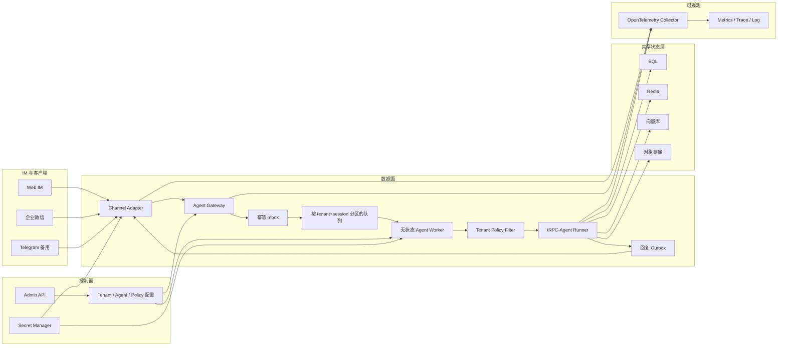
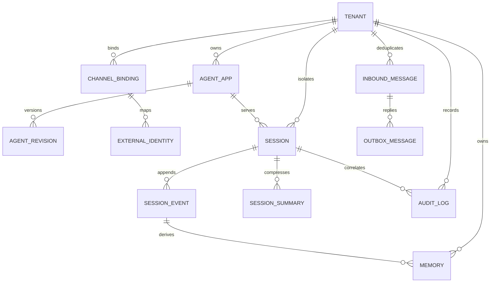
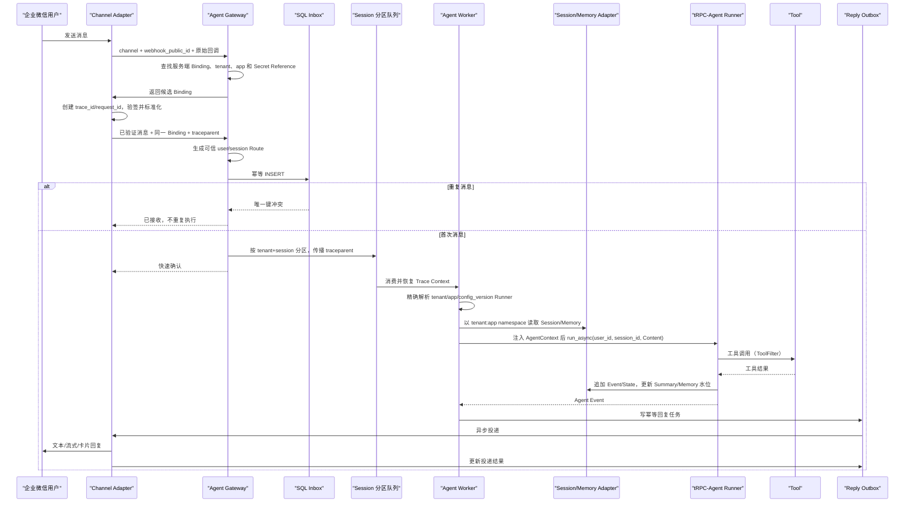

# 基于 tRPC-Agent-Python 的多租户节点化 Agent 部署平台方案

> 方案提交日期：2026-08-27
> 结果提交日期：2026-09-11
> 当前阶段：第一阶段多租户 Agent 运行内核已完成
> 技术底座：tRPC-Agent-Python 1.1.11、Python 3.10+、FastAPI、Redis、SQL、OpenTelemetry

## 1. 题目理解与范围

本项目不是重新实现 Agent 框架，而是在 tRPC-Agent-Python 之上增加企业平台层。原框架负责模型调用、Agent 编排、Tool/MCP、Session、Memory、Summary、Knowledge、Filter 和 Telemetry；本项目负责租户控制面、IM 接入、可信路由、跨节点一致性、多后端选择、可靠投递、权限治理和运维。目标是让多个租户在同一平台创建 Agent 应用、绑定不同 IM 账号、选择不同数据后端，并让无状态 Agent Worker 横向扩展。

结合指导意见，最终代码至少实现两个 IM 通道：第一种为自研 Web IM（FastAPI + SSE，便于独立验证完整问答链路），第二种为企业微信（优先复用 tRPC-Agent-Python OpenClaw 使用的 `wecom-aibot-sdk-python` 和现有事件转换思路）。如果企业微信环境在开发期无法完成真实账号验证，则保留可运行的模拟回调测试，并增加 Telegram 作为可公开验证的备用通道；企业微信 Adapter、验签和消息格式代码仍必须完成。

本阶段不追求一次实现完整生产系统，而是提供可运行的纵向链路和清晰扩展边界：`IM -> Gateway -> Tenant Route -> Runner -> Tool -> Session/Memory -> Outbox -> IM`。

## 2. 对原 tRPC-Agent-Python 的理解与复用边界

### 2.1 原框架的执行模型

`Runner` 是一次 Agent 调用的统一执行入口。构造时注入 `agent`、`session_service`、`memory_service` 和 `artifact_service`，运行时接收 `user_id`、`session_id`、`Content` 和 `AgentContext`，通过异步生成器输出 `Event`。流式 Event 使用 `partial=True` 表示增量文本；正式 Event 中可包含文本、`function_call` 和 `function_response`。Runner 会把非 partial Event 追加到 Session，并在轮次结束后触发 Summary 和 Memory 处理。因此平台层不重复实现 Agent 循环，只负责创建租户运行时并消费 Event。

Session 表示单次会话内的事件和状态，Memory 表示跨 Session 的长期信息，Summary 是旧 Event 的压缩锚点，三者不能混为同一张聊天记录表。原框架已有 InMemory、Redis、SQL Session/Memory 后端；但多节点同时写同一 Session 时仍需平台增加分区串行、分布式锁或版本 CAS，不能把“使用 Redis”误认为自动解决一致性。

Filter 分为 Agent、Model、Tool 三类，适合挂载预算、敏感信息和工具策略。原 Telemetry 已覆盖 Runner、Agent、LLM、Tool Span；平台补充 IM callback、租户解析、队列、Session/Memory Adapter 和 IM send Span。OpenClaw 已包含 MessageBus、企业微信和 Telegram 通道实现，可复用 SDK 接法，但它是一套运行时配置对应一个应用，不能直接替代多租户控制面。

### 2.2 复用与新增模块

| 能力 | 处理方式 | 说明 |
|---|---|---|
| `LlmAgent`、多 Agent、Tool、MCP、Skill | 直接复用 | 平台只负责按租户配置创建和缓存 |
| `Runner.run_async()`、`Content`、`Part`、`Event` | 直接复用 | 作为 Worker 内核和流式事件协议 |
| InMemory/Redis/SQL SessionService | 复用并包装 | 增加 tenant namespace、session 串行化、版本冲突处理 |
| MemoryService、Summary | 复用并包装 | 增加异步任务水位、跨节点可见性和失败重试 |
| Knowledge | 复用 LangChain 组件 | 平台强制 tenant/knowledge_base 过滤 |
| Agent/Model/Tool Filter | 直接复用机制 | 新增统一 `TenantPolicyFilter`，运行时读取租户策略 |
| OpenTelemetry Runner/Agent/LLM/Tool Span | 直接复用 | 新增 IM、Gateway、Storage、Outbox Span |
| OpenClaw WeCom/Telegram 与 MessageBus 思路 | 部分复用 | 抽取成多账号 Channel Adapter，不复用单实例全局配置 |
| Artifact 抽象 | 复用接口 | 新增 COS/S3/MinIO 生产实现；上游当前主要提供内存实现 |
| Tenant/Admin API/Channel Binding | 平台新增 | 原框架不负责企业多租户控制面 |
| Inbox/Outbox、成本账本、灰度回滚 | 平台新增 | 保证 IM 幂等、可靠回复和版本治理 |

## 3. 总体架构

系统划分为控制面和数据面。控制面管理租户、Agent 版本、通道绑定、后端和策略；数据面接收消息并运行 Agent。

Agent Gateway 根据公开定位符 `channel + webhook_public_id` 查询 Channel Binding，由服务端得到 `tenant_id`、`agent_app_id` 和 Secret Reference；`webhook_public_id` 本身不是认证凭证。Adapter 必须先使用该 Binding 验签，再产生标准消息和可信 Route，外部请求不能自行指定租户或应用。Worker 不保存正确性所依赖的本地会话状态，任何 Worker 都可从共享 Session/Memory 后端恢复上下文，因此不依赖 sticky session。一次流式请求仍由同一 Worker 完成；不同轮次可由不同 Worker 处理。

## 4. 租户模型和核心数据关系

租户配置至少包含 `tenant_id`、Agent 应用、模型配置、工具权限、IM 绑定、后端配置和审计策略。配置使用不可变 `config_version`，Worker 缓存键为 `(tenant_id, app_id, config_version)`。Session、Memory、Summary、Knowledge、Artifact 和 Audit 的后端 namespace 在配置加载时都必须等于当前 `tenant_id`。模型、IM 和数据库配置只保存 `vault://` 等 Secret Reference，不保存密钥原文。

核心表为：`tenants`、`agent_apps`、`agent_revisions`、`channel_bindings`、`external_identities`、`sessions`、`session_events`、`session_summaries`、`memories`、`audit_logs`、`inbound_messages` 和 `outbox_messages`。所有业务唯一键包含 `tenant_id`；向量库 metadata 和对象存储 prefix 同样强制包含租户作用域。

单聊 Session 由 `tenant_id + channel_binding_id + app_id + external_user_id` 生成；群聊由 `tenant_id + channel_binding_id + app_id + external_chat_id + thread_id` 生成。实现使用租户级 HMAC 密钥产生不可逆内部 ID。同一用户跨群时 `internal_user_id` 相同但 `session_id` 不同；跨租户时二者都不同。队列分区键使用 `tenant_id:session_id`，保证同一 Session 尽量顺序消费。

## 5. 数据后端与同步策略

| 后端 | 主要数据 | 一致性与同步策略 |
|---|---|---|
| SQL | Tenant、Agent、Binding、Event、Summary、Audit、Inbox/Outbox | 作为控制面和可靠事件事实源；事务、唯一键、乐观版本 |
| Redis | 热 Session、分布式锁、限流、配置缓存 | 低延迟共享状态；启用持久化，不能单独承担不可丢审计 |
| 向量库 | Knowledge chunk、语义 Memory | 最终一致；记录文档版本、embedding 模型和 source_event_id |
| 对象存储 | 原始文档、图片、文件、Artifact | 通过 tenant prefix 和短期签名 URL 隔离；元数据写 SQL |

每条 IM 消息先写 `inbound_messages`，唯一键为 `(tenant_id, channel_binding_id, external_message_id)`。插入成功才进入队列，重复回调直接返回已接收。Worker 对同一 Session 使用队列分区，并在写入时使用 `version` CAS；Event 使用 `(tenant_id, session_id, event_id)` 去重并按 `seq_no` 追加。Session state 与 Event 在同一事务提交，Summary 记录 `covered_event_seq`，Memory 记录 `source_event_id`，二者可由 Outbox 异步生成并安全重试。

Redis 迁移 SQL 时采用“建立新后端、双写/CDC、历史回填、哈希校验、影子读、按租户切换 config_version、保留回滚窗口”的步骤。向量库迁移同时校验 embedding 模型和维度；若不兼容，从对象存储原文重新切片和向量化。

## 6. IM 接入方案

### 6.1 两种首选实现

| 维度 | Web IM | 企业微信 |
|---|---|---|
| 用途 | 无外部账号即可自测完整链路 | 满足微信/企业微信验收要求 |
| 入站 | FastAPI `/v1/chat` | SDK/回调或机器人通道 |
| 流式回复 | SSE 原生支持 | 根据企业微信产品能力做流式或异步分片 |
| 身份 | 登录用户或演示 token | 企业成员、外部联系人、群身份 |
| 验证 | 平台登录态/HMAC | BotID/Secret、回调签名和平台 SDK |
| 卡片 | Web 前端组件 | 转为企业微信支持的卡片格式 |
| 文件 | HTTP 上传后存对象存储 | 使用媒体接口下载，再存对象存储 |

内部统一为 `NormalizedInboundMessage`。入口调用顺序固定为：查找服务端 Binding、使用其 Secret Reference 验签、解析标准消息、使用同一 Binding 生成 Route。文本转换为 tRPC-Agent `Content(parts=[Part.from_text(...)])`；图片和文件先下载、校验、扫描并放入租户对象存储，再转换为多模态 Part 或 Artifact 引用。Runner 输出中，`partial=True` 的文本进入节流聚合器，最终文本发送正式回复；`function_call` 和 `function_response` 对外只保留工具名和状态，工具参数、原始结果、thought 和内部异常详情不会进入 Channel Event。卡片先转换成通道无关 Card Schema，再由 Web 和企业微信分别渲染。

IM webhook 在验签、幂等落库和入队后立即确认，Agent 异步执行。长文本按通道能力分段；限频使用 token bucket 和 `Retry-After`；回复经 Outbox 重试并设置 dead-letter；撤回只能取消未执行任务或删除支持撤回的消息，不能自动回滚已完成的退款等业务副作用。

## 7. 治理、监控和密钥安全

治理分为五层：Ingress Policy 校验 IM 用户、租户状态、限流和幂等；AgentFilter 检查应用权限和总预算；ModelFilter 处理模型白名单、token 限额和输入输出脱敏；ToolFilter 实施默认拒绝、白名单、参数租户边界和危险工具确认；Output Policy 在发送 IM 前再次检查隐私和密钥。第一阶段已经在 Runner 构建入口执行 allow/deny 筛选，未知工具使构建失败，需要确认的工具在确认流程实现前不注册给 Agent。`max_calls_per_run` 暂不另写计数中间件，当前仅由应用的 `max_tool_iterations` 提供基础轮数上限，两者语义并不完全等价。

危险工具不阻塞 Worker 等待用户，而是保存有 TTL 的 `PendingAction`，发送一次性确认卡片；确认时重新验证 tenant、user、session、policy_version，并原子地从 pending 改为 executing。

指标包括 IM 请求量和重复率、Gateway/队列耗时、Runner 总耗时、模型首 token 与总耗时、工具调用耗时、Session/Memory 读写耗时、版本冲突、IM 投递成功率、错误率、token 和成本、Outbox 积压。高基数 user/session 不作为 Prometheus label；精确租户成本写 SQL cost ledger。

审计字段包含 `tenant_id`、`channel`、`user_id`、`session_id`、`agent_name`、`tool_name`、`decision`、`latency_ms`、`error_type`、`cost`、`trace_id`，并增加 `policy_version`、`agent_revision`、`request_id`、token 和脱敏标志。默认不保存原始 prompt/tool result，只保存哈希或脱敏摘要。

所有敏感值只保存 Secret Reference，由 Vault/KMS/云 Secret Manager 提供。日志、Trace 和错误报告经过统一 Redaction Processor，过滤 `authorization`、`cookie`、`token`、`secret`、`api_key`、`password`、DSN 和常见密钥模式；Exporter 在数据离开服务前再检查一次。

## 8. 完整消息时序与 trace 传播

`trace_id` 在 callback 创建，`request_id` 标识本次入站消息；二者写入 Inbox、队列 header、AgentContext、Event metadata、Outbox 和 Audit。tRPC-Agent 内部 Runner/Agent/LLM/Tool Span 继承同一上下文，平台新增 Session/Memory 和 IM send Span，因此可以从一次 IM 回调查看到最终投递。

## 9. 故障恢复、部署和容量

最小可运行环境使用 Docker Compose：单个 FastAPI Gateway/Worker、PostgreSQL、Redis、向量库、MinIO 和 OpenTelemetry Collector。生产环境使用 Kubernetes，将 Channel/Gateway、Worker、Outbox Dispatcher 和 Admin API 独立部署；Worker 按队列积压和活跃运行数 HPA，数据库和 Redis 使用高可用托管服务。

容量估算使用 `在途任务数 ≈ 峰值消息率 × 平均 Agent 耗时`。同时受模型 RPM/TPM、平均工具轮数、Session 写 QPS、IM 回调峰值和出站限频约束。目标常态利用率控制在约 60%~70%，为模型延迟抖动和突发回调保留空间。

## 10. 生产风险与缓解措施

| 风险 | 缓解措施 |
|---|---|
| 1. IM 重复投递导致重复回复 | SQL Inbox 唯一键、工具幂等键、Outbox 唯一键 |
| 2. 同一 Session 多节点并发覆盖 | session 队列分区、分布式锁/fencing token、version CAS |
| 3. Worker 崩溃丢失执行结果 | 队列确认、Event 持久化、Outbox、可重试状态机 |
| 4. Redis/SQL 短暂不可用 | 超时、有限重试、熔断；状态不可持久化时禁止副作用工具 |
| 5. 模型超时或限流 | 指数退避、备用模型、已流式输出后禁止整轮盲目重放 |
| 6. 工具副作用重复执行 | invocation_id + tool_call_id 幂等、确认状态机、业务补偿 |
| 7. 跨租户数据泄漏 | 全链路 tenant namespace、复合主键、向量过滤、对象前缀和测试 |
| 8. 密钥进入日志或 Trace | Secret Reference、源头和 Exporter 双层脱敏、密钥扫描测试 |
| 9. IM 长度或频率限制 | ChannelCapabilities、分片、节流、Retry-After 和发送队列 |
| 10. Memory/Summary 延迟或重复 | source_event_id、covered_event_seq、幂等异步任务和水位监控 |
| 11. 配置发布导致部分节点不一致 | 不可变 config_version、缓存键带版本、灰度和一键回滚 |
| 12. 成本失控 | 调用前预算预留、调用后结算、租户配额和告警 |

## 11. 预期效果

最终演示应能够创建至少两个租户，为每个租户配置独立 Agent、模型引用、工具权限和后端；通过 Web IM 与企业微信发送消息，展示单聊/群聊 Session 隔离、流式文本、一次工具调用和跨 Worker 共享 Session；重复回调只执行一次，危险工具触发确认，Trace 可从 callback 下钻到 LLM、Tool、Session/Memory 和回复，审计中不出现密钥明文。开发环境可一条命令启动，并提供自动化测试和样例配置。

## 12. 时间规划

| 日期 | 目标 | 可验证产物 |
|---|---|---|
| 8/27 | 提交方案；完成租户模型、通道中立消息契约、可信路由 | 本文、Pydantic 模型、Session HMAC 路由、单测 |
| 8/28–8/29 | 控制面与存储抽象 | Tenant/Admin API、SQL Schema、Backend Factory |
| 8/30–9/01 | Web IM 纵向链路 | FastAPI + SSE 页面、Runner Event 转换、文件上传 |
| 9/02–9/04 | 企业微信通道 | SDK Adapter、账号绑定、验签/模拟回调、回复和文件处理 |
| 9/05–9/06 | 一致性与可靠消息 | Redis/SQL Session、session 锁/CAS、Inbox/Outbox |
| 9/07 | 治理与安全 | TenantPolicyFilter、预算、危险工具确认、Redaction |
| 9/08 | Telemetry 与审计 | OTel 完整 Trace、指标、成本账本、审计查询 |
| 9/09 | 故障与迁移验证 | 重复消息、节点故障、后端故障、迁移演练 |
| 9/10 | 部署和验收彩排 | Compose、文档、两通道演示、七项验收清单 |
| 9/11 | 提交结果 | GitHub 代码、测试报告、演示记录、最终设计文档 |

## 13. 验收标准映射

| 验收项 | 本方案位置 / 最终证据 |
|---|---|
| 1. 多租户、节点、同步、后端、IM、治理、恢复 | 第 3–10 节 |
| 2. tenant/agent/binding/session/event/memory/summary/audit 关系 | 第 4 节 ER 图与 SQL Schema |
| 3. 至少两种 IM，含微信/企业微信 | 第 6 节；Web IM + 企业微信代码与测试 |
| 4. 至少三类后端 | 第 5 节；SQL、Redis、向量库、对象存储 |
| 5. 完整消息链路和 trace_id/request_id | 第 8 节时序图和 OTel 演示 |
| 6. 至少 8 个生产风险 | 第 10 节，共 12 项 |
| 7. tRPC 复用与平台新增边界 | 第 2 节表格和实现目录 |

## 14. 当前第一阶段代码

第一阶段多租户运行内核已经实现并通过自动化验收：

- `trpc_service/tenant/models.py`：完整租户配置模型；配置不可变、引用完整，六类数据后端 namespace 强制等于 tenant_id。
- `trpc_service/tenant/routing.py`：从服务端 Binding 生成可信 Route；Tenant、Binding、Application 状态全部参与判断；HMAC 生成跨租户隔离的 user/session ID，支持单聊、群聊和线程。
- `trpc_service/channels/models.py`：通道中立消息、附件和能力模型，并校验群聊、线程及空消息边界。
- `trpc_service/channels/base.py`：共用 Adapter 协议和“先验签、后解析”调度入口。
- `trpc_service/agent/runtime.py`：按 `(tenant_id, agent_app_id, config_version)` 精确查找 Runner，使用稳定的 `tenant_id:agent_app_id` app namespace，并在构建期执行工具白名单。
- `trpc_service/agent/bridge.py`：精确选择 Runner，注入 tenant/app/version/binding/request 元数据；桥接原生 `Content`、`Part`、`Runner.run_async()` 和 `Event`；通道事件不包含工具参数、工具原始结果、thought 或内部异常详情。
- `tests/`：47 项测试覆盖模型不变量、可信路由、Runtime、Bridge 和工具策略。最小双租户 Fake Adapter/Fake Runner 链路验证验签失败时 Runner 零调用；增强链路使用真实 `Runner`、`LlmAgent`、`FunctionTool` 和共享 InMemory Session，验证双租户两轮会话隔离、真实工具执行、模型错误安全投影以及 v3→v4→v3 灰度回滚时的 Session 连续性。

本阶段没有实现 Admin API、真实 IM Adapter、持久化 Session/Memory、Inbox/Outbox、Telemetry 和生产审计；这些能力按后续阶段接在现有稳定边界之外，不重新定义 tenant、user、session 或 runtime key 语义。
