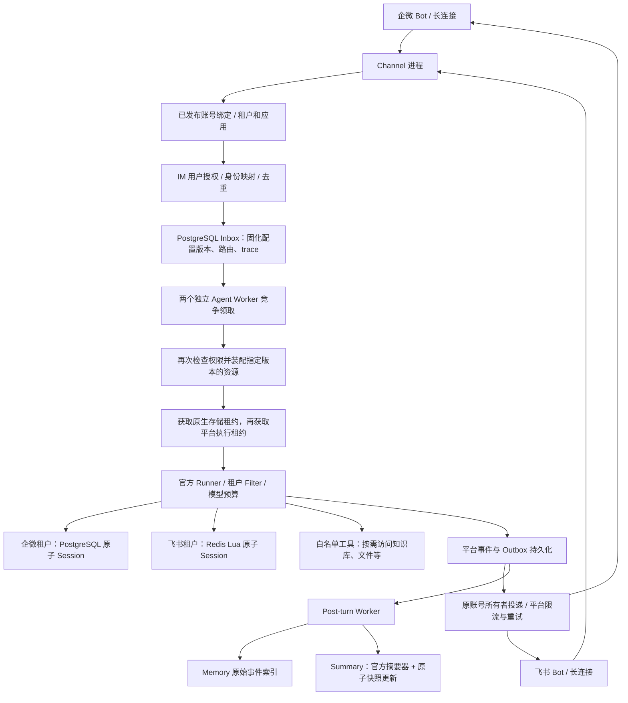

# 服务自有原子 Session 与租户 IM 全链路

本次按选择的第二种方案实现：使用官方 tRPC-Agent-Python 的公开 `BaseSessionService` 扩展接口，在服务仓库实现存储适配器。官方 Runner、Agent、Event、Session、摘要器仍然复用；没有修改上游源码，也没有使用本地二开 fork。

## 1. 两个租户实际如何配置

以下是新增验收部署的配置，不是对之前两个隔离 IM 测试数据库的改名。

| 项目 | 企微租户 `demo_wecom` | 飞书租户 `demo_feishu` |
|---|---|---|
| IM 账号 | 本机配置中的企微 Bot ID | 本机配置中的飞书 App ID |
| 连接 | `wecom_ws`，Bot Secret | `feishu_ws`，App Secret |
| 绑定 | `primary → assistant` | `primary → assistant` |
| Session | PostgreSQL，`sql_protected@1` | Redis，`redis_runtime@1` |
| Summary | 与 Session 同一 profile、同一原子会话快照 | 与 Session 同一 profile、同一原子会话快照 |
| Memory | SQL，`sql_runtime@1` | SQL，`sql_runtime@1` |
| Knowledge | Qdrant，`vector_prod@1`，租户过滤 | Qdrant，`vector_prod@1`，租户过滤 |
| Artifact | MinIO，`object_prod@1`，租户/用户/会话路径 | MinIO，`object_prod@1`，租户/用户/会话路径 |
| Audit | SQL，`sql_audit@1`，tenant_id 隔离 | SQL，`sql_audit@1`，tenant_id 隔离 |
| Agent 名字空间 | `demo_wecom:assistant` | `demo_feishu:assistant` |
| 模型 | 官方 SDK 调用 OpenRouter 的已有限额模型 | 相同模型接口，独立租户预算账本 |
| 新演示预算 | 每日 1 USD、每月 2 USD | 每日 1 USD、每月 2 USD |

六类资源不要求六台服务器。Session/Summary 必须共享同一会话存储；Memory、审计可以共用 PostgreSQL 实例，但表、用途和租户条件不同。知识库与文件也可以共享基础设施，访问范围由服务端可信租户上下文确定。

参考配置文件：`deploy/protected-profiles.example.json` 和 `deploy/protected-tenants.example.json`。示例账号是占位符。运行 `prepare-protected-demo` 后，`reports/protected-demo-config/` 保存使用本机真实公开账号 ID 的配置，密钥字段始终是 `env://...` 引用。

## 2. 从 IM 到后端再回到 IM



外部消息不能自己指定 tenant_id 或数据库连接。服务用账号绑定解析租户，生成隔离的用户/会话标识，然后把配置版本、存储版本和路由保存到 Inbox。Worker 根据这个固定版本选择 Runner 和后端，不能执行到一半改用另一租户的配置。

同一个外部用户在两租户中不会共享内部用户与 Session。单聊、群聊的现有身份规则保持不变；群成员权限与会话隔离仍由已有身份和授权模块处理。

本次真实验收入口只测单聊文本。它会装配六类资源，并执行 Post-turn；文本未触发知识检索或文件工具时，不能据此声称发生过 Qdrant 查询或 MinIO 读写。工具链另有集成测试。

## 3. 原子保护解决的具体问题

旧方案把平台 fencing_token 放进 Event 元数据，原生 SDK 存储并不强制验证它。新适配器在存储内维护 owner、generation、expires、revision 和操作回执。

1. Worker A 获得原生租约 generation=1。
2. A 暂停，租约过期。
3. Worker B 获得 generation=2，读取最新快照并继续执行。
4. A 恢复后，即使仍持有旧 Session 对象，存储也会拒绝它的 append、update、delete 和 renew。

| 操作 | 强制条件 |
|---|---|
| 创建 | 当前精确 app/user/session 租约有效；不能复活已删除的会话 ID |
| append | owner/generation/到期时间有效，Session revision 相等；涉及共享状态时检查对应 revision |
| 重复 Event | 相同 ID、相同内容返回已提交回执；相同 ID、不同内容拒绝 |
| update/摘要 | 会话及共享状态 revision 相等；保留原始历史事件；相同快照重试可识别 |
| delete | 当前原生租约有效；保留删除标记与 generation，避免旧身份重新生效 |
| renew/release | 续租不能恢复已过期租约；旧 owner 释放不能清除新 owner |

PostgreSQL 使用独立表 `trpc_protected_session_v1`。短事务锁住应用守卫行，校验和写入 app/user/session 三个文档；模型和工具调用不持有数据库事务。建表使用事务级 advisory lock，避免两个启动进程同时创建表。

Redis 的三个键使用同一个应用 hash tag。Lua 比较三个读取快照，使用 Redis 服务端时间检查租约，并原子写入三个文档。租约记录不设置 TTL，不允许因键被淘汰而让 generation 从头开始。

应用共享状态使 SQL 的同应用写入短暂串行；Redis 在冲突时重试 CAS。当前格式保存完整 JSON 快照和回执，长会话的容量、延迟需要单独测量。它不是无限吞吐的存储实现。

新保护范围是 Session 及其共享状态、历史和摘要。它不把远程模型调用、业务工具副作用、Memory 数据库、IM 投递一起变成跨系统事务。未知模型/工具执行结果继续沿用已有“不盲目重放”的处理。Memory 只索引已提交且保留不变的原始事件，不承担 Session 写入权威。

Redis 的安全前提包括不丢失已确认的存储状态。示例开启 AOF、always fsync 和 noeviction；异步主从故障转移导致数据回滚的场景仍需单独验收，不能从 Lua 原子性推导出零数据丢失。

## 4. 配置与运行入口

新运行模式为 `TRPC_RUNTIME_MODE=protected`，要求 `TRPC_CONFIG_SOURCE=database`、平台 PostgreSQL、Session 为 PostgreSQL 或 Redis、Memory 为 PostgreSQL。Session/Summary profile 必须显式标注 `session_format=protected_v1`。模式、后端或模型契约不满足时启动失败，不降级为模拟模型。

`docker-compose.protected-test.yml` 提供独立测试基础设施，使用 localhost 的 55442、56382、56335、59002 端口与独立数据卷。`deploy/protected-test.env.example` 对应这套本机测试服务；其中密码仅用于该隔离环境。

PowerShell 中在仓库目录依次执行：

```powershell
docker compose -f docker-compose.protected-test.yml up -d
Get-Content deploy/protected-test.env.example | ForEach-Object {
    if ($_ -match '^([A-Z][A-Z0-9_]*)=(.*)$') {
        [Environment]::SetEnvironmentVariable($Matches[1], $Matches[2], 'Process')
    }
}
.\.venv\Scripts\python.exe -m trpc_service._cli migrate
.\.venv\Scripts\python.exe -m trpc_service._cli init-resources
.\.venv\Scripts\python.exe -m trpc_service._cli prepare-protected-demo
```

prepare 只接受没有租户和 profile 的隔离平台数据库，避免改动原有部署。它加载已有 `.secrets/im.json`、`.secrets/feishu.json`，注册 profile、创建并发布两个租户，设置独立预算，导出脱敏配置。重复准备不会清空数据库；已存在内容时明确拒绝。

先执行真实存储接管测试：

```powershell
.\.venv\Scripts\python.exe -m pytest tests/storage/test_protected_faults.py --backend-mode=real -q --junitxml=reports/protected-real-storage.xml
```

再启动全链路验收：

```powershell
.\.venv\Scripts\python.exe -m trpc_service._cli protected-demo-e2e --test-timeout 600
```

它会先校验模型、六类资源，再启动两个独立 Agent Worker 子进程、一个 Post-turn 子进程和真实 Channel 连接。终端输出两个随机口令，分别发给企微和飞书机器人。每个账号只接受一条对应口令的单聊消息；收到后为该发送者授予隔离测试租户的 chat 权限，并验证重复回调不会产生第二条 Inbox。

这个自动登记仅存在于受限验收入口。常驻 `channel` 进程仍要求管理员通过已有成员管理接口授权；不会自动放行陌生用户。

报告位于 `reports/protected-dual-im-*.json`，分别记录两租户的输入/投递状态、trace_id、session_id、模型 token、成本和 Post-turn 结果。报告不保存消息正文、外部用户原始 ID、连接密码或模型/IM 密钥。人眼是否看到回复是独立确认项，不以平台投递成功替代。

常驻部署使用已有 `worker`、`post-turn`、`channel` 入口；两个 `worker` 使用相同的已发布配置和平台数据库。IM 投递由持有账号长连接的 Channel 进程执行。

## 5. 旧数据如何处理

新表/键与官方原生存储格式独立。不能只把现有 profile 的标记改成 protected_v1 就认为数据已迁移。

现有 OfflineMigrations 已接入新格式：启用维护，排空并核对任务，停止源与目标写进程，保存源快照与摘要，目标租约内导入，重读比对，再切换已发布版本。中途重试以已保存摘要识别已完成的导入；目标已有不一致内容时拒绝覆盖。

仍要求停止旧写进程，因为原生 SDK 源存储不认识新租约。带 app:/user: 共享状态的离线迁移继续明确拒绝，必须先制定共享状态迁移单元，不能混入单会话数据。删除也不自动完成跨 Memory、文件等所有存储的数据清除。

## 6. 验收状态与边界

本次本地测试覆盖：旧进程真实等待租约过期后接管；四类旧写拒绝；旧释放不伤新租约；重复提交；快照与共享状态 CAS；删除防复活；双租户官方 Runner 与工具执行；Inbox 去重/Outbox 持久化；重开客户端读取；官方摘要压缩；SQL Memory 搜索；离线导入重试；profile 发布。

2026-09-07 Docker 恢复后，真实 PostgreSQL/Redis 接管、旧写拒绝、防复活、并发争抢及提交回执测试共 6 项通过，无跳过，见 `reports/protected-real-storage.xml`。

新格式真实双 IM 消息均已收到，两个租户均完成官方 Runner 执行、原子 Session 写入与 IM 投递；独立读取客户端核对了两个 Session 各 2 条原始事件。飞书租户的 Memory、Summary 和费用结算均完成。企微租户 Memory 已恢复，但摘要模型调用费用未知，摘要没有生成，因此完整验收仍未通过。恢复后的报告为 `reports/protected-dual-im-after-recovery-2026-09-07.json`。

本轮修复两个实际问题：Windows Worker 改用 PostgreSQL 异步驱动兼容的 Selector 事件循环（Channel/验收父进程保留子进程所需事件循环）；上游摘要器吞掉模型失败时，服务现在检查未结算调用，拒绝把任务记为成功，也拒绝自动重复发起摘要调用。两个失败 Memory 任务已从原生会话补写并通过查询核验，未重放 IM 输入；纠正企微摘要的错误成功状态并留下审计记录。新增摘要费用保护测试和相关 6 项回归通过，Flake8 通过。

已结算模型费用共 0.0000917064 USD，另有 1 笔企微摘要费用待核对，不能以零费用计入。IM 平台投递成功与用户实际看见回复仍分别记录。

最终本地回归结果见 `reports/protected-session-regression.xml`；新增用例结果见 `reports/protected-session-focused.xml`。旧 SDK 原生写契约的预期失败测试保留，证明的是原生实现缺口，不是新适配器测试失败。

2026-09-07 本地结果：完整回归 294 passed、17 skipped、3 xfailed；最后的适配器专项回归 11 passed、2 skipped（两项 Redis 实测）。完整回归之后补充的续租故障处理已包含在专项回归中。全仓库 Flake8 与新增 Compose 配置校验通过。

当前不能标记“全量生产验收通过”。后续必须补齐真实 PostgreSQL/Redis 接管、真实双通道新格式测试，并对部署选定的 Redis 持久化/故障切换和实际会话容量作验收。
