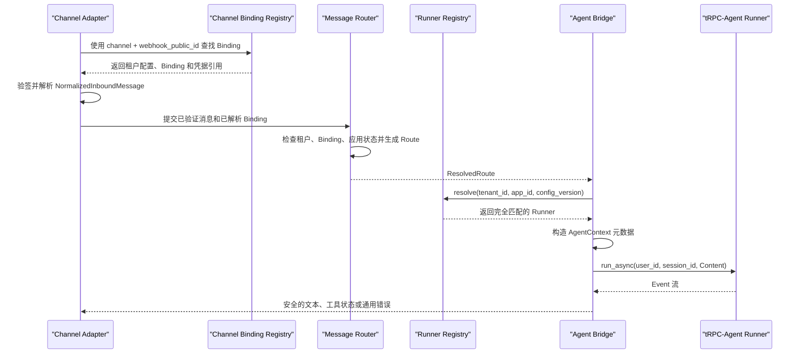

# 第一阶段补充开发方案

> 文档日期：2026-08-31
> 适用仓库：`trpc-agent-service`
> 阶段定位：多租户 Agent 平台运行内核
> 本文性质：开发与验收说明，不包含代码实现

## 1. 背景

仓库当前已经完成第一阶段的主要骨架：

- 租户、Agent 应用、模型、工具策略、Channel Binding、数据后端和审计策略的数据模型；
- 通道中立的入站消息、出站消息和 Channel Adapter 协议；
- 基于可信 Channel Binding 的租户、用户和 Session 路由；
- 使用租户级 HMAC 生成内部 user/session ID；
- 标准消息到 tRPC-Agent `Runner.run_async()` 的桥接；
- 文本、工具调用、工具结果和错误 Event 的基础转换；
- 15 个模型、路由和 Runner 桥接单元测试。

现有实现仍缺少若干会直接影响第一阶段正确性的部分：后端 namespace 没有强制绑定租户、禁用应用仍可被路由、Route 与 Runner 没有强绑定、租户信息没有自动进入 AgentContext、工具参数和工具结果可能进入通道事件、验签与可信路由的调用顺序没有形成可测试契约。

本补充阶段只解决这些已经确认的问题，不提前实现完整控制面、多节点基础设施或生产治理系统。

## 2. 开发原则

本阶段遵循仓库根目录 `README-开发原则.md`，具体落实为：

1. **直接修正现有模型和接口**：不保留错误行为的兼容分支，不增加 legacy mode。
2. **只解决已经确认的问题**：不为尚未出现的部署方式、迁移路径或故障模式增加抽象。
3. **先形成最小端到端链路**：从标准化消息一直执行到正确租户的 Runner，并得到安全的通道输出。
4. **复用 tRPC-Agent**：继续使用其 Runner、AgentContext、SessionService、MemoryService 和 Filter 能力，不自行实现 Agent 循环。
5. **模块职责清晰**：Tenant 负责配置与路由，Channel 负责验签和消息转换，Agent 负责运行时选择与执行。
6. **保留必要的安全约束**：租户边界、工具权限、消息验签和输出数据边界属于明确需求，不能因为避免“防御性代码”而省略。
7. **避免过度防御**：不增加多级 fallback、兼容层、策略 DSL、通用插件框架、旧 ID 双读或尚无需求的密钥轮换流程。

## 3. 第一阶段完成目标

第一阶段完成后，系统必须能够证明以下事实：

1. 一个合法的租户配置不会引用其他租户的数据 namespace。
2. 外部请求不能自行声明 `tenant_id` 或 `agent_app_id`。
3. 只有通过对应 Channel Binding 验签的消息才能生成可信 Route。
4. 禁用租户、禁用 Binding 和禁用应用都不能执行 Agent。
5. 相同外部用户在不同租户中得到不同的内部身份和 Session。
6. 同一租户内的单聊、群聊和线程按既定规则稳定路由。
7. Route 中的租户、应用和配置版本只能选择完全匹配的 Runner。
8. Runner 使用稳定的租户应用 namespace 访问 Session。
9. Tenant、应用、配置版本、Binding 和请求 ID 自动进入 AgentContext。
10. 工具参数、工具原始返回值、模型 thought 和内部错误不会直接发送到 IM 通道。
11. 工具白名单在运行时有效，而不只是配置模型中的字段。
12. 上述行为有自动化测试覆盖。

## 4. 阶段边界

### 4.1 本阶段包含

- 租户模型必要约束补齐；
- Binding、应用状态和可信路由补齐；
- HMAC user/session 路由规则确认；
- 最小 Runner Registry；
- Route 与 Runner 的一致性校验；
- AgentContext 租户元数据注入；
- 最小工具白名单执行；
- 安全的 Agent Event 到 Channel Event 投影；
- Fake Adapter、Fake Runner 和双租户端到端测试；
- 现有设计文档中与实现不一致部分的同步修改。

### 4.2 本阶段不包含

- Admin API 和租户管理页面；
- PostgreSQL 租户配置表及数据库迁移；
- Redis/SQL Session、Memory 的实际部署接线；
- 消息队列、Session 分区消费者、分布式锁和 CAS；
- Inbox/Outbox 和消息幂等落库；
- 企业微信、Web IM、Telegram 的真实 Adapter；
- Secret Manager 的真实客户端、密钥轮换和缓存；
- 危险工具确认卡片和 PendingAction 状态机；
- 完整日志脱敏、Audit Log、OpenTelemetry 和成本统计；
- Docker Compose、Kubernetes 和多节点压测。

这些能力属于后续阶段。第一阶段只保留清晰扩展边界，不为它们编写占位实现。

## 5. 第一阶段目标链路



这条链路不包含 HTTP 服务和消息队列，但必须通过集成测试完整跑通。后续 Gateway 只是在这条链路外增加网络入口、幂等和异步调度，不改变核心路由语义。

## 6. 详细设计

### 6.1 租户模型约束

目标文件：`trpc_service/tenant/models.py`

#### 6.1.1 后端 namespace

`TenantConfig` 完成校验后，`session`、`memory`、`summary`、`knowledge`、`artifact` 和 `audit` 的 `BackendRef.namespace` 必须全部等于当前 `tenant_id`。

本阶段不支持一个租户手工指定另一个 namespace，也不增加 `allow_shared_namespace` 配置。确实需要共享数据时，应在后续阶段设计独立的显式共享资源模型，不能通过绕过租户 namespace 实现。

#### 6.1.2 应用和 Binding 状态

模型加载时继续校验 Binding 引用的应用存在。运行时路由额外检查：

- Tenant 必须为 `active`；
- Binding 必须 `enabled=True`；
- Binding 指向的 Agent Application 必须 `enabled=True`。

不增加状态回退。例如应用禁用后，不自动切换到同租户的其他应用。

#### 6.1.3 工具策略

保留现有 `default_deny`、`allow`、`deny`、`require_confirmation` 和 `max_calls_per_run` 字段。

本阶段采用最小执行规则：

1. `deny` 中的工具永远不可用；
2. `default_deny=True` 时，只允许 `allow` 中的工具；
3. `require_confirmation` 中的工具在确认流程尚未实现前不注册给 Agent；
4. 配置引用不存在的工具时，Runner 构建直接失败；
5. 不设计条件表达式、角色继承、通配符或策略 DSL。

`max_calls_per_run` 若 tRPC-Agent 当前已有等价限制则直接复用；若没有，本阶段不另写计数中间件，只使用现有 `max_tool_iterations` 形成基本上限，并在文档中记录两者语义尚未完全等价。

#### 6.1.4 审计策略

本阶段只保留审计策略模型，不实现审计存储。`hash_external_identifiers` 表示允许后续审计组件对外部标识做不可逆化处理，不代表所有路由都必须使用哈希。

不提前加入具体哈希算法选择、salt 配置、轮换版本或兼容读取逻辑。

### 6.2 Channel Binding 与验签边界

目标文件：

- `trpc_service/channels/base.py`
- `trpc_service/channels/models.py`
- `trpc_service/tenant/routing.py`

`webhook_public_id` 是 Binding 定位符，不是认证凭证。正确顺序固定为：

1. Adapter 或入口层从 URL 获取 `channel` 和 `webhook_public_id`；
2. `ChannelBindingRegistry` 返回候选 Tenant 和 Binding；
3. Adapter 使用 Binding 中的 Secret Reference 对原始请求验签；
4. Adapter 验签成功后生成 `NormalizedInboundMessage`；
5. MessageRouter 使用同一个 Binding 生成 `ResolvedRoute`。

第一阶段不创建复杂的“验签证明对象”或签名 token。通过一个清晰的调度函数和 Fake Adapter 集成测试约束调用顺序即可。

`NormalizedInboundMessage` 需要补充与会话类型直接相关的校验：

- `group` 和 `thread` 必须包含 `external_chat_id`；
- `thread` 必须包含 `thread_id`；
- 消息必须包含文本或至少一个附件；
- `message_type=text` 时空文本是否允许，以真实 Channel 行为为准，不增加臆测规则。

### 6.3 内部身份和 Session 路由

目标文件：`trpc_service/tenant/routing.py`

现有 HMAC 方案保留，因为它直接解决以下明确需求：

- 不把企业微信等平台的原始用户和群 ID 直接写入 Session key；
- 相同外部 ID 在不同租户下不能碰撞；
- 多节点在持有相同租户密钥时能够独立计算相同 Route；
- 不需要额外的身份映射数据库即可保持无状态路由。

HMAC 不属于无意义的防御性代码，但本阶段仅保留当前最小实现：SHA-256、租户级 key resolver 和最小密钥长度检查。

本阶段明确不实现：

- HMAC 算法可配置；
- 多版本密钥；
- 旧密钥双读；
- Session ID 迁移；
- 找不到密钥时使用默认密钥；
- HMAC 失败时退回原始外部 ID。

路由规则保持：

- 内部用户：`tenant + binding + external_user_id`；
- 单聊 Session：`tenant + binding + app + direct + external_user_id`；
- 群聊 Session：`tenant + binding + app + group + external_chat_id`；
- 线程 Session：`tenant + binding + app + thread + external_chat_id + thread_id`；
- 分区键：`tenant_id:session_id`。

### 6.4 Runner namespace 与运行时选择

建议新增目标文件：`trpc_service/agent/runtime.py`

第一阶段只需要一个简单的进程内 Runner Registry：

```text
(tenant_id, agent_app_id, config_version) -> Runner
```

不设计通用 IoC 容器、插件系统或异步配置加载器。Registry 只需要：

- 注册一个 Runner；
- 按完整 key 查找 Runner；
- 重复 key 注册时报错；
- key 不存在时明确失败；
- 不允许忽略 `config_version` 查找最新版本；
- 不允许回退到默认 Runner。

Runner 的 `app_name` 使用稳定的租户应用 namespace：

```text
{tenant_id}:{agent_app_id}
```

`config_version` 不放进 `app_name`。原因是 Session 属于租户应用，而不是某个配置修订版；配置升级后仍应能读取同一个 Session。配置版本只参与 Runner Registry 查找，并写入 AgentContext 和后续审计记录。

tRPC-Agent 的 SessionService 已以 `app_name + user_id + session_id` 作为存储作用域，因此无需重新包装一套 Session key 生成器。

### 6.5 AgentContext 元数据

目标文件：`trpc_service/agent/bridge.py`

调用 Runner 前必须保证 AgentContext 至少包含：

| Key | 来源 | 用途 |
|---|---|---|
| `tenant_id` | ResolvedRoute | 工具、Filter 和存储识别租户 |
| `agent_app_id` | ResolvedRoute | 标识当前应用 |
| `config_version` | ResolvedRoute | 配置一致性和后续审计 |
| `channel_binding_id` | ResolvedRoute | 关联 IM 账号 |
| `request_id` | NormalizedInboundMessage | 关联一次入站请求 |
| `external_message_id` | NormalizedInboundMessage | 后续幂等扩展点 |

如果调用者传入 AgentContext，则在该对象上补齐平台元数据；平台键与调用者已有值冲突时直接失败，不能静默覆盖，也不能信任调用者提供的不同 `tenant_id`。

本阶段不把外部用户 ID、群 ID、Secret Reference 或模型 API Key 放入 metadata。

### 6.6 Route 与 Runner 一致性

Agent Bridge 不再接受一个与 Route 没有关联的任意 Runner。执行前至少保证：

1. Runner 由 `(tenant_id, agent_app_id, config_version)` 精确解析得到；
2. `runner.app_name == f"{tenant_id}:{agent_app_id}"`；
3. Route 中应用处于启用状态；
4. Runner 不匹配时直接返回内部错误，不尝试其他版本或其他应用。

该检查属于租户正确性边界，不属于多余的防御性校验。

### 6.7 工具权限的最小执行

建议在 Runner/Agent 构建时完成工具筛选，而不是再实现一套完整策略引擎：

1. 从系统已有工具注册表取得候选工具；
2. 根据当前应用 `ToolPolicy` 过滤；
3. 只把允许且不需要确认的工具传给 Agent；
4. `deny` 优先于 `allow`；
5. 需要确认的工具暂不暴露给模型；
6. 不存在的工具名导致该 Runner 构建失败。

后续实现 PendingAction 后，再把 `require_confirmation` 工具注册为受确认 Filter 控制的工具。本阶段不写一个“永远允许”的假确认流程。

### 6.8 安全的 Channel Event 投影

目标文件：`trpc_service/agent/bridge.py`

现有 `AgentChannelEvent.data` 会承载工具调用参数或工具原始响应，容易被后续 Channel Adapter 直接发送。第一阶段应直接删除该对外字段，不保留兼容模式。

投影规则如下：

| tRPC-Agent Event | Channel Event | 对外内容 |
|---|---|---|
| partial text | `TEXT_DELTA` | 文本增量 |
| final text | `TEXT` | 最终文本 |
| function call | `TOOL_CALL` | 仅工具名或固定进度文案 |
| function response | `TOOL_RESULT` | 仅工具名和完成状态，不含结果数据 |
| thought part | 无 | 丢弃 |
| internal error | `ERROR` | 固定通用错误文案和稳定错误类型 |

内部错误消息、异常堆栈、请求头和工具返回值不进入 Channel Event。第一阶段不增加通用正则脱敏器；最简单可靠的方式是不把这些数据放进通道对象。

## 7. 文件级开发任务

| 文件 | 任务 |
|---|---|
| `trpc_service/tenant/models.py` | 增加 namespace 与租户一致性校验；确认工具策略最小语义 |
| `trpc_service/tenant/routing.py` | 检查应用启用状态；保持 HMAC 路由规则；完善可信路由输入 |
| `trpc_service/channels/models.py` | 增加群聊、线程和空消息的必要校验 |
| `trpc_service/channels/base.py` | 明确 Binding 查找、验签、解析的调用契约 |
| `trpc_service/agent/runtime.py` | 新增最小 Runner Registry 和稳定 app namespace |
| `trpc_service/agent/bridge.py` | 精确选择 Runner；注入 AgentContext；移除工具原始数据投影 |
| `trpc_service/agent/__init__.py` | 只导出第一阶段稳定使用的运行时入口 |
| `tests/test_tenant_models.py` | 增加 namespace 和状态约束测试 |
| `tests/test_routing.py` | 增加禁用应用、线程、跨应用和密钥失败测试 |
| `tests/test_agent_bridge.py` | 增加 Runner 匹配、metadata 和输出边界测试 |
| `tests/test_phase_one_flow.py` | 新增双租户最小端到端链路测试 |
| `tests/test_real_runner_flow.py` | 新增真实 Runner、Agent、Tool 和 InMemory Session 增强端到端测试 |
| `README.md` | 更新第一阶段真实完成状态 |
| `docs/方案设计-2026-08-27.md` | 同步验签顺序、Runner namespace 和第一阶段状态 |

## 8. 测试设计

### 8.1 租户模型测试

| 编号 | 场景 | 预期结果 |
|---|---|---|
| T-M01 | 所有 Backend namespace 等于 tenant_id | 配置通过 |
| T-M02 | Session namespace 指向其他租户 | 配置拒绝 |
| T-M03 | Artifact 或 Audit namespace 指向其他租户 | 配置拒绝 |
| T-M04 | Binding 引用不存在的应用 | 配置拒绝 |
| T-M05 | 应用引用不存在的模型 | 配置拒绝 |
| T-M06 | require_confirmation 不属于 allow | 配置拒绝 |

### 8.2 路由测试

| 编号 | 场景 | 预期结果 |
|---|---|---|
| T-R01 | 活跃租户、Binding、应用 | 正常生成 Route |
| T-R02 | 租户 suspended/disabled | 拒绝路由 |
| T-R03 | Binding disabled | 拒绝路由 |
| T-R04 | 应用 disabled | 拒绝路由 |
| T-R05 | 相同外部用户跨租户 | user/session 均不同 |
| T-R06 | 相同用户跨群 | user 相同，session 不同 |
| T-R07 | 同群不同 thread | session 不同 |
| T-R08 | HMAC key 少于 32 字节 | 明确失败，无 fallback |

### 8.3 Runtime 和 Bridge 测试

| 编号 | 场景 | 预期结果 |
|---|---|---|
| T-A01 | 完整 runtime key 命中 | 返回正确 Runner |
| T-A02 | config_version 不存在 | 明确失败，不回退 |
| T-A03 | Runner app_name 与 Route 不一致 | 拒绝执行 |
| T-A04 | 未传 AgentContext | 自动创建并写入平台 metadata |
| T-A05 | 调用者 metadata 与 tenant_id 冲突 | 拒绝执行 |
| T-A06 | function_call 含敏感参数 | Channel Event 不包含参数 |
| T-A07 | function_response 含敏感结果 | Channel Event 不包含结果 |
| T-A08 | thought part | 不产生 Channel Event |
| T-A09 | 内部错误含异常细节 | 对外只返回通用错误 |

### 8.4 最小端到端测试

使用两个 Tenant、两个 Fake Adapter 和两个 Fake Runner，验证：

1. 相同 `external_user_id` 通过不同 webhook 进入不同 Tenant；
2. 两个消息分别选择各自的 Runner；
3. Runner 收到正确的内部 user/session ID；
4. AgentContext 中 tenant/app/version/request 信息正确；
5. 最终只输出允许发送的文本；
6. 一个租户的 Route 不能选择另一个租户的 Runner；
7. Fake Adapter 验签失败时 Runner 调用次数为零。

该测试是第一阶段的核心验收证据。测试不启动 Redis、SQL、HTTP Server 或外部 IM SDK。

### 8.5 真实运行内核增强测试

在最小 Fake Runner 链路之外，使用真实 tRPC-Agent `Runner`、`LlmAgent`、`FunctionTool` 和共享的 InMemory SessionService 验证：

1. 两个 Tenant 各自完成两轮真实 Agent 循环；
2. 工具从 AgentContext 读取到正确 tenant、config version 和 request 信息；
3. require_confirmation 和默认拒绝工具没有注册给 Agent；
4. 两个租户的 Session 历史互不包含对方消息；
5. 模型错误中的 Provider 细节不会进入 Channel Event；
6. v3、v4 Runner 可以共存并按 Route 精确选择；
7. v3→v4→v3 回滚保持同一个租户应用 Session namespace 和历史连续性。

该增强测试仍不访问真实模型、数据库或 IM 平台，确定性模型只替代外部模型响应；Agent 循环、工具执行和 Session 持久化路径均使用 tRPC-Agent 的真实实现。

## 9. 开发顺序

### 步骤一：固定模型不变量

先补充 TenantConfig namespace 和应用状态相关校验，更新模型测试。完成后确保全部模型测试通过。

### 步骤二：固定可信路由语义

补充应用状态检查、群聊/线程消息校验以及 Adapter 验签调用契约，更新路由测试。

### 步骤三：建立最小 Runtime Registry

实现精确的三元组 Runner 查找和稳定 `app_name`，不接数据库和动态配置中心。

### 步骤四：收紧 Agent Bridge

完成 AgentContext 注入、Route/Runner 一致性检查和安全 Event 投影。

### 步骤五：执行工具白名单

在 Runner 构建阶段筛选工具。需要确认的工具在确认流程完成前不注册。

### 步骤六：跑通双租户端到端测试

用 Fake Adapter/Fake Runner 证明从 Binding 到输出的完整链路，并运行全量测试。

### 步骤七：同步文档

只在代码和测试完成后更新 README 的“当前进展”，避免文档提前声明未实现能力。

## 10. 不采用的方案

为避免过度设计，本阶段明确不采用以下方案：

| 不采用方案 | 原因 |
|---|---|
| 为每种后端新建平台 Adapter 基类 | tRPC-Agent 已有 Session/Memory 服务，本阶段尚未接后端 |
| HMAC 算法插件化 | 当前只有一个明确算法需求 |
| 旧 Session ID 双读和迁移 | 当前尚未形成生产数据 |
| Runner 查找失败时回退默认应用 | 会破坏租户和版本正确性 |
| 通用策略 DSL | 当前 allow/deny 足够 |
| 通用字段脱敏框架 | 本阶段直接禁止敏感数据进入 Channel Event 更简单 |
| 为验签创建多层证明 token | 一个明确的调用顺序和集成测试足够 |
| 自研 Session/Memory | 已有成熟依赖可复用 |
| 提前实现分布式锁和 CAS | 第一阶段没有多 Worker 写入链路 |
| 为未来数据库迁移保留兼容字段 | 当前没有已发布 Schema 和生产数据 |

## 11. 风险与处理

| 风险 | 本阶段处理 |
|---|---|
| Backend namespace 配错导致跨租户访问 | TenantConfig 构造时直接拒绝 |
| 禁用应用仍被调用 | 路由时检查应用状态 |
| Route 使用错误 Runner | 完整 runtime key 查找并校验 app_name |
| 外部请求伪造 tenant_id | tenant/app 仅从服务端 Binding 获取 |
| 未验签消息进入 Runner | 固定查 Binding、验签、解析、路由顺序 |
| 工具参数或结果泄露到 IM | Channel Event 不携带原始工具数据 |
| 配置版本不存在 | 直接失败，不回退 |
| HMAC key 不可用 | 直接失败，不使用默认 key |
| 需要确认的工具被执行 | 确认流程完成前不注册该工具 |

## 12. 完成定义

以下条件全部满足后，第一阶段才可以标记为完成：

- [ ] 所有 Backend namespace 都被强制限制到当前 tenant；
- [ ] Tenant、Binding、Application 状态都参与路由判断；
- [ ] 验签先于可信 Route 和 Runner 执行；
- [ ] HMAC 身份规则与设计文档一致；
- [ ] Runner 按 tenant/app/config_version 精确选择；
- [ ] Runner app_name 使用稳定租户应用 namespace；
- [ ] AgentContext 自动包含必要平台元数据；
- [ ] 工具 allow/deny 在 Runner 构建阶段实际生效；
- [ ] require_confirmation 工具在确认流程完成前不可执行；
- [ ] Channel Event 不包含 thought、工具参数、工具结果和内部异常详情；
- [ ] 双租户最小端到端测试通过；
- [ ] 原有测试及新增测试全部通过；
- [ ] README 和详细设计只声明已经实现且测试验证的能力；
- [ ] 不存在为旧行为保留的兼容层、fallback 或未使用抽象。

## 13. 第一阶段完成后的接口边界

第一阶段完成后，后续阶段应直接复用以下稳定边界：

- Channel Adapter：把外部请求变成已验证的 `NormalizedInboundMessage`；
- Channel Binding Registry：从公开 Binding 定位符取得服务端租户配置；
- Message Router：生成可信 `ResolvedRoute`；
- Runner Registry：根据租户、应用和配置版本选择 Runner；
- Agent Bridge：注入上下文、执行 Runner 并产生安全 Channel Event；
- TenantConfig：作为运行时配置唯一事实来源。

第二阶段可以在这条链路外接入 FastAPI、Redis/SQL 和真实 IM Adapter，不应重新定义 tenant、user、session 或 runtime key 的语义。
