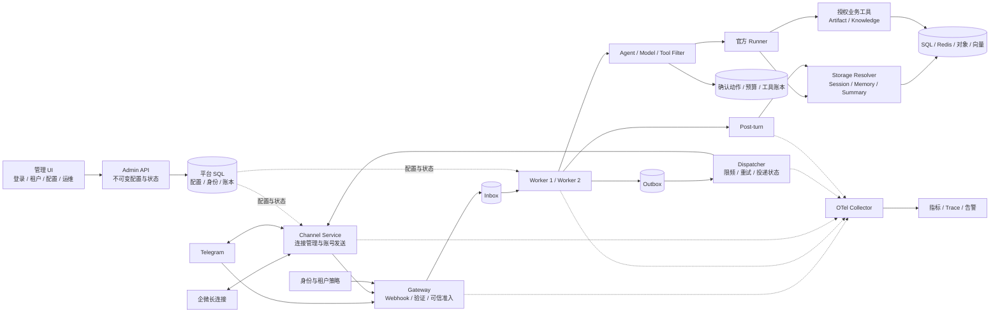
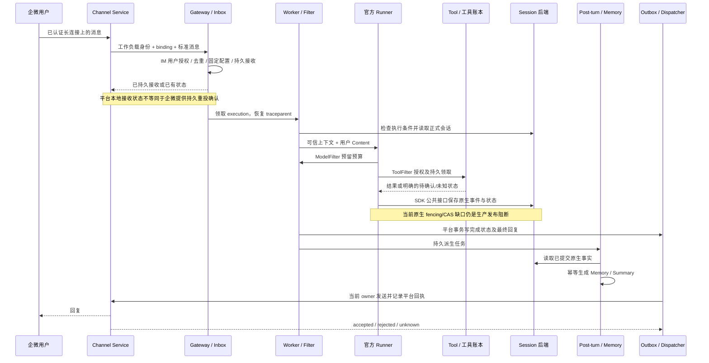
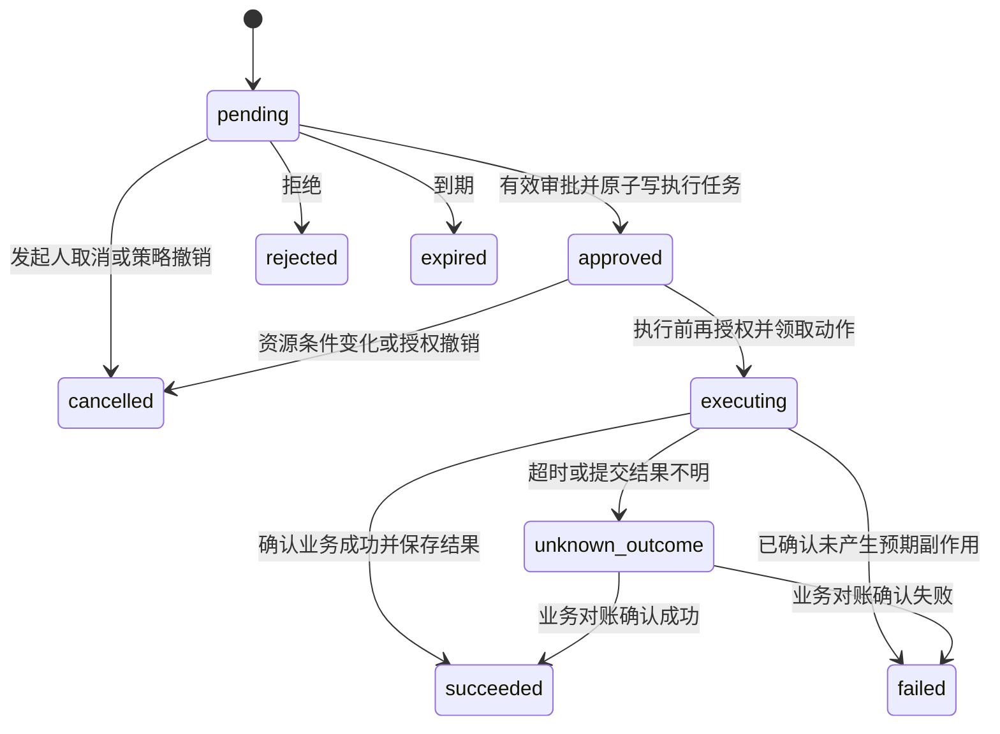

# 第三阶段开发方案：企业微信、Telegram、租户治理运维与管理 UI

版本：1.2　日期：2026-09-06　状态：实施中；按用户要求收敛到原 README 和已明确要求的 UI/真实联调。

**范围修订优先级：**以 [原始需求对照与范围校准](第三阶段范围校准-原始需求对照-2026-09-06.md) 为准。下文保留的详细方案不再自动成为必做清单，尤其是商业业务工具、全部媒体能力、OIDC、固定角色体系及 12 页拆分。实现状态以开发进度与测试报告为准。

本文面向本服务仓库的工程实施，覆盖真实 IM、租户治理、预算、危险工具确认、观测审计、安全、运行维护及实际连接后端的管理 UI。文中的新类型、表、接口、指标及命令入口均为**拟开发契约**；只有“现有基线”明确列出的能力可以视为已实现。本文不宣称真实账号联调或生产验收已经通过。

阅读顺序：范围和现状见第 1–3 节；架构与通道见第 4–7 节；治理与预算见第 8–10 节；存储、观测和安全见第 11–13 节；恢复、部署与接口见第 14–16 节；实施、验收和风险见第 17–20 节。

## 1. 目标、范围与完成口径

### 1.1 已确定的需求

1. 保留企业微信智能机器人 API 模式长连接；第二类通道原选 Telegram，因账号条件未满足，正在讨论替代，尚未自动切换。只要求完成至少两类。
2. 企业微信按导师给出的创建路径获取 BotID、BotSecret：工作台 → 智能机器人 → 创建机器人 → 手动创建 → API 模式 → 使用长连接。截图中的凭据不进入文档、示例和仓库。
3. Agent 内核仅使用官方 `trpc-group/trpc-agent-python`，不使用用户本地二开项目或 fork，不在本阶段修改外部 SDK 仓库。
4. 复用第二阶段共享存储、Inbox/Outbox、双 Worker、工具账本、后处理、版本发布、离线迁移和基础观测。
5. 治理必须包含工具白名单、敏感信息脱敏、预算、危险工具二次确认、IM 用户授权；监控、完整 Trace、审计和密钥保护同时验收。
6. 参考既有讨论中的成熟项目，但按模块采纳设计，不整体替换本项目运行内核。
7. 最终产品包含可部署、可登录、按租户授权并连接真实后端的管理 UI。先完成后端和 IM，再完成 UI 集成验收；仅有 API、Swagger 或静态页面不能视为本阶段最终完成。

需求来源：[服务 README](../README.md)、[导师与跨任务参考记录](跨对话参考与导师IM要求-2026-09-05.md)、本次用户确定的 Telegram 及治理运维要求。

### 1.2 三种完成状态

| 状态 | 判定依据 | 不代表什么 |
|---|---|---|
| 设计完成 | 本文需求、接口、数据、不变量、工作包、测试与风险互相对应 | 不代表新增能力已运行 |
| 工程功能验收完成 | 受控环境中双真实 IM、官方 Runner、真实模型及后端、治理和故障用例有证据 | 不代表跨所有故障窗口都可安全接管 |
| 生产发布通过 | 工程验收完成，且原生存储写保护、账号协议恢复边界、容量、安全和恢复演练均通过发布门禁 | 不允许用模拟模式测试替代 |

当前官方 SDK 原生 Session 写入缺少 fencing/CAS，生产门禁仍保留。先完成可独立测试的平台和通道模块；在该限制解决前，真实联调只能采用明确隔离、限制副作用的集成测试入口，不能解除服务的生产拒绝启动逻辑。

### 1.3 本阶段必须实现与明确延期的内容

**核心实现：**原 README 对应的多租户、节点化、共享数据、至少两类 IM、可执行工具、Filter 治理、观测审计及故障处理；保留用户明确要求的实际管理 UI 和真实联调。优先复用已有资源工具；不要求接入真实退款、订单等商业系统。UI 页面按核心功能合并，不以页面数验收。

**必须说明并验证支持边界：**IM 回复/流式/卡片的转换方式和选择，图片/文件、编辑/撤回、长度/频率、异步回复、失败重试等平台限制。可靠文本作为基线；未支持的媒体类型须明确处理。没有要求两通道同时实现所有消息形式，不能将“考虑”提升为全功能开发门槛。

**不计入本阶段实现：**完整人工客服接管工作台、可视化工作流编排器、任意新 IM 通道、语音/视频理解、在线双写迁移、Memory/Artifact/Audit 全库搬迁、新 embedding 的全量重建、未经工具登记的任意 Shell/MCP。管理 UI 中的会话查看、执行诊断和审批必须实现，但不由此扩展成完整客服产品。

README 的 2000–4000 字建议适用于提交版架构概述。本文是开发附件，展开实施细节；提交时从本文提炼概述，并附本文件及测试证据。

## 2. 现有基线与实际缺口

核对依据为 [2026-09-06 第二阶段运行时记录](第二阶段运行时补全与边界-2026-09-06.md)及本仓库源码。历史报告按各自时间与范围保留，不混算通过数。

| 模块 | 当前已有 | 第三阶段需要补充 |
|---|---|---|
| SDK | 官方固定提交 `f05797d9f9dff2461922b5985aeccc1b636b7c8d`，版本 1.1.20；第二阶段核验时与上游 HEAD 一致 | 开发开始重新核验官方版本，记录版本/提交与差异，运行契约回归后固定依赖 |
| 通道 | `channels/base.py` 通用接口，消息/能力模型，模拟入口 | 长连接/轮询生命周期、真实协议、回复回执、事件类型与安全媒体处理 |
| 身份 | Binding 可信路由，HMAC 用户/会话 ID | 成员授权、actor 与存储身份分离、个人/群共享模式、Memory 范围隔离 |
| 执行 | 官方 Runner/FunctionTool，精确版本加载 | 真实模型工厂、完整 Filter 注册、公共接口确认续接 |
| 治理 | 构建时 allow/deny；需要确认的工具不注册；调用次数限制 | 每次执行授权、持久确认、金额及 token 预算、模型/输出脱敏 |
| 可靠性 | SQL Inbox/Outbox、租约、工具完整结果、Post-turn、投递重试 | 协议接收进度、投递未知状态、跨进程连接发送、动作任务与预算恢复 |
| 六类资源 | 数据库配置模式装配 Session/Memory/Summary/Artifact/Knowledge/Audit | IM 身份范围贯通；独立 Audit 后端的可靠汇出；媒体进入 Artifact |
| 知识检索 | Qdrant 工具接收预计算向量 | 不向模型暴露“自行生成语义向量”的伪 RAG；需要自然语言检索时另配真实 embedding |
| 管理 | 操作员 API、配置版本、灰度、维护和离线迁移 | 租户 RBAC、通道运行状态、成员、确认、预算、审计/投递查询 |
| 管理 UI | 当前 `trpc_service/web` 是后端服务入口，未发现管理前端工程及既有视觉实现 | 新建管理前端，完成第 16.4 节页面、真实 API 联动、权限和交互状态 |
| 观测 | 平台跨进程 Trace/OTLP、队列和操作指标 | SDK 内部 Span 安全导出、真实模型用量与费用、完整 IM/存储指标和告警接入 |

已有严格真实后端回归记录为 161 passed、0 skipped；其模型和通道仍为确定性模拟。已有部署烟测中 16 条消息关联四类平台 Span，不能据此宣称 SDK 内部完整 Trace 或真实 IM 已验收。

两个必须纠正的实现假设：

- 当前 `SessionIdentityFactory` 的群聊 session_id 不含发言人，而 SDK 会话还包含 user_id；这既不等于完整个人隔离方案，也不等于已实现群共享记忆。按第 7 节重新明确身份契约。
- `ChannelAdapter.send()` 当前只返回字符串，无法表达回执类型、平台是否接受、未知结果、编辑版本和失效上下文。需用有类型的结果替换，不能用非空 ID 代表全部投递成功。

工程原则沿用 [README-开发原则](../README-开发原则.md)：优先现有成熟依赖、模块化、按纵向链路推进、避免兼容层和多余抽象。用户已要求的数据迁移、灰度与恢复仍须设计；这是明确业务需求，不属于为旧原型保留兼容逻辑。

## 3. 需求到交付的映射

| 编号 | 要求 | 本文位置 | 工作包 / 验收组 |
|---|---|---|---|
| R01 | 两类真实 IM，包含企业微信 | 5–6 | W01/W03/W04；IM |
| R02 | 用户输入与 Agent Event 转换、单聊群聊隔离 | 5、7、11 | W02/W03/W04；ID/IM |
| R03 | 账号/租户绑定、凭据、验签、去重 | 5–7、13 | W02/W03/W04；ID/REL |
| R04 | 长度、频率、异步/流式、卡片、媒体、撤回 | 6、14 | W04/W08；IM/REL |
| R05 | Agent/Model/Tool Filter 五类治理 | 8–10 | W05/W06/W07；GOV/BUD |
| R06 | 请求/模型/工具/IM/错误/token/成本/后端指标 | 12 | W09；OBS |
| R07 | IM→Runner→Tool→Session/Memory→回复 Trace | 4、12 | W09；OBS |
| R08 | 指定审计字段、租户查询与可靠持久化 | 12、16 | W09/W10；AUD |
| R09 | 密钥管理、日志/Trace/错误报告无明文 | 13 | W05/W09/W10；SEC |
| R10 | 节点/IM/DB/模型/工具故障恢复 | 14 | W11；REL/OPS |
| R11 | 灰度、回滚、容量、最小及生产部署 | 15 | W11；OPS |
| R12 | 六类资源与至少三类后端同步方案 | 11、15 | W02/W11；STO |
| R13 | 数据模型、架构图、时序图、八项以上风险 | 4、16、19 | 全工作包 |
| R14 | 复用官方 SDK 与新增平台模块的分界 | 2、3、17 | W01；SDK |
| R15 | 参考此前成熟项目 | 3.1、17 | 各工作包的参考记录 |
| R16 | 可复现代码、部署、测试和报告 | 17–20 | W13；最终交付清单 |
| R17 | 可登录、可管理、连接真实后端的完整管理 UI | 16.4、17–18 | W10/W12；UI |

### 3.1 参考项目与采纳方式

下表是本项目的设计取舍，不表示参考仓库已经具备本项目全部隔离、预算或恢复保证。2026-09-06 核对了所链接的公开主页/文档；本轮没有对每个参考仓库进行全量源码审计。实施时在对应工作包记录实际借鉴的文件、固定提交、许可证和采用理由。

| 参考来源 | 采纳到本项目的模块 | 边界 |
|---|---|---|
| [官方 tRPC-Agent-Python](https://github.com/trpc-group/trpc-agent-python) | Runner、LlmAgent、FunctionTool、Filter、Session/Memory/Summary、Telemetry 公共接口 | OpenClaw 通道代码作为接法参考；不引入其整套单应用消息总线替代平台 |
| [LangBot](https://github.com/langbot-app/LangBot) | Adapter 划分、平台消息归一化、机器人配置和媒体交互 | 租户授权、预算和可靠账本由本平台承担 |
| [TGO](https://github.com/tgoai/tgo) | 通道服务职责、账号状态、AI 与人工协作边界 | 不为参考其产品形态增加整套微服务依赖 |
| [Chatwoot](https://github.com/chatwoot/chatwoot) | Account→Tenant、Inbox→Binding、Contact→外部身份、Conversation→会话 | 平台 session_id 不直接等于外部 conversation ID；人工接管 UI 后续实现 |
| [ZITADEL Organizations](https://zitadel.com/docs/guides/manage/console/organizations-overview) | 外部组织、主体、角色映射；OIDC 管理登录 | IM 身份仍需显式映射，群管理员不自动成为租户管理员 |
| [Mimir 鉴权](https://grafana.com/docs/mimir/latest/manage/secure/authentication-and-authorization/) | 认证边界产生可信租户上下文 | 外部自带 tenant header、消息正文、模型参数不能指定租户 |
| [Kubernetes Controller](https://kubernetes.io/docs/concepts/architecture/controller/) | Binding desired/observed 状态、版本协调和条件 | 使用普通数据库/API 即可，不要求把租户做成 CRD |
| [Debezium Outbox](https://debezium.io/documentation/reference/stable/transformations/outbox-event-router.html) | 平台业务事实与待发送任务同库事务，消费幂等 | 延续 PostgreSQL 消费；不强制部署 CDC/Kafka，不把 SDK 异库写入称为同事务 |
| [Kafka 设计](https://kafka.apache.org/41/design/design/) | 会话稳定分区、有序处理及投递语义边界 | 分区不替代 SDK 原子写保护，也不提供 IM 外部副作用 exactly-once |
| [OpenTelemetry](https://opentelemetry.io/docs/concepts/context-propagation/) | 上下文传播、Span 父子/Link、跨进程观测 | 审计和费用账本独立持久化，不依赖 Trace 采样 |
| [Dify](https://github.com/langgenius/dify)、[FastGPT](https://github.com/labring/FastGPT)、[MaxKB](https://github.com/1Panel-dev/MaxKB) | 本阶段管理 UI 的 Agent/模型/知识库/工具配置任务流程；对应第 16.4 节页面 | 参考信息结构和交互，不照搬品牌或未经许可复制代码；不假设各产品版本的多租户能力相同 |

## 4. 架构、进程职责与核心时序

### 4.1 系统架构



Gateway 的准入逻辑由 Webhook 入口和长连接入口共用。Channel Service 向内部准入端点提交消息时使用工作负载身份；Gateway 按该身份允许的 binding 解析租户，不能信任载荷中的 tenant_id。

Channel Service 管理多账号连接，但一个账号只有一个有效的连接/轮询 owner。Worker 不持有机器人连接。Dispatcher 管理逻辑投递与重试，实际网络发送通过当前 owner 的内部接口完成；禁止 Dispatcher 与 Channel Service 各重试一套而失去统一次数和截止时间。

内部发送请求带 outbox_id、attempt_id、binding_id 和连接 generation。owner 校验后从可信存储加载投递内容；它不接受任意收件人和消息正文的公开发送请求。Channel Service 保存网络发送尝试结果，Dispatcher据此更新业务投递状态。

### 4.2 企业微信完整执行时序



所有本地事务边界均显式注明。正式 SDK 写入、平台事务、IM 请求属于不同提交域，恢复需要对账，不能在图中写成一次全局原子提交。

## 5. 通道契约与标准消息

### 5.1 依赖与复用决定

企业微信优先使用项目 `im` extra 已声明的 `wecom-aibot-sdk-python`，以[该包文档](https://pypi.org/project/wecom-aibot-sdk-python/)和[企微官方协议实现](https://github.com/WecomTeam/aibot-node-sdk)核对公开能力。此 Python 包不能仅凭名称认定为腾讯官方 SDK。W01 固定实际版本并验证认证、回调、流结束、发送回执及日志行为；缺少必要公开接口时报告具体缺口后调整依赖，不访问私有字段。

Telegram 采用 `python-telegram-bot` 的公开 `Bot`/`Update` 能力，显式列入项目依赖并固定验证版本；当前上游 OpenClaw 也有该库的使用示例。持久消费进度由本平台控制，不能直接使用会在入库前确认更新的默认后台消费流程。[Bot 接口参考](https://docs.python-telegram-bot.org/en/stable/telegram.bot.html)

SDK OpenClaw 的 `_chat_frames`、内存流 ID 和单应用配置只供理解消息关联，不作为服务恢复依据；不复制其日志输出正文的示例。

### 5.2 接口职责

| 契约 | 责任与返回值 |
|---|---|
| `authenticate_ingress(raw, binding, transport_context)` | Webhook 身份验证或已认证连接的来源验证；返回不可由外部构造的来源证明 |
| `normalize(raw, verified_origin)` | 标准聊天消息、控制事件、忽略事件或不支持类型；不执行 Agent |
| `ingest(verified_event)` | 授权、分配可信身份、幂等持久化；返回接收状态和 execution_id |
| `start/stop(binding, generation)` | 仅长连接/轮询需要；生命周期与接收逻辑分离 |
| `render(event, capabilities, policy)` | 将已经审查的 Channel Event 转为稳定回复快照/分片 |
| `deliver(outbox_id, attempt_id, generation)` | 单次发送；返回结构化 DeliveryResult，不内部无限重试 |
| `reconcile(delivery)` | 仅在平台确有查询/编辑/幂等能力时确认结果；不支持时返回 unknown |

Webhook 的 2xx 与长轮询 offset 是传输确认；业务回复属于 Outbox。企微回调中的 req_id 用于协议关联，是否具有持久 ACK/重投语义需要独立证据，不能机械套用 `acknowledge()`。

### 5.3 入站消息字段

在现有标准消息上重构为 `ChatMessage | ControlEvent` 有类型联合，移除“卡片事件必须伪造文本”的约束。

| 字段组 | 字段及规则 |
|---|---|
| 来源 | channel、binding_id、external_account_id、transport_generation；由已验证来源产生 |
| 幂等 | external_event_id、event_kind、external_message_id、business_payload_hash；外部更新 ID 与消息 ID 分开 |
| 身份 | external_actor_id、external_chat_id、conversation_type、thread_id；数值 ID 规范化为无损字符串 |
| 内容 | text、attachments、reply_to、edited_message_ref；不允许租户/模型/工具配置透传 |
| 控制 | action_id、action_operation、callback_event_id；仅控制事件可携带，不从普通文本任意提取授权 |
| 关联 | request_id、received_at、traceparent；仅平台生成/可信内部传播，不纳入业务去重 hash |
| 受限数据 | reply_context_ref、raw_payload_ref；正文/媒体下载令牌单独受控存储，不放日志 metadata |

Telegram 接收去重使用 binding 范围内的 update_id；企微使用协议 msgid 及事件种类。重发若只改变接收时间、trace 或连接 req_id，应命中原事件。不同业务内容占用同一外部事件 ID 时记录冲突，不覆盖已接收事实。

图片/文件先保存受限接收记录与临时下载引用，再由媒体任务下载，避免回调等待大文件。已有 `AttachmentRef` 只表示已完成归档的文件，不能用它伪装尚未下载的附件。

接收回执、对应 Inbox 或控制任务在平台同一事务创建，防止“已标记 accepted，但执行任务不存在”。带媒体的 Inbox 进入 waiting_media，全部必要附件完成安全检查与归档后才成为可执行；失败转为明确终态及安全通知，不能先用缺附件的输入执行再自动重跑。仅 ignored/rejected 事件可以没有 Agent execution。

### 5.4 出站消息与能力

`OutboundMessage` 增加逻辑回复 ID、目标引用、回复/编辑类型、stream_id、revision、分片序号、到期时间与审查版本。目标只能从入站 Binding 和会话目录生成。禁止模型选择另一个租户或 chat_id。

`DeliveryResult` 至少包含 `outcome=accepted|rejected|unknown`、receipt_kind、external_message_id（可空）、provider_request_id、retry_after、error_type、observed_at。没有消息 ID 的平台 ACK 可以是 accepted，但不能填造 message_id。

能力模型改为按操作声明：文本计量单位与上限、编辑、流式、卡片动作、媒体、撤回、结果查询、外部幂等支持。所有上限由固定版本能力表与部署策略共同约束，不能用一个 `max_text_length` 同时代表字节和字符。

## 6. 企业微信与 Telegram 差异及实现行为

### 6.1 协议事实与本项目选择

企微官方 SDK 展示了 BotID/Secret 的 WebSocket 认证、流式回复、卡片事件、主动发送和媒体接口。本项目按消息保存回复关联与到期信息，不用“群最近一条 frame”查找回复目标。[企微 SDK](https://github.com/WecomTeam/aibot-node-sdk)

Telegram 官方提供互斥的 Webhook/长轮询；Webhook 可通过 Secret Token 请求头验证；待接收更新最多保留 24 小时。文本发送接口按解析实体后的字符数限制长度，限频响应可返回 retry_after。文档也提供消息草稿/富消息能力，所以本文选择节流编辑作为基线，不等于 Telegram 没有原生流式能力。[Telegram Bot API](https://core.telegram.org/bots/api)

| 项目 | 企业微信智能机器人 | Telegram Bot |
|---|---|---|
| 部署入口 | 主动建立长连接，无需为此配置公网回调 | 本地长轮询；生产 HTTPS Webhook；两种模式显式切换 |
| 认证配置 | bot_id_ref、bot_secret_ref | bot_token_ref；Webhook 另有 webhook_secret_ref |
| 账号归属 | 管理员登记的机器人与 Binding 一一对应 | 调用账号身份接口确认 Token 对应的 Bot，绑定后不得被其他租户复用 |
| 接收进度 | 保存 msgid/事件与连接 generation；协议离线补发待实测 | 保存持久 offset 或 Webhook 事件；不因重启清空待处理更新 |
| 回复关联 | 原请求关联/流 ID/可用回复窗口均持久化 | 保存 chat、topic、message 引用及编辑 revision |
| 流式基线 | 已审查累计快照，稳定 stream_id，最后一次 finish | 首条消息成功取得 ID 后节流编辑；最终 revision 持久化 |
| 确认交互 | 模板卡片动作；必要时提供精确动作编号的确认命令 | Inline Keyboard 回调；必要时同样提供动作编号命令 |
| 限频 | 按机器人与会话设策略，依据实际错误调整 | 按机器人与 chat 共享限额，遵从 retry_after |
| 离线恢复 | 只对已进入平台持久接收边界的消息给出恢复保证 | 上游保留窗口外不承诺补回；已有 Inbox 独立恢复 |

### 6.2 Telegram 接收算法

长轮询 owner 从 SQL 读取 next_offset，拉取一批更新。该批每项必须持久记录为 accepted、duplicate、rejected 或 ignored；失败项不能被较大的 offset 跳过。记录全部完成后推进 next_offset，下次请求才向 Telegram 确认；崩溃后允许重新取得同批更新并命中去重。

Webhook 路径为 `/im/telegram/{public_binding_id}`。先验证请求大小、绑定状态和 Secret Token，再解析与写入。持久完成后返回 2xx，临时数据库故障返回可重试状态。已验证但不支持的事件写安全的忽略原因并确认，避免永久重投。伪造或未知 Binding 不进入 Runner。

模式切换必须先停旧 owner，检查当前 Webhook 状态，保留 pending updates，再启动新模式；不默认使用删除待处理消息的选项。切换过程写管理审计和 observed_generation。

群聊只处理策略允许且机器人能看到的命令、回复或提及，不默认放开群隐私模式。匿名发言、缺失稳定用户身份、其他 Bot 和频道广播默认不作为有权执行工具的用户。[群消息可见性参考](https://core.telegram.org/bots/faq#what-messages-will-my-bot-get)

### 6.3 企业微信连接与恢复

平台用 SQL 租约协调账号 owner，以数据库时间判断到期；连接 generation 每次接管递增。失去续租能力后立即停止新接收/发送、取消客户端自动重连并关闭连接。新 owner 取得租约后才认证。

SQL 租约不会自动封锁已暂停的旧进程到企微的网络请求。生产需验证 SDK 关闭/重连行为和平台账号连接规则；若旧进程不能被可靠隔离，先在部署层确认停止旧实例再接管，该状态显示为需隔离旧节点，不能宣称无条件自动切换。

入站 frame 只提取必要字段，回复相关秘密单独加密保存；每条消息保存自己的 reply context。连接中断后先验证旧关联是否还能使用，再选择协议允许的主动回复或标记 reply_expired。没有验证过的替代路径不自动启用。

数据库不可用时停止准入并告警。若协议没有可验证的持久确认/补发机制，不伪造“稍后一定重投”；本阶段不另建第二套本地消息事实库掩盖该限制。

### 6.4 消息格式、媒体、编辑和撤回

- 长文本按平台计量规则切分；不切断 Unicode 字符、实体或代码块结构，必要时转纯文本。稳定分片 ID 保证恢复后沿用原分片，最终成功要求全部必要分片完成。
- 流式保存累计快照及单调 revision；已排队但未发送的旧快照可以合并，最终快照不能被丢弃。一次只发送一个 revision，避免迟到编辑覆盖最终内容。
- 卡片 payload 使用平台模板白名单；按钮只含不透明动作引用，不携带工具参数、租户凭据或信任声明。
- 图片/文件执行大小、MIME 与实际格式、文件名、下载来源、超时、解压限制和恶意文件检查；文件归档到当前租户 Artifact，使用受控授权读取。
- 测试通过后支持安全图片/文件上传下载；仅在已配置模型确实支持对应输入时传入多模态 Part。未知格式/无权限/超限返回明确结果，不用空文本调用模型。
- 编辑事件保存与原消息的关系；默认不自动重跑 Agent 或已确认动作。用户需要按新消息重新发起业务请求。
- 撤回接口只在平台能力、权限、有效期满足时执行；消息撤回不能撤销已发生的业务副作用，也不能自动删除审计。原消息撤回使尚未执行的关联确认失效。

流式快照属于执行中的展示，不代表正式会话已经提交。每个可发布快照通过独立的持久投递记录发送；最终快照需与平台完成状态关联，并确认对应原生事实已经可读取。执行中断后发送安全的中断状态或保留未完成标记，不将部分文本标成成功最终答案，也不从已发片段重建完整 SDK Session。

## 7. 租户、用户与会话身份

### 7.1 可信身份链

`认证过的账号/连接 → Binding → tenant/app → external identity → tenant membership/grant → TrustedExecutionContext`。

未知 IM 用户默认不能调用 Agent。初期由租户管理员登记外部稳定用户 ID；需要自助绑定时使用一次性邀请、登录后的主体校验和短期绑定流程，不能以昵称、用户名或消息中的 tenant_id 建立授权。

可信上下文包括 tenant_id、app_id、binding_id、actor_id、session_storage_user_id、memory_scope_id、session_id、config_version、policy_version、authz_epoch、storage_revision、execution_id、request_id、traceparent。Filter、工具与存储只接受此上下文，不接受模型提供的等价参数。

### 7.2 Session 与 Memory 范围

新身份格式使用版本化的规范 JSON 编码后计算租户 HMAC；不依赖可碰撞的字符串分隔拼接。身份 HMAC 密钥与 Bot 凭据独立，凭据轮换不改变 Session。

| 会话策略 | session_id 输入范围 | SDK Session user_id / Memory 范围 |
|---|---|---|
| 单聊 | tenant、app、binding、direct、external actor、conversation_epoch | 当前 Binding 的单聊主体；不默认跨通道合并 |
| 群聊个人模式（默认） | tenant、app、binding、chat、topic、actor、epoch | 该人于该群/话题的存储主体；不读取私聊或其他群 Memory |
| 群聊共享模式（显式开启） | tenant、app、binding、chat、topic、shared、epoch | 群/话题合成存储主体；每条消息保留真实 actor_id 单独授权与审计 |

`session_storage_user_id` 解决官方 SDK 将 user_id 作为存储键的问题；actor_id 解决操作是谁发起的问题。两者不得混用。Memory 和 Summary 的任务、缓存、Knowledge 检索及 Artifact ACL 都必须采用对应作用域，不能仅修改 session_id 就宣布隔离完成。

共享群只使用群公开授权资源。个人获准读取的秘密不能因为他在群里发起请求就广播；此类操作必须拒绝群输出或引导用户在已授权私聊重新发起，不自动把私聊结果转发到群。

账号跨租户绑定、群更换归属、个人/共享模式切换均不能热改旧 Session 的意义。生产 Binding 禁止原地改变账号所有权；模式改变产生新 identity_version/会话范围。旧数据若需保留，使用显式映射和停写校验，不自动合并。

### 7.3 权限模型

管理角色：platform_operator、tenant_owner、developer、operator、auditor。IM 权限采用应用/工具/资源 grants，危险动作增加 approver grant。组织身份参考 ZITADEL，管理 API 采用 OIDC JWT 验证 issuer、audience、expiry、签名与主体映射；开发环境保留隔离的操作员入口，不将其 Bearer Token 暴露给 IM。

配置版本固定保证执行可复现；紧急吊销、租户禁用、成员移除按当前 authz_epoch 再检查，并在下一次模型/工具/投递操作前生效。首次授权快照不能永久覆盖紧急撤销。

## 8. Filter 治理实施

### 8.1 挂载点与执行顺序

使用官方公开 `BaseFilter`、`register_agent_filter`、`register_model_filter`、`register_tool_filter`，在对应 Agent、模型和工具执行路径安装并验证实际调用顺序。SDK 注册表存在共享实例语义，Filter 不得在实例字段保存“当前租户”、当前预算或当前审批人；请求局部信息从上下文读取，必要的 ContextVar 在 finally 清理。

| 层 | 调用前 | 调用后/流式中 | 拒绝结果 |
|---|---|---|---|
| Ingress Policy | 来源、成员、应用、聊天范围、限流、消息大小 | 持久接收和准入审计 | 明确的认证/授权/限流错误，不启动 Runner |
| AgentFilter | 上下文完整性、版本、运行并发、总 deadline、整轮额度 | 汇总执行状态，回收资源，结算/标记未确定预留 | 安全业务错误和 audit decision |
| ModelFilter | 模型 allowlist、输入出境/脱敏、token 上限、费用原子预留 | 读取真实 usage、取消处理、输出检查、逐次结算 | 不调用模型；停止后续付费调用 |
| ToolFilter | allow/deny、actor grant、参数资源 ACL、次数额度、确认要求 | 输出敏感级别检查、耗时、结果账本、未知副作用 | deny / awaiting_confirmation / unknown_outcome |
| Output Policy | 接收群/用户权限、内容敏感级别、能力与到期时间 | 每次最终发送/编辑前再检查紧急撤销 | 安全提示或禁止投递，不泄漏原内容 |

工具规则优先级：当前安全禁用 > deny > 身份/资源授权 > allow > 确认 > 调用额度。确认不能让被禁用或越租户的工具获得执行资格。配置中的工具名必须存在于工具目录；未知名称拒绝发布。

### 8.2 策略模型

新增不可变 TenantPolicyVersion，至少包含：

- `agent_policy`：允许应用、单租户/用户并发、整轮截止时间、群共享与降级授权。
- `model_policy`：允许模型、单次最大输入/输出 token、执行调用上限、日/月预算、价格版本、是否允许已批准的备用模型。
- `tool_policy`：保留现有 allow/deny/default_deny/require_confirmation/max_calls_per_run，增加风险级别、资源范围与批准规则。
- `im_policy`：允许用户/群、触发方式、回复范围、消息/媒体限制、投递期限和已知重复风险处理策略。
- `data_policy`：入模字段规则、输出规则、正文保留、审计保留与审计不可用策略。

策略以 schema 验证；不允许租户上传可执行 Python 作为 Filter。工具实现和平台网络目的地仍由操作员登记，租户只能在被允许范围内配置。

### 8.3 工具接入与状态处理

普通工具继续复用 DurableTools 和官方 FunctionTool。工具目录新增 `effect=read|idempotent_write|non_idempotent_write`、timeout、资源验证器、confirmation_required、recover 能力声明及安全结果投影。

只读与幂等写的重试各自配置；声明幂等必须由业务服务接受并持久处理业务键，不能只由本地工具包装器生成 UUID。结果未知的非幂等写禁止重新调用。

调用预算既覆盖 SDK 轮内限制，也覆盖平台 execution 跨恢复的调用次数；确认动作和正常执行共用计数规则。工具账本已有完整结果属于受控业务数据，不向日志、Trace、卡片或模型无条件透传。

## 9. 危险工具二次确认与持久恢复

### 9.1 采用两阶段业务动作，不等待内存中的协程

第一步运行 Agent 时，危险工具入口只创建待确认动作并返回结构化 `awaiting_confirmation`，本轮正常结束。用户确认后由持久任务执行该动作，必要时启动新的总结轮。此方案不要求 SDK 持久保存 Python 调用栈，也不把旧工具调用的“待确认”响应改写为已经完成。

第一版每个 execution 只允许一个未完成危险动作。出现待确认后停止本轮后续模型/业务工具步骤；不能让模型继续根据未执行结果推导后续危险操作。控制命令仍可取消动作或查询状态。

### 9.2 PendingAction 字段

| 字段 | 规则 |
|---|---|
| action_id、tenant_id、binding_id、session_id | 操作与授权范围固定 |
| requester_actor_id、approver_rule | 指定发起人/审批角色；必要时审批人与发起人分离 |
| execution_id、tool_call_id、tool_name、tool_revision | 定位具体动作及工具版本 |
| encrypted_arguments、arguments_hash、safe_summary | 完整参数加密保存；展示只用结构化脱敏摘要 |
| resource_revision / preconditions | 记录目标对象版本、金额、目的地等执行前提 |
| config_version、policy_version、authz_epoch | 原始决策版本，执行前再检查当前撤销状态 |
| expires_at、nonce_hash、status、revision | 防过期、防重放、状态 CAS；不透明随机 nonce 只存摘要 |
| approver_actor_id、approved_at、result_ref | 审批证据和实际结果引用 |

确认页面/卡片必须让审批人看清工具、对象、影响和可披露参数。参数被修改、价格或目标资源条件变化时旧授权失效，重新发起确认；不能批准后让模型重新生成参数。

### 9.3 状态机与事务



1. 创建动作、审计和确认 Outbox 在平台同库事务内提交，唯一约束为 `(tenant_id, execution_id, tool_call_id)`。
2. 按钮回调或精确确认命令经过通道验证、成员授权、动作归属检查。用户发一句“确认”不构成任意动作授权。
3. 校验 nonce、有效期、审批角色、预期 revision、原参数和资源前提，CAS `pending→approved`，同事务写动作执行任务与审计。
4. 回调反馈“已确认”只说明批准已保存；只有工具账本确定成功后才回复“操作成功”。
5. Worker 领取动作时获取对应会话协调权并复核当前授权；沿用 action_id 派生稳定业务幂等键。任务重复消费读取已有结果。
6. 正式执行经过相同 ToolFilter；批准凭证由内部 ActionExecutor 注入，模型和外部请求均不能自行设置。
7. 业务成功后先持久结果与回复任务，再进行可选 Agent 总结。总结失败不能再次执行动作。

### 9.4 与 SDK 会话及后续消息的关系

动作执行不恢复原模型循环。原 FunctionTool 响应是已记录的“待确认”；动作完成以新的受信平台事件通知后续 Runner，并明确标记来源、action_id 和结果状态，不伪造成用户同意或原工具已经同步成功。

在 SDK 公共接口集成测试中验证：待确认结束、动作完成通知、后续总结能形成合法事件序列，不使用私有 Session 结构，也不把通道脱敏摘要当成原生恢复事实。若公开接口无法保证正确续接，先只发送确定性的动作结果通知，保持模型总结关闭并记录能力缺口。

等待期间允许用户继续普通对话；动作执行前检查业务资源前提。旧动作的完成通知只关联原 action_id，不覆盖较新的聊天响应。涉及依赖动作结果的业务流程不得自动并行启动。

执行结果未知时不自动过期释放成“未执行”，不把账本重置为 pending。人工对账必须说明依据、操作者和结果；再次执行需要新的业务动作，不能复用旧审批绕过不确定性。

## 10. Token、调用数与租户费用预算

### 10.1 账本模型与并发控制

预算账户以 `(tenant_id, budget_period, currency)` 唯一，金额使用 Decimal/SQL NUMERIC，不能使用 float 作为结算事实。成本明细的唯一标识为 `(tenant_id, model_attempt_id)`；每次真实模型请求或真实重试对应独立 attempt。

调用前事务锁定预算账户，计算 `可用额度 = 上限 - 已结算金额 - 活跃预留金额`，满足条件才插入 reservation 并更新预留总额。两个 Worker 争用同一预算时最多有满足余额条件的一方成功，不能以 Redis 缓存余额批准支出。

同时启用日/月或应用子额度时，一次请求需在同一事务检查并预留所有适用账户，按固定账户键顺序加锁；任一不足整体回滚，避免只通过月额度却绕过日额度。时区与周期边界是预算账户配置的一部分。同一 attempt 恢复沿用其已登记周期；跨周期发出的新计费重试创建新 attempt 并向新周期预留。周期结束不能自动释放旧的未知费用。

预留依据实际发送的入模内容、受支持的 token 计数方法、最大输出上限和固定价格版本。模板、工具 schema、缓存/推理等计费维度必须纳入模型适配器的计价契约。若不能给出可执行的费用上界，该模型不能用于“严格金额上限”模式。

### 10.2 调用后结算

| 结果 | 预算处理 |
|---|---|
| 有真实 usage 和匹配价格 | 同事务写费用明细、更新余额、结清该预留；重复结算幂等 |
| 明确未发出请求 | 释放预留，记录取消原因 |
| 请求已经发出但超时/usage 缺失 | 标为 pending_reconciliation，保持相应预留；不记零成本 |
| 返回费用超出预留 | 记录实际费用、标记超额、停止后续调用并告警；不能截断真实账单 |
| 崩溃遗留预留 | 查询请求/供应商证据后结算或释放；到期时间本身不能证明未产生费用 |

价格目录版本化保存输入、输出及供应商支持的其他计费维度，币种分别汇总。未配置汇率来源和时间时不混币种相加。不自动购买配额或启用付费广播。

模型内部隐式重试必须关闭或纳入可观察的 attempt 管理；每次新增可能计费的网络请求都重新预留。禁止 SDK 内部三次重试只收集一次预算事件。

Summary、Memory 提取和可选 embedding 中的付费模型请求同样进入预算服务；由后台任务发起不构成免预算路径。整轮或任务取消时，只有尚未发送的请求能够直接释放预留，正在计费或结果未知的请求继续对账。

### 10.3 限额层次

- 每条输入：大小、输入 token、媒体数和媒体大小。
- 每次模型调用：输出 token、单次费用、timeout。
- 每轮 execution：模型次数、工具次数、累计 token/费用、总 deadline。
- 每租户/用户：并发、消息频率、日/月费用；拒绝一个租户的过载不阻塞其他租户。

默认阈值必须写入示例配置并注明为开发策略，不冒充平台限制或生产容量。最终值由真实模型和两个 IM 的压测、租户预算决定。

## 11. 真实模型、六类资源与数据同步

### 11.1 模型工厂

在现有 ServiceRuntime 中增加明确的真实模型构建职责，使用官方 LLMModel/模型适配器公共接口，按 tenant/app/config_version 创建 Runner。provider、model_name、base_url、API key 引用、token/超时/预算策略均来自已发布配置。

不再仅依靠配置中写 provider 名字就认定真实模型已接通；必须验证真实外部响应、tool calling、usage、取消、错误和 Filter。请求不允许覆盖模型地址或 API key。模型目的地由操作员登记并约束网络访问。

保留现有 simulation 行为及其明确标识。受控真实集成测试可以直接构造公共 Runner 验证真实模型/IM/后端；生产 ServiceRuntime 继续执行 SDK 写保护门禁，不增加可误开的生产绕过开关。

### 11.2 资源职责与一致性

| 资源 | 存储及事实来源 | 一致性/同步与故障处理 |
|---|---|---|
| Session | 官方 Redis 或 SQL Session；InMemory 仅单进程测试 | 同会话串行协调；事件/状态以原生提交事实为准，平台协调不能代替原生原子 fence |
| Memory | 官方 SQL Memory，按 memory_scope_id 访问 | Post-turn 幂等生成，最终一致；保留输入事件边界，跨 Worker 按水位验收可见性 |
| Summary | 与 Session 后端匹配的官方摘要能力 | 从原生事实生成并记录覆盖范围；延迟不会让未写入结果冒充会话历史 |
| Artifact | MinIO/S3 原文 + SQL 元数据/版本 | 上传与元数据不同提交域；沿用已有版本保留与恢复，附件权限同时检查租户和受众 |
| Knowledge | Qdrant 索引 + 对象原文/SQL目录 | 强制 tenant/KB/index 过滤；索引最终一致，返回索引版本；不可用按应用策略降级 |
| Audit | 平台 SQL 事务审计，按配置可靠汇出独立 Audit SQL | 授权、动作和执行决策本地可靠；异库复制至少一次，以 audit_id 去重并测量 lag |

SQL 适合事务性控制面和账本，成本是连接池和事务延迟；Redis 适合热 Session，依赖持久化和恢复配置；向量库提供检索而非通用事务；对象存储承载大文件，不能单独承担业务状态。这四类后端的选择沿用第二阶段，不新增租户自选任意连接字符串能力。

### 11.3 本阶段对第二阶段的必要衔接

1. 数据库配置模式成为完整 IM 部署的配置来源，固定每个资源 profile_revision；文件模式只保留既有测试用途。
2. Actor/存储主体/Memory scope 进入 Resource Bundle、工具和 Post-turn，不以全租户 Memory 查询替代用户范围。
3. 原始工具结果与原生 Session 事实受控保存，脱敏通道输出仅负责展示。
4. 独立 Audit profile 当前只接部分运行时审计；新增 audit export 持久任务，目标以 `(tenant_id, audit_id)` 去重，恢复后追平。关键操作不依赖异库同步事务成功才生成本地事实。
5. 现有 Knowledge 工具接收预计算向量。基础验收可使用已授权的文件工具；若演示自然语言知识检索，增加真实 embedding 工厂并固定模型/维度/index，不能让 LLM 生成浮点数组代替 embedding。
6. Session/Knowledge 迁移仍采用维护、排空、停止相关写者、快照/清单、复制、校验、切换的受控离线方式。新增 PendingAction、媒体、审计汇出任务也必须纳入排空检查。

## 12. 可观测性、费用与审计

### 12.1 Trace 设计

遵循 [OpenTelemetry Context Propagation](https://opentelemetry.io/docs/concepts/context-propagation/)：IM 入口创建平台 request_id 与 Trace；可信内部请求及 SQL 任务携带 W3C traceparent，消费者提取后创建自身 Span。外部 IM 附带的任意 trace/header 不作为租户身份或采样授权依据。

| Span | 范围 | 必要安全属性 |
|---|---|---|
| im.receive / im.verify | 单个回调或单个长连接事件；不把整条长期连接当一次用户 Trace | channel、binding_id、event_kind、verification_outcome |
| gateway.admit / inbox.persist | 用户授权、准入、去重与持久化 | tenant_id、actor_id、session_id、decision、config/policy revision |
| worker.execute / agent.run | 消费和官方 Runner 调用 | execution_id、attempt_id、agent_name、queue_wait |
| model.call | 一次真实模型请求 | provider、model、model_attempt_id、usage、outcome |
| tool.call / policy.decide | 一次工具检查及调用 | tool_name、call_id、risk_level、decision、latency |
| session.read/write / memory.read/write | 真正后端访问，区分同步与后处理 | resource、backend_kind、operation、duration、error_type |
| outbox.dispatch / im.send | 一次实际发送尝试 | outbox_id、attempt_id、channel、receipt_kind、outcome |
| action.approve / action.execute | 审批请求与持久动作执行 | action_id、approver_actor_id、decision；Link 到原 Trace |
| post_turn / audit.export | 后处理与审计汇出 | task_id、source_execution_id、watermark |

SDK 的 Runner、模型、工具 Span 必须与平台当前上下文一致。W09 核查官方全局 provider 的初始化顺序与公开配置，避免重复 provider 导致 Span 丢失或导出两份。已有平台独立 provider 不作为“SDK 内部已经接入”的证据。

不直接原样导出 SDK 对输入、输出、state 和工具参数的采集。采用公开可配置的安全采集/导出包装，所有 Span、events、links、status description 都经过字段允许列表。无法安全关闭的正文属性在进程出口剔除；Collector 再执行一层清理。禁止修改 SDK 私有函数来隐藏这个问题。

一次消息的重复投递可以产生新的入口 Trace，通过原 execution_id 或 Span Link 关联；不覆盖已有 Trace。长时间后处理/审批采用独立 Trace + Link，避免依赖后端无限保留一个未结束 Trace。

### 12.2 指标及统计口径

下列为拟实现指标的逻辑名称，最终暴露名和单位在报告中固定。已有 `model.first_event_latency_ms` 继续表示首事件，不能改名冒充首 token。

| 逻辑指标 | 类型/单位 | 口径 |
|---|---|---|
| im.received、im.duplicate、im.rejected | counter | 所有入口尝试、去重、拒绝分别计数 |
| request.admitted、request.completed、request.failed | counter | 按唯一 execution 统计，不因消息重投增加成功数 |
| request.queue_wait、request.duration | histogram / s | 入库至领取；入库至业务终态，含明确的失败 |
| model.call.duration、model.first_content.duration | histogram / s | 每次模型调用；首个有效生成内容，不含工具状态/心跳 |
| model.usage | counter / token | 真实输入/输出/缓存等分类；不重复累计流式重复 usage |
| tool.duration、tool.calls、tool.unknown | histogram / s；counter | 按实际调用与最终账本状态统计 |
| policy.decisions、action.pending、action.age | counter；gauge / count、s | allow/deny/confirm；等待数量与最老年龄 |
| im.delivery.attempts、im.delivery.messages | counter | 单次请求 accepted/rejected/unknown 与逻辑回复终态分开 |
| im.delivery.duration、im.rate_limited | histogram / s；counter | 最终必要分片完成耗时；限频次数 |
| channel.connected、channel.reconnects、channel.last_receive_age | gauge；counter；gauge / s | 连接状态、重连、接收活动；空闲不能单独判故障 |
| session.operation.duration、memory.operation.duration | histogram / s | 按后端与读写操作区分，覆盖真实 SDK 调用 |
| backend.errors、backend.pool | counter；gauge | 各后端实际错误和连接/资源情况 |
| queue.pending、queue.oldest_age | gauge / count、s | Inbox/Outbox/动作/媒体/Post-turn/审计汇出共享队列 |
| budget.denied、budget.unreconciled | counter；gauge | 拒绝调用与未核算预留；金额来自持久账本 |
| telemetry.dropped、audit.export_lag | counter；gauge / s | 遥测丢弃与审计落后分别监控 |

投递尝试成功率 = accepted 尝试数 / 全部实际尝试数。逻辑最终成功率采用固定观察窗口的已到期回复批次，分母包含最终失败及超期未终态，另报未到期 pending；不可只取终态消息而隐藏长期积压。accepted 表示 IM 平台确认接受，不能标注用户已读。

模型、工具和后端错误率按各自调用分母统计；权限拒绝、用户取消与系统错误分开。模型计费尝试不能因整轮失败从 token/费用中扣除。

Prometheus 标签限制为受控的 channel、operation、backend、model 配置标识、outcome 等；user/session/request/trace/action 不作为标签。默认不为每个租户创建无限指标序列；租户费用和明细从授权 SQL 聚合查询，少量运营租户可在显式标签预算内启用看板。

### 12.3 审计字段与事件

| 字段 | 要求 |
|---|---|
| audit_id、occurred_at、event_type | 全局事件标识、UTC 时间、固定事件类型 |
| tenant_id、channel、binding_id | 可信归属；无法认证的外部请求进入独立安全日志，不伪造业务租户 |
| user_id、session_id、agent_name | user_id 保存平台 actor；另记 session_storage_user_id 的受控标识 |
| tool_name、decision | 非工具事件 tool_name 可空；decision 为 allow/deny/confirm/approved/rejected/executed 等固定值 |
| latency_ms、error_type | 单位固定；错误类型使用受控映射，不保存第三方异常原文 |
| cost、currency、cost_status、pricing_version | 精确金额；未知是 null + pending_reconciliation，不是零 |
| trace_id、request_id、execution_id | 能关联追踪、请求和业务执行 |
| config_version、policy_version、authz_epoch | 决策依据 |
| action_id、approver_actor_id、outbox_id、attempt_id | 对应事件有值，其余为空 |
| redaction_version、retention_class | 脱敏规则版本和保留策略 |

至少审计：配置发布/撤销、成员授权/移除、账号绑定与凭据轮换、准入拒绝、工具拒绝/开始/终态、动作创建/审批/执行/对账、预算预留/结算异常、最终投递失败/人工重投、迁移切换与备份恢复操作。

当前 AuditLogRow.cost 为 float；新增成本账本使用 NUMERIC，并将审计金额字段改为 NUMERIC 或引用精确明细，不能继续使用浮点值做账务判断。审计默认不保存完整 prompt、工具参数、结果或协议正文；安全摘要有独立 schema 和字段规则。

审计写入账号仅 INSERT/必要查询；管理业务 API 不提供更新/删除单条历史审计的接口。保留清理由独立权限作业执行。高要求租户可周期归档到具备保留保护的对象存储，但不能宣称普通 SQL 表天然防篡改。

## 13. 密钥、正文与脱敏策略

### 13.1 密钥生命周期

配置与数据库保存 SecretRef。开发环境使用 env 引用，部署建议挂载只读秘密文件；生产选定一种组织已有 Secret Manager/Vault 接入，不同时实现所有供应商。Kubernetes Secret 需结合静态加密、RBAC 和只读挂载，不能把 base64 当成加密。

凭据在需要的进程运行时解析，Worker 不获得无关 IM Secret，通道进程不获得模型 Key。支持秘密版本、轮换状态和撤销；轮换过程记录引用及版本，不记录值。账户认证失败时暂停绑定并输出可操作的安全错误码。

基础 secret 种类：企微 Bot Secret、Telegram Bot Token/Webhook Secret、模型 API key、数据库/Redis 密码、对象存储凭据、身份 HMAC key、内容加密 key。秘密不可放在普通配置 JSON、URI 查询参数、前端回显、审计 metadata 或诊断压缩包。

### 13.2 日志、Trace 与错误出口

参考 [OpenTelemetry 敏感数据处理](https://opentelemetry.io/docs/security/handling-sensitive-data/)，以源头最少采集为主，进程导出前清理和 Collector 清理为补充。

- 标准日志仅允许请求/任务 ID、受控操作名、耗时、固定错误类型及安全状态。拒绝直接打印整个 request、model request、SDK event、HTTP response 或异常对象。
- 对 Authorization、Cookie、Token、Secret、API key、password、DSN 做键名规则和已知值匹配，递归处理结构化容器；换键名不应绕过正文禁止策略。
- Telegram Bot API 的 Token 位于请求 URL 路径。HTTP 客户端日志、自动 HTTP Span、代理 access log、连接异常中的 URL 都必须脱敏，不只是处理 Authorization header。
- 企微认证帧、媒体解密 key、临时下载/回复地址、预签名 URL 不得写入普通日志和 Trace。
- SDK 自带 logger、自动插桩、Span events/status、OTLP/文件/debug exporter、健康检查与错误报告都纳入同一出口测试。
- 面向用户返回 error_code、request_id 和安全说明；详细诊断也只能包含已审查字段。

### 13.3 业务内容保护

运行所需正文与“允许进入日志”是两回事。Inbox、PendingAction 参数、工具完整结果和原生 Session 中必要数据按照租户保留策略、存储加密、最小读取权限和备份权限管理；HTTP 日志脱敏不能替代这些数据保护。

入模脱敏先按工具/字段的分类 schema 处理，确有业务需要传入的字段由租户策略批准。被检索文件和工具返回都视为不可信内容，不能借内容中的指令授予工具权限。

流式检查采用已审查的句段或结构化完整字段，再发布累计安全快照。对长度不受限的凭据/敏感模式不能声称固定尾缓冲可完全覆盖；此类策略改为整段或最终全文检查后发送。中间提示只使用固定安全文本。

文件下载仅允许协议给出的可信目的地，校验重定向和私网地址，限制响应大小与耗时；不把用户输入的任意 URL 当 IM 媒体来源。临时文件使用租户任务目录，失败清理和保留期限可追踪。

## 14. 可靠消息、故障恢复与降级

### 14.1 必须保持的不变量

1. 相同 Binding 的同一业务事件只形成一条接收事实；重投不重新扣预算或创建危险动作。
2. 同一 execution 的输入、配置和存储版本固定；平台恢复不以 latest 替换原版本。
3. 已确认的工具结果重复读取，未知写结果先对账；网络超时不等于没有副作用。
4. 最终回复先持久化再发送；投递失败只重试投递，不能重跑 Agent。
5. 一个逻辑回复的分片与编辑保持顺序，后到的旧 revision 不覆盖新内容。
6. 用户授权、工具资源范围和目标群可见性各自校验；具备工具权限不等于具备向群发布结果的权限。
7. 预算、审计、动作和投递状态都不依赖进程内内存；使用跨进程可恢复的事实来源。
8. SQL 平台事务、原生 SDK 存储、外部工具和 IM 是独立提交域，任何跨域保证均需要明确的幂等/对账证据。

### 14.2 投递状态与进程间发送

出站消息状态为 `pending→sending→accepted`，或进入 `retry_wait/dead_letter/unknown/cancelled`。这里 accepted 是平台接受；产品界面可显示“平台已接受”，避免把旧 delivered 名称理解为用户已读。

每次实际网络发送有独立 DeliveryAttempt：claim、network_started、accepted/rejected/unknown。Channel Service 与 Dispatcher 使用同一 attempt_id；内部调用超时后先查 attempt 记录，不能立即生成新 attempt 重发。

若发生“外部已经接受，但本地提交前退出”，只有外部业务幂等键或公开结果查询能消除不确定性。否则停在 unknown，按明确租户策略选择人工处置或允许可能重复的重发，并记录决策。第一版默认不自动重发这种不确定回复。既有 Outbox 唯一键只能防重复排队，不能证明外部只发了一次。

未知结果会阻塞同一逻辑回复的后续编辑/分片，防止破坏顺序；不同会话可继续。某条消息进入死信不应使整个租户无限停止，应有明确的放弃/重投决定和审计。

### 14.3 故障处置矩阵

| 故障 | 即时行为 | 恢复条件/证据 |
|---|---|---|
| Gateway 退出 | Webhook 可重投；内部准入调用返回可重试失败 | Inbox 唯一键识别已经提交的接收 |
| Channel Service 退出 | 连接断开，停止该 owner 发送 | 新 owner 取得租约及 generation，查消费进度和在途发送记录 |
| Channel Service 与 SQL 分区 | 停止准入/发送并关闭连接，不继续自动认证 | SQL 恢复、旧实例隔离、当前所有权重新确认 |
| Worker 正常滚动退出 | 停止领取，续约在途执行至 drain deadline | 完成或持久记录终态/不确定状态后退出 |
| Worker 强制退出 | 租约到期后检查原生提交、平台状态和工具账本 | 只有经过验收的恢复窗口可自动接管；SDK 原子写保护门禁仍适用 |
| 平台 SQL 不可用 | 接收不确认、轮询不推进，停止新付费/写工具操作 | SQL 可写且事务/租约检查通过；企微未落库消息按协议证据处理 |
| Session 后端失败 | 不以空 Session 继续，不继续副作用工具 | 可安全重试读；写结果先对账，保留未确定执行 |
| Memory/Summary 积压 | 保留任务，按策略允许仅用已提交 Session 继续 | 追平水位；要求强依赖的应用拒绝继续 |
| Knowledge 不可用 | 只在租户允许时无检索回答，并显式说明缺少检索结果 | 后端探针恢复；知识强依赖应用不生成无依据答案 |
| Artifact 不可用 | 文件请求暂停/失败；纯文本按策略继续 | 对象与元数据校验成功，不能返回未存在的附件地址 |
| 模型超时/断流 | 停止调用并保留 usage/预留、已输出状态 | 无副作用且符合重试规则才重试；备用模型需已批准且单独预算 |
| 工具失败 | 分清确定失败与 unknown_outcome | 只读有限重试；写工具查询业务幂等结果或人工对账 |
| IM 429/限频 | 共享账号/chat 限速，延后 next_retry_at | 达到平台 retry_after 和本地限速条件 |
| IM 永久拒绝 | 失效 Token 暂停 Binding；目标不可达进入终态 | 管理员修复后显式重投，执行前重查目标权限 |
| 确认回调重复/延迟 | 返回动作当前状态，不重复执行 | 一次性审批 CAS 与工具业务键证明 |
| Audit 目标库不可用 | 平台本地审计与 export 任务持久化 | 目标恢复后去重追平；队列容量触顶时按租户策略停止关键操作 |
| 平台审计无法写入 | 关键授权、危险动作和配置变更拒绝 | 本地可靠审计恢复；不能借同一故障 SQL 宣称另有可靠队列 |
| Collector/监控后端不可用 | 有界缓存，遥测丢弃可计数，不阻塞业务 | 恢复后续传可用数据；费用/审计仍从 SQL 查询 |

重试策略必须有单次 timeout、总 deadline、最大次数、指数退避和抖动。初始示例对安全幂等操作可设最多 3 次，总预算需小于剩余执行期限；实际数值须经压测调整。禁止无限重试、任务在内存里 sleep 很久或多层客户端重试相乘。

### 14.4 队列、公平性与背压

同一 session 按持久接收顺序执行，不承诺恢复 IM 没有提供的跨平台全局时间顺序。不同会话并行；按租户并发配额与轮转领取抑制大租户挤占。数据库按状态、next_retry_at、tenant、session 建立领取索引。

共享限频以机器人和聊天为键，首版在平台 SQL 事务中分配发送时间槽，减少额外事实源；遇到 429 更新账号/chat 的冷却时间。需要更高吞吐再根据实测决定是否使用现有 Redis 做限频缓存，关键投递状态仍在 SQL。

入口根据队列容量/最老消息年龄/租户额度执行背压。对已验证但不再处理的消息持久记录明确拒绝，Webhook 确认代表已经处理该更新，不代表启动 Agent。不要靠持续返回 5xx制造过载重投风暴。

## 15. 部署、灰度、迁移与容量

### 15.1 最小完整联调部署

| 组件 | 最小数量 | 职责 |
|---|---|---|
| Gateway/Admin API | 1 | Webhook、可信准入、管理授权 |
| 管理 UI 静态服务 | 1 或与入口合并 | 浏览器访问、同源 API 路由、登录会话和完整管理流程 |
| Channel Service | 1 | 企微长连接、Telegram 轮询或账号发送 |
| Agent Worker | 2 | 共享状态、动作任务、可观察的跨进程处理 |
| Dispatcher | 1 | Outbox、限频和投递恢复 |
| Post-turn | 1 | Memory/Summary、媒体和审计汇出任务；按任务类别设并发上限 |
| PostgreSQL | 1 | 平台/原生 Session/Memory 使用独立数据库或明确 schema 边界 |
| Redis、Qdrant、MinIO | 各 1 | 按所选资源 profile 验证真实后端 |
| OTel Collector、Prometheus、Trace UI | 各 1 | 指标持久化与 Jaeger 或等价 Trace 查询；开发端口限本机 |

通过 Compose 描述一键启动、初始化、健康检查、停止和独立验收。镜像不包含秘密；管理模式加载不可变配置。联调部署与现有模拟实例使用独立项目名、数据库、端口和测试账号，避免污染第二阶段证据。

需要真实外部模型/账号的测试单独标记，普通回归不要求联网或产生费用。受控入口必须把 integration 状态显示在健康信息和报告中；未经生产门禁不得把其当作生产运行模式。

### 15.2 生产推荐拓扑

Gateway 至少两副本，Worker 按容量扩展；Channel Service 可多副本承载不同账号，每账号一个 owner；Dispatcher 可多副本按 SQL 领取，Post-turn 独立扩容。平台 SQL 高可用并启用备份/PITR；其他持久后端依其部署策略保障可恢复性。

公网只暴露 TLS Webhook 和受保护的管理入口；内部准入/发送接口采用工作负载身份或 mTLS，并限制网络路径。监控、数据库、对象/向量管理端口不直接公网开放。Kubernetes 清单包含启动/就绪/存活探针、优雅退出、资源请求限制、反亲和或分散部署、PDB、NetworkPolicy 和 Secret 挂载。

readiness 按进程所需依赖判断：Gateway 无法持久准入时失败，通道能报告逐 Binding 认证/连接状态；单个账号失败不应将所有租户的 Gateway 判死。liveness 不因短暂数据库或 IM 故障反复触发全进程重启。

### 15.3 发布与租户配置回滚

1. 校验 SDK 来源、schema、秘密引用、模型/工具/后端能力和新的策略版本。
2. 先在测试租户验证；使用第二阶段 session 稳定分桶逐步放量，记录旧/新版本相同业务的可比较基线。
3. 消息接收即固定 config/policy/storage revision；紧急撤销另走 authz_epoch，不让旧授权长期存活。
4. 新旧 Runner/资源包保留到在途执行、未确认动作、Outbox、Post-turn 和审计汇出不再引用。
5. 错误率、费用/用量变化、投递延迟、积压或授权异常超阈值时停止扩大灰度；发现跨租户泄漏立即停止相关 Binding/应用。
6. 回滚影响新请求的选择，不改变已产生的副作用。回滚不自动重新启用被撤销成员、已停用秘密或已拒绝工具。

已有灰度接口要求路由与存储布局不变。账号、身份模式、后端迁移不能混入提示词/模型灰度。机器人凭据和接收方式更新由 Binding reconcile 执行，采用 observed_generation 验证生效。

### 15.4 Schema 与数据迁移

第三阶段增加字段、表和索引，现有 `create_schema` 无法安全给不兼容表补列。W02 提供明确 schema 版本及一次性升级/初始化工具，先备份、检查旧结构、在测试副本验证，再升级；未匹配版本的进程拒绝启动。不创建长期兼容双读写层。

开发纯测试库可以重建；保留业务数据的环境必须显式迁移并验数/hash，不能自动删除或覆盖。涉及 HMAC 身份格式调整时生成映射清单并验证 SDK 会话完整键，迁移范围和历史可见性单独报告。

租户后端切换继续使用第二阶段离线流程：维护→关闭新准入→处理待确认/未知动作→排空派生与投递→停止相关写者→冻结清单→复制→全量复核→原子发布目标指针→恢复。中止未执行的确认时要通知用户并记录原因，不把旧动作带到未知资源布局继续执行。

SDK 原生事件写入与平台表不同事务；维护标志或操作员 writers_stopped 声明都不是原生 fence。切库后有新数据时，回退必须通过反向复制与验证，不能只切旧指针。

### 15.5 容量与服务目标

压测分别测准入、模型执行、工具、存储、回复和混合业务。令有效到达率为 λ、平均执行耗时 W，则平均在途量约为 λW；节点数初估为 `ceil(λW / (每节点安全并发 × 目标利用率))`。尾延迟、突发、模型配额、IM 配额和存储连接预算再提供余量，不把均值公式当上线保证。

各进程连接池总和必须小于数据库可用连接预算；Memory/Summary 的模型调用也计入 tenant 用量与容量。测单热会话、多租户公平、同机器人高峰、长文本/文件、慢工具与限频恢复。IM 高峰吞吐同时受平台账号配额约束，增加 Worker 不会自动提高机器人发送额度。

服务目标记录表必须包含以下项目，数值由 W11 的实测和部署业务确认后填写：

| 目标 | 测量方式 | 发布要求 |
|---|---|---|
| 准入 P95/P99 与拒绝率 | 验证后请求至持久接收 | 满足目标峰值且没有队列失控 |
| 端到端回复 SLO | 接收至全部必要回复分片被平台接受 | 模型/排队/限频分别可解释 |
| 断线恢复时间 | 断线至重新认证且新消息处理成功 | 与旧 owner 隔离证据一起报告 |
| 租户公平性 | 热租户压测中其他租户延迟/拒绝 | 无跨租户饥饿 |
| RPO/RTO | 备份时间点、故障和恢复演练 | 不填未经演练的零丢失/秒级恢复 |
| 预算正确性 | 并发预留、重复结算、供应商对账 | 不超过可证明的预留批准范围；不隐藏费用未知 |

告警覆盖连接认证失败、持续断线、队列最老年龄、模型/工具错误、IM unknown/dead-letter、审计落后、预算接近上限、后端连接/磁盘、备份过期和遥测丢弃。阈值和通知路由是部署配置；本次文档不配置真实收件人或发出通知。

### 15.6 运维操作手册必须交付

提供首次启动、绑定验证、秘密轮换、账号模式切换、暂停/恢复租户、死信重投、unknown 对账、待确认取消、预算核算、灰度回滚、离线迁移、备份恢复和证据导出的步骤。每项写明前置状态、实际操作、预期状态、失败退出和所需角色。

## 16. 数据模型与管理 API

### 16.1 新增/调整数据表

以下为逻辑表设计，能扩展既有表时直接扩展，不另建同义状态副本。所有跨租户关联使用包含 tenant_id 的外键或等价的事务校验，不能只凭单个资源 UUID 查询。

| 表 | 核心字段 | 唯一性/并发规则 |
|---|---|---|
| tenant_policy_versions | tenant、policy_version、schema_version、policy_json、hash、created_by | tenant+version 不可变 |
| tenant_memberships / grants | tenant、subject、role、scope、status、authz_epoch | tenant+subject+grant_scope；撤销增 epoch |
| im_identities | tenant、binding、external_actor、subject、status | tenant+binding+external_actor 唯一；跨通道需明确映射 |
| channel_bindings（扩展） | transport、credential_refs、capabilities_revision、identity_version、policy_version、generation | 外部账号有效归属不能跨租户重复；使用复数凭据引用 |
| channel_runtime | binding、owner、generation、lease_expiry、state、last_heartbeat、observed_generation、error_type | 原子 owner/generation 更新；无秘密值 |
| channel_offsets | binding、generation、next_offset、updated_at | 同一 Binding 持久接收进度，旧 owner 不可推进 |
| im_event_receipts | tenant、binding、external_event_id、event_kind、hash、disposition、inbound_id | 接受/忽略/拒绝均能去重；有界保留与重复窗口协调 |
| im_reply_contexts | tenant、inbound_id、encrypted_context、expires_at、context_kind | 按消息保存，不按群保存“最新 frame” |
| conversation_scopes | tenant、binding、chat、topic、mode、epoch、session_id、storage_user、memory_scope | 完整身份范围唯一；保留真实 actor 与存储主体区别 |
| inbound_messages（扩展） | event_kind、actor_id、policy_version、authz_epoch、reply_context_ref、task_kind | 沿用 execution 唯一事实；控制事件不假装聊天正文 |
| pending_actions | 第 9 节字段 | tenant+execution+tool_call 唯一；revision CAS |
| durable action/media/audit tasks | task_kind、tenant、business_key、status、lease、retry、deadline、result_ref | 复用持久任务领取模式；各类别业务键唯一 |
| budget_accounts | tenant、period、currency、limit、reserved、settled、revision | tenant+period+currency 唯一；行锁或 CAS |
| budget_reservations | tenant、attempt_id、amount、pricing_version、status、timestamps | 每次真实计费尝试唯一；未知结果保留 |
| cost_entries | tenant、attempt_id、model、usage_json、amount NUMERIC、currency、status | 结算幂等；usage 与计价依据可追溯 |
| outbox_messages（扩展） | binding、logical_reply_id、kind、part、stream_id、revision、deadline、review_version | tenant+逻辑回复+分片+revision 唯一；最终快照不可被旧版覆盖 |
| delivery_attempts | tenant、outbox、attempt_id、owner_generation、network_started、outcome、receipt | 相同 attempt 不能发起第二次网络写；不确定状态可查询 |
| audit_logs（扩展） | 第 12.3 节字段、精确 cost 或 cost_entry_ref | 追加写；不能更新历史决策 |
| audit_export_checkpoints | tenant、destination_revision、last_acknowledged、lag | 目标 audit_id 去重；失败不推进 checkpoint |

索引至少覆盖：到期可领取任务、tenant+session 顺序、Binding owner、待确认到期、租户时间段费用/审计、Outbox 状态及最老年龄。正文与加密大字段不放队列热点索引。

### 16.2 API 约定

沿用现有 `/admin/tenants/{tenant_id}` 命名。所有管理请求先验证身份及租户范围；对无权资源不泄漏它是否属于别的租户。写接口支持 Idempotency-Key 与预期 revision；重复键不同业务内容返回 conflict。返回错误包含 code、request_id、safe_message、retryable，不包含秘密和原始异常。

| 拟新增或扩展接口 | 用途 | 最低权限 |
|---|---|---|
| `POST /admin/tenants/{tenant}/channel-bindings` | 创建绑定草稿，校验账号归属/凭据引用/策略 | tenant_owner 或授权 developer |
| `POST .../channel-bindings/{binding}/validate` | 检查凭据与能力；不隐式发送测试消息 | developer |
| `POST .../channel-bindings/{binding}/activate` | 启动协调并验证 observed_generation | operator |
| `POST .../channel-bindings/{binding}/pause` | 停止接收与相关发送，保留持久任务 | operator |
| `POST .../channel-bindings/{binding}/rotate-credentials` | 发布新的 SecretRef 版本并协调 | tenant_owner/秘密管理授权 |
| `GET .../channel-bindings/{binding}/status` | 状态、owner generation、脱敏错误、积压 | developer/operator/auditor |
| `POST/GET .../members`、`POST .../members/{id}/revoke` | 成员及 IM 身份授权/撤销 | tenant_owner |
| `POST/GET .../policies`、`POST .../policies/{version}/publish` | 不可变治理策略与发布 | tenant_owner/策略管理授权 |
| `GET .../actions`、`GET .../actions/{action}` | 待确认动作与安全摘要 | 发起人、指定审批者或授权 operator |
| `POST .../actions/{action}/approve`、`/reject`、`/cancel` | 执行动作状态转换 | 精确动作授权；不能只检查租户成员身份 |
| `GET .../budgets`、`GET .../costs` | 余额、预留、费用与待核算项 | tenant_owner/授权财务或 auditor |
| `GET .../deliveries`、`POST .../deliveries/{id}/replay` | 投递查询和安全重投 | operator；沿用现有重投接口语义并扩展 unknown 决策 |
| `GET .../audit-logs` | 租户审计分页筛选 | auditor；正文不包含工具完整结果 |
| `POST .../reconciliations/{id}/resolve` | 记录未知业务/费用/投递的处理依据 | 专门 reconciliation grant |
| `/im/telegram/{public_binding_id}` | 外部 Webhook | 通道身份校验；不使用管理登录 |
| `/internal/im/ingest`、`/internal/im/deliver` | 通道进程内部准入/发送 | 工作负载身份 + binding 授权 |

现有配置 publish、rollout、maintenance、migrations 保留职责；策略/Binding 的发布必须与配置快照关联，不能产生“显示已发布但 Worker 加载另一份规则”的双重来源。新增接口最终路径以生成的 OpenAPI 文档和契约测试为准，发布前不保留同义别名。

### 16.3 配置示例

以下 JSON 是第三阶段拟新增的 Binding 配置形状，不可直接提交到当前第二阶段 API；所有示例均为虚构标识与秘密引用。

```json
{
  "binding_id": "telegram_support",
  "tenant_id": "tenant_demo",
  "agent_app_id": "support_agent",
  "channel": "telegram",
  "transport": "webhook",
  "external_account_id": "demo_bot_account",
  "webhook_public_id": "public_binding_demo_001",
  "credential_refs": {
    "bot_token": "env://DEMO_TELEGRAM_BOT_TOKEN",
    "webhook_secret": "env://DEMO_TELEGRAM_WEBHOOK_SECRET"
  },
  "policy_version": 1,
  "identity_version": 2,
  "conversation_policy": {
    "group_mode": "per_user",
    "cross_channel_identity_linking": false,
    "personal_memory_in_groups": false
  },
  "reply_policy": {
    "mode": "edit_stream",
    "unknown_delivery_action": "manual_review"
  },
  "generation": 1
}
```

企业微信使用相同平台范围字段，channel=`wecom`、transport=`websocket`，凭据项为 bot_id/bot_secret，回复模式为 stream。不同传输的必需字段由有类型联合模型约束，不能要求企微配置一个无用的公网 Webhook URL。

状态示例：

```json
{
  "binding_id": "telegram_support",
  "desired_generation": 3,
  "observed_generation": 3,
  "state": "ready",
  "conditions": [
    {"type": "CredentialsValid", "status": true},
    {"type": "IngressReady", "status": true},
    {"type": "DeliveryReady", "status": true}
  ],
  "pending_deliveries": 0,
  "unknown_deliveries": 0,
  "last_error_type": null
}
```

后台操作返回“已接收变更”与 `state=ready` 分开：只有实际认证、准入路径和投递客户端准备完成，observed_generation 才追上 desired_generation。DeliveryReady 表示已认证客户端及内部发送路径可用，不保证任意目标用户可达。验证目标可达性需要显式测试操作和指定测试收件人；`validate` 本身只进行无消息发送的检查。

### 16.4 管理 UI：历史页面设计参考

1.2 修订：用户要求的管理 UI 保留；下方 12 组页面可以合并，不逐页强制交付。只围绕原 README 的配置、租户/通道、治理、预算、审计、会话及运维需求连接实际 API。OIDC/具体前端技术是可选实现方案，不是原始验收标准。

#### 16.4.1 用户、任务与产品结构

平台操作员负责租户及共享后端；租户管理员负责应用、成员、机器人和预算；开发者负责配置与调试；运维人员处理异常与发布；审批者处理危险动作；审计人员查看证据。界面按这些任务组织，角色只能看见并执行获授权的功能。

管理 UI 的成功标准是：管理员从浏览器完成租户配置、发布 Agent、绑定企微/Telegram、检查真实通话、处理确认或投递故障，并能找到对应审计和费用。所有结果来自后端持久状态，刷新或重新登录后仍然存在。

采用操作型管理界面：固定导航、清晰租户上下文、列表与详情、明确主操作、就地校验与状态反馈。平台管理与租户工作区有清楚的入口区分；租户选择器只能列出已授权租户。具体色彩、字体与组件样式在 W12 的设计稿中统一确定，本次文档不伪造已确认的视觉稿。

#### 16.4.2 页面与参考对应关系

下表的参考是本项目拟采用的任务组织方向；实施前记录对应实际页面/源码与固定版本，不能把主页截图直接视为可复制的完整实现。

| 页面 | 必须完成的内容 | 主要参考与 API 对接 |
|---|---|---|
| P01 登录与租户工作区 | 登录、退出、租户选择、当前角色、无权限状态；平台操作员创建/停用租户 | ZITADEL 组织/角色思路；身份会话、租户与成员 API |
| P02 工作区概览 | 通道状态、待确认、投递异常、预算及最近活动；有明确跳转和统计时间范围 | 本平台运营任务；概览聚合、状态、预算与队列 API |
| P03 Agent 与模型配置 | 应用列表、提示词、模型选择、工具/知识库绑定、参数校验、草稿/已发布版本、配置差异 | Dify/FastGPT/MaxKB 的配置流程；现有配置草稿、版本、发布与回滚 API |
| P04 IM 账号与绑定 | 企微/Telegram 分步配置、SecretRef、身份/群策略、验证、启停、认证错误、重连状态 | LangBot/TGO 的机器人配置；Binding 生命周期 API |
| P05 会话与执行详情 | 单聊/群聊筛选、受控消息视图、执行时间线、模型/工具/投递状态、Trace 链接 | Chatwoot 的列表与会话关系；新增会话/执行/事件查询 API |
| P06 危险动作审批 | 我的待办、操作影响、脱敏参数、有效期、批准/拒绝/取消、执行结果及审计 | 本平台 PendingAction 契约；动作查询/状态转换 API |
| P07 工具与治理 | 工具目录、allow/deny、风险级别、确认规则、调用上限、用户/群授权与脱敏规则 | Dify/MaxKB 配置组织及本平台权限规则；策略/工具目录/成员 API |
| P08 数据后端与资源 | 六类资源绑定、profile 版本、连接状态、文件/知识库目录、索引版本；操作员后端登记与租户受限选择 | FastGPT/MaxKB 资源配置思路；后端管理、Artifact/Knowledge 目录和授权接口 |
| P09 预算与用量 | 额度、预留、已结算、待核算，模型/时间筛选及授权调整预算；明确币种与计价版本 | 本平台成本账本；预算/费用/预留查询与调整 API |
| P10 审计与追踪 | 按用户/工具/决策/时间查询，关联动作、执行和 Trace，分页与授权导出 | 本平台审计契约与 OTel；审计列表/详情/安全导出 API |
| P11 发布与迁移 | 草稿对比、灰度比例、运行版本、撤回灰度；维护、排空、迁移进度与验证报告 | Kubernetes desired/observed 思路；既有 publish/rollout/maintenance/migrations API |
| P12 运行状态与异常处理 | 节点/账号健康、积压、死信、unknown、告警详情、安全重投及对账入口 | TGO 状态组织与本平台可靠账本；状态/投递/对账 API |

P08 中若未接自然语言 embedding，只展示实际存在的文件、索引和能力限制，不出现可点击但无法工作的“自动知识问答”入口。平台已声明不能执行的在线迁移等能力不得伪装成正常按钮。

#### 16.4.3 必须走通的用户流程

1. **首次配置：**登录 → 创建/进入租户 → 配置模型与秘密引用 → 创建 Agent 草稿 → 选择后端/工具策略 → 校验并发布 → 绑定 IM → 检查实际就绪状态。每步展示未满足的条件，保存草稿可以离开后继续。
2. **真实 IM 联调：**选择已授权测试聊天 → 明确发起测试 → 展示真实执行/投递状态 → 进入会话详情查看 Trace 和费用。配置验证不暗中发送消息。
3. **危险动作：**IM 发起操作 → UI/IM 展示同一待确认动作 → 指定审批人批准/拒绝 → 状态变更 → 展示实际业务结果。UI 和 IM 共用后端状态机，不能维护两套批准事实。
4. **故障排查：**概览出现投递异常 → 定位消息 → 区分拒绝、限频与结果未知 → 按权限重投或提交对账依据 → 检查最终状态与审计。
5. **发布和回滚：**比较草稿与运行版本 → 配置灰度 → 查看错误/延迟/费用变化 → 正式发布或撤回。展示操作范围及其对新请求的影响。
6. **迁移：**选择租户与目标版本 → 检查维护及待处理任务 → 显示停写前提 → 执行复制/校验 → 展示切换结果。界面不将操作员声明显示成“已自动完成原子写保护”。

危险按钮显示具体对象和后果；审批内容变化、过期或权限撤销后及时刷新并拒绝旧提交。普通可逆保存提供清晰反馈，不给所有操作都增加重复确认。

#### 16.4.4 UI 状态和交互约束

- 页面区分首次使用、确实无数据、筛选无结果、加载、部分失败、无权限、登录过期和服务不可用；数据缺失不能显示成“0 次错误”或“成本 0”。
- “已保存草稿”“已提交发布”“实际运行中”分别显示；提交操作不提前将本地列表改成最终成功。
- 版本冲突返回 409 时显示冲突与重新加载/比较入口，保留用户尚未保存的输入，不默默覆盖他人修改。
- 表格采用服务端分页、筛选和稳定排序；筛选条件可放 URL，秘密、完整消息和凭据不进入 URL。长 ID 支持安全复制，完整字段在详情查看。
- 切租户时取消旧请求、清空旧租户缓存及敏感详情，迟到响应不得覆盖新工作区；查询缓存键必须含租户范围。
- 状态页使用有界轮询与退避，页面隐藏时降低频率；恢复网络后重新校验。无需为只读状态先引入新的 WebSocket 系统。
- 表单提供标签、必填/格式说明、字段级错误和提交状态；长任务展示最近更新、当前阶段和下一步，不使用永不结束的假进度。
- 以桌面管理任务为主，窄屏支持查看状态和审批；复杂配置使用可理解的分步布局。键盘可完成主要流程，焦点可见，错误与状态不只靠颜色，尊重减少动画设置。
- 会话正文按专门权限读取，默认列表仅展示安全摘要。渲染模型 Markdown 禁止任意 HTML/脚本，附件访问仍需服务端授权；前端清理不替代后端规则。

#### 16.4.5 前端工程、登录和部署

当前未发现管理前端工程，拟新增 `admin-ui/`，采用 [React](https://react.dev/) + TypeScript、[Vite](https://vite.dev/guide/) 构建，使用 [Ant Design](https://ant.design/docs/react/introduce/) 的成熟表单/表格/对话框能力，并建立本项目统一的导航、状态、权限和版本展示组件。开始实现时锁定兼容版本；不在本次文档更新中安装依赖。

前端 API 类型根据 OpenAPI 契约生成或严格对齐，所有业务授权和状态转换在后端执行。服务端分页与聚合由 API 完成，不把全租户数据下载到浏览器再筛选。以 [Playwright](https://playwright.dev/docs/intro) 对真实前后端流程做浏览器验收。

浏览器登录采用同源服务端会话：Gateway 的 OIDC 登录适配层完成授权码流程与 state/nonce/PKCE 检查，供应商 Token 保留在服务端，浏览器使用 Secure/HttpOnly/SameSite Cookie。修改请求执行 CSRF/Origin 校验。已有直接 API 客户端仍按其 JWT/服务身份授权；两者复用同一权限决策，不让 UI 持有平台操作员 Token。

IM Token、模型 Key、数据库密码仅通过秘密管理设施配置，界面保存 SecretRef 并显示“已配置/已失效”；不提供秘密值回读，不放入 localStorage、前端构建变量或浏览器遥测。注销、会话过期和租户切换清理本地业务缓存。

生产交付静态构建产物、同源反向代理与安全响应头、前端健康/版本信息及独立构建发布步骤。浏览器不直连 SQL/Redis/向量/对象管理端口；Trace 看板跳转需要对应授权，不能嵌入管理员凭据。前后端发布必须声明兼容的 API/schema 版本。

#### 16.4.6 UI 驱动的 API 补充

W10 除第 16.2 节命令接口外，补齐：当前主体/租户/权限查询、平台租户管理、工作区概览聚合、Agent/模型/工具目录、会话/执行/投递详情、受控资源目录、费用时间序列、审计详情及授权导出、运行状态聚合。写配置优先复用现有版本化接口，不为每页各维护一份配置。

查询响应提供稳定 ID、当前状态、更新时间、版本、允许的操作及安全错误码。`allowed_actions` 用于说明 UI 可执行动作，实际提交仍重新鉴权。聚合接口部分后端失败时按字段返回 unavailable 和时间戳，不能把异常替换为正常的零值。

### 16.5 管理 UI 分批交付与最终标准

UI 最后集成验收，但页面和接口契约随 W10 提前确定：先完成登录/租户/应用/通道，再完成会话/审批/治理，最后完成资源/成本/审计/发布/运维。每批都接实际 API 并覆盖正常、空数据和失败状态，不以截图或模拟数据页面作为功能完成证据。

最终必须能够从浏览器走完第 16.4.3 节的主要管理流程，且所有页面显示真实状态。人工客服接管、复杂工作流编排等扩展继续单独安排，不影响已明确的管理 UI 交付责任。

## 17. 目录改动与实施工作包

### 17.1 代码落点

| 位置（仓库内） | 改动 |
|---|---|
| `trpc_service/channels/` | 重构协议与消息联合类型；新增 wecom、telegram、delivery、media 模块 |
| `trpc_service/channel_runtime.py`（新增） | 账号 owner、客户端生命周期、内部投递入口与协调 |
| `trpc_service/tenant/models.py`、`routing.py` | 可信 actor/存储主体、scope、成员与策略版本 |
| `trpc_service/governance/`（新增） | SDK Filters、权限判断、PendingAction、预算、内容策略；按明确职责拆分 |
| `trpc_service/agent/`、`service_runtime.py` | 真实模型工厂、Filter 安装、确认结果续接、既有生产门禁 |
| `trpc_service/reliability/` | 复用 Inbox/Outbox/工具账本；扩展任务、投递未知状态和恢复 |
| `trpc_service/persistence/` | 表结构、schema 版本、索引、事务领取/预留/审批 |
| `trpc_service/storage/` | scope 贯通、媒体归档、Audit 可靠汇出 |
| `trpc_service/telemetry/`、`log/` | SDK/平台安全观测、结构化日志与出口清理 |
| `trpc_service/management.py`、`web/` | RBAC、通道/策略/预算/审计管理及真实 Webhook |
| `admin-ui/`（新增） | 管理前端、类型化 API、页面/表单/状态组件、浏览器测试；不与 `trpc_service/web` 后端入口混淆 |
| `deploy/`、Compose、`.github/` | 隔离联调、监控面板/告警规则、配置检查和分层 CI |
| `tests/`、`reports/`、`docs/` | 第 18 节测试组、原始报告、安全样例、运维说明 |

不在本阶段复制官方 Agent 循环、Session 内部数据库模型或自行维护 SDK fork。直接借用参考代码时固定提交并保留许可证/来源；仅借鉴设计也在工作包说明对应决策。

### 17.2 依赖顺序与完成条件

| 工作包 | 内容 | 依赖 | 完成条件 |
|---|---|---|---|
| W01 SDK/协议基线 | 官方 SDK 版本、Filter/Trace/确认契约、两通道客户端版本、企微恢复实验 | 无 | 形成能力矩阵和固定版本清单；必要公开接口的契约测试完成 |
| W02 身份与持久模型 | actor/scope、Binding、事件/回复上下文、schema、成员授权 | W01 | 两租户/两群/两话题隔离；升级/初始化验证；现有回归不退化 |
| W03 双通道准入 | 企微连接、Telegram 轮询/Webhook、认证、去重、控制事件 | W02 | 双通道真实接收，重复与错误来源不重复运行 |
| W04 可靠文本回复 | 协议投递结果、owner 发送、分片、限频、unknown、最终消息 | W03 | 两通道文本往返；回复失败不重跑 Agent；重启可查在途发送 |
| W05 治理与脱敏 | SDK 三类 Filter、ACL、入模/输出策略、安全日志 | W02 | 未授权请求零模型/工具调用，跨租户拒绝，秘密出口测试通过 |
| W06 危险动作 | PendingAction、两通道确认、持久动作执行及可选总结 | W04/W05 | 重复/他人/过期/篡改确认均拒绝；重启不丢动作、不重复副作用 |
| W07 真实模型与预算 | 真实模型工厂、次数/token/金额、原子预留、对账 | W05 | 两 Worker 并发预算正确；真实 usage/价格证据；未知费用不记零 |
| W08 消息能力边界 | 回复形式选择、长度/频率、媒体/流式/卡片/撤回支持矩阵和降级 | W04/W05 | 已支持能力正确，未支持类型明确处理；不强制实现全部形式 |
| W09 观测与审计 | SDK 完整 Trace、指标、精确费用、审计汇出及告警 | W03/W05/W07 | 在 Trace 后端查询真实全链路；跨进程指标和账本对账一致 |
| W10 管理后端 | 必要身份验证、租户授权、管理和查询接口 | W02；随 W05–W09 逐步接入 | 后台功能可用，服务端拒绝越权；不指定 OIDC 或固定角色数量 |
| W11 运维验证 | 连接接管、故障注入、容量、公平性、灰度、备份恢复 | W03–W10 | 各故障实测报告、容量/SLO、部署与恢复手册 |
| W12 管理 UI | 原需求对应的功能入口、实际 API、权限/错误状态和部署 | W04/W10 | 浏览器完成核心管理流程；页面可合并，不固定为 12 页 |
| W13 交付收口 | 前后端与 IM 联合验收、需求映射、设计决策与已知限制 | W11/W12 | 每个必需项都有测试/实测证据；管理 UI 实际可用；生产阻断另列，无虚假通过 |

实现按纵向切片推进：先用确定性模型和只读测试工具跑通双通道文本，再接治理/预算/确认，随后媒体与完整观测，最后故障和容量。生产凭据和业务副作用不能用于验证尚未生效的安全 Filter。

最终产品交付顺序为后端与双 IM → 治理/观测/运维验证 → 管理 UI 全面集成 → W13 联合收口。UI 是本计划内的必交付项；先做后端不表示 UI 被移出范围。

W09 的上下文及安全观测应从 W03 开始逐步接入，不能最后才补；W10 的权限基础随 W02 建立。表中依赖表示最终验收前置，不要求所有模块直到上一个包结束才开始。

## 18. 验收矩阵、证据与测试分层

### 18.1 功能与安全场景

| 编号 | 场景 | 必须证明的结果 |
|---|---|---|
| SDK-01 | 官方依赖来源核验 | 版本/提交可追溯；拒绝本地 fork；生产门禁没有被放开 |
| SDK-02 | 真实 Agent/Model/Tool Filter | 三类路径实际经过 Filter；异常和取消仍清理上下文 |
| ID-01 | 相同外部用户出现在两个租户 | Session/Memory/工具/费用/审计查询全部隔离 |
| ID-02 | 同人两个群/话题/私聊 | 默认个人模式不串历史和 Memory，群输出不泄漏私聊数据 |
| ID-03 | 群共享模式两人交替发言 | 共享上下文存在，actor 权限仍独立；无权限者不能借他人上下文执行 |
| ID-04 | 未授权用户、匿名用户、群管理员 | 不自动获得租户/工具管理权，无模型或工具调用 |
| ID-05 | 成员在执行或等待确认时被移除 | 下一次付费/工具/发送检查拒绝；审计保留原/当前版本 |
| IM-01 | 两种真实 IM 各两轮单聊及群聊 | 正确路由到官方 Runner，保持上下文并真实回复 |
| IM-02 | Telegram Webhook 错误 Secret 与正确重投 | 错误来源零执行；正确重复只产生一个 execution |
| IM-03 | 轮询入库中断/进度提交前退出 | 不跳过未持久事件；重新拉取后去重 |
| IM-04 | 企微多消息并发、断线重连 | 不用错误的群最近 frame 回复；逐消息关联正确 |
| IM-05 | 长文本、Emoji、Markdown、乱序编辑 | 不损坏文本；分片/最终 revision 有序且可恢复 |
| IM-06 | 两通道图片/文件及非法媒体 | 合法文件有真实 Artifact；越权/超限/危险来源拒绝 |
| IM-07 | 卡片动作、消息编辑与撤回 | 事件正确分类；编辑/撤回不重放危险业务，能力缺失不报成功 |
| GOV-01 | deny 工具、未登记工具、越权参数 | 真实函数调用次数为零；不是只隐藏工具 schema |
| GOV-02 | 正常确认与拒绝/取消 | 提示包含准确影响；批准后工具才运行，拒绝不运行 |
| GOV-03 | 重复点击、他人点击、过期、参数变更 | 防重放和归属校验有效，副作用不重复 |
| GOV-04 | 动作批准后/外部成功后进程退出 | 持久动作可恢复；成功结果可复用或进入未知对账 |
| GOV-05 | 等待时继续聊天、资源状态变化 | 新消息正常；旧动作前提变化必须重新确认 |
| BUD-01 | 两 Worker 竞争剩余额度 | 只有满足原子预留的请求被发出，无读后写超卖 |
| BUD-02 | 真实 usage、流式重复 usage、模型重试 | 每次计费尝试恰当记账，重复结算不重复收费 |
| BUD-03 | 模型超时、Worker 退出、供应商用量未知 | 保持待核算预留；不盲释放为零成本 |
| BUD-04 | 不同币种/价格变更 | 按固定版本和币种结算，历史金额不被重算覆盖 |
| OBS-01 | 一条真实 IM→模型→工具→存储→回复 | Trace 后端存在相关 Span 和正确父子/Link；不是仅打印 ID |
| OBS-02 | 双 Worker/Dispatcher/Post-turn 指标 | 后端聚合正确，分母/单位正确；不用本地分位数冒充全局 |
| OBS-03 | IM ACK、unknown、部分分片失败 | 平台接受/逻辑完成/用户已读没有混淆；积压不被成功率隐藏 |
| AUD-01 | 审计字段完整与租户查询 | 指定字段都有明确语义，越权读/改历史被拒绝 |
| AUD-02 | 独立 Audit SQL 故障与恢复 | 本地关键审计可靠，汇出恢复去重追平，有 lag 指标 |
| SEC-01 | 测试秘密出现在嵌套正文/异常/URL/SDK Span | stdout、文件、Trace、审计、错误报告中没有测试秘密 |
| SEC-02 | 凭据分散在多个流式片段 | 审查前不发送；最终输出也不泄漏 |
| SEC-03 | Secret 轮换与撤销 | 新连接生效、旧连接停止；日志只保存引用，Session 身份稳定 |
| SEC-04 | OIDC 错误 issuer/audience、过期与跨租户请求 | 管理 API 拒绝，菜单/客户端字段不能绕过授权 |
| STO-01 | 六类资源数据库配置装配 | 实际读写目标与固定 profile_revision 一致；身份范围贯通 |
| STO-02 | Memory/Summary 延迟及跨节点读取 | 只使用已提交事实；水位可观察，重启后追平 |
| STO-03 | Session/Knowledge 离线迁移 | 新任务已排空/取消，内容校验和切换正确，回滚不丢新数据 |
| REL-01 | 入站、任务、投递内部请求重复 | 业务输入、预算预留、动作和逻辑回复不重复生成 |
| REL-02 | IM 429、临时失败、永久失败 | 有界重试及限频生效；Agent 调用次数不增加 |
| REL-03 | IM 接受后、本地确认前退出 | 成为可查询 unknown 或经平台能力对账；不假设唯一键保证只发送一次 |
| REL-04 | 旧连接进程暂停、租约失效、旧进程恢复 | 证明隔离/停止旧网络发送；无法证明时阻断自动接管发布项 |
| REL-05 | 原生 Session 旧 Worker 写入窗口 | 原生写保护通过才可解除生产门禁；当前缺口明确失败/阻断 |
| OPS-01 | SQL/Redis/对象/向量/模型/遥测分别故障 | 按第 14 节处理，无无限重试或空会话继续 |
| OPS-02 | 灰度、停止灰度、配置回滚 | 在途版本固定，紧急撤销即时生效，已执行副作用不重放 |
| OPS-03 | 混合负载、热租户、热会话、文件高峰 | 实测并发/延迟/错误/用量/后端 QPS/公平性，形成容量结论 |
| OPS-04 | 冷启动和备份恢复到隔离环境 | 数据/身份/秘密引用/任务恢复正确，记录真实 RPO/RTO |
| UI-01 | 登录、退出、会话过期、直接访问无权页面 | 正确引导与服务端授权，浏览器无平台/模型/IM 秘密 |
| UI-02 | 首次创建租户/Agent/模型与发布配置 | 浏览器流程可完成；刷新后真实配置和发布状态仍存在 |
| UI-03 | 切换租户时旧请求迟到、浏览器返回 | 页面/缓存/请求不串租户，不能看到上个租户敏感信息 |
| UI-04 | 草稿编辑、冲突、灰度和回滚 | 保存/发布/运行版本可区分；冲突不覆盖用户或他人修改 |
| UI-05 | 企微与 Telegram 创建/验证/启停 | 两套凭据和传输表单正确；显示实际状态，验证不暗中发消息 |
| UI-06 | 查看真实会话及执行时间线 | 关联模型/工具/投递/Trace；无正文权限只显示安全摘要 |
| UI-07 | 同一动作从 UI 和 IM 同时批准或拒绝 | 共用状态机，只有一次有效决策；正确显示后续执行结果 |
| UI-08 | 六类资源配置和离线迁移流程 | 正确呈现前置条件、进度、校验与限制；不能绕过后端门禁 |
| UI-09 | 预算不足、待核算和指标部分不可用 | 真实值/未知状态分开，不显示伪零成本或伪成功 |
| UI-10 | 审计筛选、详情和授权导出 | 服务端租户过滤、分页、权限和脱敏均有效 |
| UI-11 | 限频/死信/unknown 的查看和处置 | 对应按钮、风险说明及审计正确，重投不重跑 Agent |
| UI-12 | 空白/加载/失败、键盘、窄屏及不可信内容 | 关键任务可完成，焦点/提示清楚，无脚本执行或秘密泄漏 |

### 18.2 分层执行与通过标准

1. **离线契约测试：**确定性模型、模拟协议服务器、真实公共 SDK 对象；验证身份、状态机、Filter、预算并发与脱敏。不依赖真实 Token。
2. **真实后端集成：**独立 Compose 数据环境，官方 Runner 与 SQL/Redis/Qdrant/MinIO，跨进程领取、崩溃和恢复；沿用严格模式，必需场景不得 skip 或 xfail 后宣称通过。
3. **真实 IM 联调：**两个专用机器人账号、两个测试租户、受控单聊/群聊，各验证接收、回复、权限、确认和协议错误。只向明确配置的测试聊天发消息。
4. **真实模型与成本：**指定模型/价格、固定费用上限和安全测试工具，记录供应商 usage/请求关联；未取得真实证据不得将模拟 token 当费用验收。
5. **运维与发布：**故障注入、容量、秘密轮换、备份恢复、生产门禁测试；区分平台可恢复边界和 IM/SDK 外部限制。
6. **浏览器联合验收：**管理 UI 对接真实 API/数据库和测试身份，覆盖第 16.4.3 节完整操作；截图只辅助检查视觉，结果以真实持久状态、授权和审计为准。

自动化报告按组输出 JUnit/JSON，真实账号报告只保存脱敏标识、测试编号、时间、版本、期望/实际状态及 Trace 链接。任何必需用例缺凭据、缺接口或缺原生保护时，标为未执行/阻断，不计入完成数。

每次中断测试必须说明准确窗口，如“外部工具已接受但结果未落库”，不能仅记录“随机 kill 一次后页面能回答”。检查数据库事实和真实函数/网络调用次数，不能只看最终文本相同。

第三阶段回归保留第二阶段已通过的非冲突行为。群身份、事件联合类型、投递状态及 schema 是明确重构项，更新其契约测试并提供数据处理说明，不通过删除失败测试、扩大 skip 或关闭生产门禁获得通过。

### 18.3 报告与交付文件

拟交付：`docs/第三阶段验收报告.md`、`docs/IM账号配置与联调.md`、`docs/租户治理与确认操作手册.md`、`docs/第三阶段部署与故障恢复.md`、`docs/第三阶段容量与SLO报告.md`、`docs/管理UI设计与使用说明.md`，以及 `reports/phase-three-*` 分组证据、管理 UI 构建产物与浏览器验收报告。文件名在实现时统一登记到文档索引。

另外交付 OpenAPI、schema 说明、秘密引用示例、固定依赖清单、参考代码来源/许可证记录、架构及核心时序图、至少八项风险及处理状态。代码提交/推送和真实环境部署按届时用户指令执行，本文编写不执行这些动作。

## 19. 生产风险清单

| 风险 | 影响 | 处理与发布判断 |
|---|---|---|
| 原生 SDK 未拒绝旧 owner 写入 | 会话覆盖、恢复重放 | 保留生产门禁；REL-05 必须有存储层证据 |
| 企微离线补发或回复窗口未经证实 | 未落库消息丢失、回复过期 | W01 实测并公布边界；不承诺协议之外的恢复 |
| 连接租约无法隔离暂停旧进程 | 重复连接/发送、互相干扰 | 隔离旧节点与 generation 校验；REL-04 未通过不启用自动接管 |
| Telegram 接收进度提前确认 | 消息永久跳过 | 先持久处理整批，再推进 offset，IM-03 |
| 外部发送成功后本地结果丢失 | 重复回复或状态不明 | DeliveryAttempt + unknown，对账能力决定是否可重发 |
| 群共享身份与个人 Memory 混用 | 隐私跨群泄漏 | actor/storage_user/memory_scope 分离，ID-02/03 |
| 工具授权只在构建时检查 | 运行中撤销仍可执行 | ToolFilter 实时 ACL 和 authz_epoch，GOV-01 |
| 确认按钮被转发/重放或参数被改 | 未授权危险操作 | 动作归属、nonce、TTL、CAS、参数/资源前提，GOV-03 |
| 非幂等工具结果未知被重试 | 重复业务副作用 | unknown_outcome 对账，不自动重放，GOV-04 |
| 并发预算预留或隐式模型重试漏记 | 租户费用超额 | SQL 原子预留、逐 attempt 计账，BUD-01/02 |
| 缺 usage 被当零费用 | 成本失真与预算继续放行 | 待核算预留和供应商证据，BUD-03 |
| SDK/HTTP 自动日志泄漏 Token | 机器人/模型/数据库凭据泄露 | 源头限制及出口扫描，SEC-01 |
| 敏感字符串跨流式片段 | 已发送内容无法补救 | 审查完整单元后发送，必要时关闭内容流式，SEC-02 |
| 恶意文件/下载 URL | 内网访问、存储耗尽、内容污染 | 来源/重定向/格式/大小/解压与扫描限制，IM-06 |
| 长文本分片与流编辑乱序 | 旧内容覆盖最终结果 | 单调 revision、单次在途编辑与持久最终快照，IM-05 |
| 热租户或 IM 429 积压 | 其他租户饥饿、回复超期 | 租户公平领取、账号共享限频、背压，OPS-03 |
| 独立审计库故障未被发现 | 审计缺口 | 本地事务审计、可靠汇出、lag 告警，AUD-02 |
| 回滚错误地切回旧存储 | 新数据丢失 | 存储迁移独立于模型灰度，反向验证迁移，STO-03 |
| 监控高基数或 Collector 阻塞 | 内存增长、业务受影响 | 标签预算、有界缓冲、出口保护，OBS-02/OPS-01 |
| 有备份但恢复时缺密钥或身份映射 | 历史不可读或数据范围错乱 | 数据+配置+秘密引用恢复演练，OPS-04 |

## 20. 开工检查、待验证事项与最终完成清单

### 20.1 开发开始即可执行的工作

W01/W02、模拟协议与 Filter/预算/动作测试不依赖用户提供真实 Token。先完成安全可审查的实现及离线测试，再接入专用测试账号。秘密通过环境或管理的秘密存储注入，不要求写到聊天或文档中。

当前已决定：两类 IM、企微长连接、Telegram 双接收模式、官方 Python Agent SDK、SQL 可靠账本、持久两阶段确认、默认群个人隔离、生产门禁保留，Admin 后端和第 16.4 节完整管理 UI 均纳入最终交付，按先后端与 IM、再 UI 集成推进。

### 20.2 必须通过实验关闭的问题

| 待验证事项 | 验证动作 | 未满足时的结果 |
|---|---|---|
| 官方 SDK 最新版本的原生 fencing/CAS | 检查公开方法与真实并发/旧进程测试 | 继续阻断生产；不切换本地 fork |
| 企微客户端版本与公开能力 | 固定版本验证事件、finish、ACK、重新认证、日志出口 | 不启用缺失能力，记录依赖调整依据 |
| 企微断线期间消息与旧回复关联 | 控制断线/重连/超期实验，检查服务器实际行为 | 明示协议限制，不给无限离线恢复保证 |
| 暂停旧 owner 的网络发送隔离 | 跨进程暂停/接管/恢复实验 | 使用部署层停止旧实例后接管，自动接管发布项不通过 |
| SDK 公共接口的确认结果通知 | 真实 Runner 事件契约测试 | 保留确定性动作通知，可选 Agent 总结关闭 |
| SDK 全链路 Trace 的安全导出 | 对实际 exporter 捕获秘密、正文和 Span 关系 | OBS/SEC 验收失败，不能以平台外层 Trace 替代 |
| 真实模型计价与 token 上界 | 固定模型、价格、usage、重试行为核对 | 禁用严格金额模式下不能界定上限的模型 |
| 生产 SLO、平台配额和恢复时间 | 专用账号/环境压测及备份恢复 | 容量报告标记未验证，不套用模拟数值 |

### 20.3 最终完成清单

**以下为 1.1 历史清单，已被 [1.2 范围校准 §2](第三阶段范围校准-原始需求对照-2026-09-06.md) 替代，不再据此追加开发。**历史全媒体、指定页面及超出原需求的审批能力不作为未完成项。

- [ ] 两类真实 IM 的协议差异、单聊群聊、多轮、文本/媒体/确认均有验收证据。
- [ ] IM 用户、租户、应用、工具资源、输出受众和 Memory 范围一致且不越权。
- [ ] SDK 三类 Filter 实际生效，危险动作具备持久批准、执行、未知结果对账。
- [ ] 两 Worker 的调用/token/金额预算并发正确，真实成本可核算。
- [ ] IM、Runner、模型、工具、Session/Memory、回复的 Trace 在后端可查询。
- [ ] 指定指标有真实采集与明确统计口径；费用与审计不依赖 Trace 采样。
- [ ] 审计字段、查询权限、异库汇出、保留和不可用策略经过验证。
- [ ] IM/模型/数据库秘密在全部日志、Trace、错误报告出口扫描通过。
- [ ] 部署、灰度、迁移、限流、背压、死信/unknown、备份恢复操作可复现。
- [ ] 第 16.4 节管理页面全部接真实 API，登录、配置、通话检查、审批、成本/审计、发布和异常处理在浏览器完成验收。
- [ ] UI 权限、租户切换缓存、冲突、加载/失败、可访问性、秘密保护及前后端联合部署经过验证。
- [ ] 每个参考项目的采用范围与实际来源清楚；官方 SDK 和平台新增能力明确分开。
- [ ] 阶段报告区分离线/真实后端/真实 IM/真实模型/生产门禁结果，不混用测试证据。
- [ ] 原生 SDK 写保护和连接接管等生产阻断已经关闭，才标记“生产发布通过”。

本文定稿只表示开发依据已形成。实施完成状态由上述清单和第 18 节证据决定，不能根据计划已写完、测试数量增加或两通道能回复就提前勾选。
