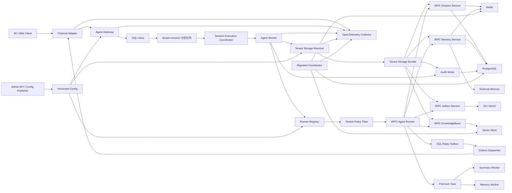
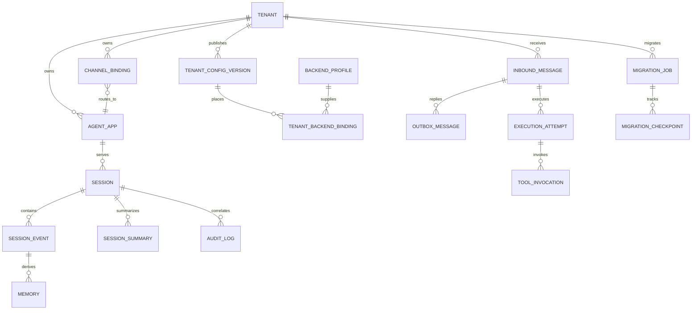
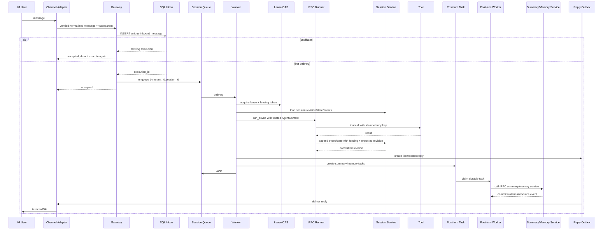

# 第二阶段开发方案：多后端共享状态、同步幂等与故障恢复

> 文档日期：2026-09-03
> 适用仓库：`trpc-agent-service`
> 前置版本：第一阶段提交 `e3d14b4`
> 阶段定位：在第一阶段可信多租户运行内核之外，增加可跨节点使用的持久化、可靠消息和迁移能力
> 当前状态：开发方案，本文出现的模块在测试通过前均不得标记为已实现

## 1. 文档目的

本文是第二阶段的开发、评审和验收依据，目标是让后续开发 Agent 可以在不重新解释需求、不改变第一阶段身份语义、不复制 tRPC-Agent 执行内核的前提下完成实现。

第二阶段解决以下问题：

1. 不同租户可以为 Session、Memory、Summary、Artifact、Knowledge 和 Audit Log 选择兼容的数据后端；
2. 任意 Agent Worker 都可以从共享后端恢复同一租户、同一 Session 的上下文；
3. 同一 Session 被多个节点并发处理时，不丢 Event、不覆盖 State、不重复执行副作用；
4. Summary、Memory 等派生数据有明确的生成顺序、水位、幂等和重试语义；
5. IM 重复回调、Worker 崩溃、数据库短暂不可用等情况能够恢复到明确状态；
6. 单个租户能够从 Redis Session 迁移到 SQL，或从本地向量索引迁移到远程向量库，并保留回滚窗口；
7. 数据模型能够表达 tenant、agent、channel binding、session、event、memory、summary 和 audit log 的关系；
8. 提供真实 Redis、SQL、向量库和对象存储的最小集成环境，为后续 Gateway、IM 和生产部署打基础。

本文中的“支持多后端”不表示任意数据类型可以写入任意后端，而表示租户可以从平台注册且满足能力要求的后端中选择。

## 2. 第一阶段基线与不可破坏约束

第二阶段必须复用第一阶段已经稳定的边界：

- `TenantConfig` 是运行时租户配置事实来源；
- 外部请求不能直接指定 `tenant_id` 或 `agent_app_id`；
- Channel Binding 验签成功后才能生成 `ResolvedRoute`；
- 内部用户和 Session ID 继续使用租户 HMAC 规则；
- `partition_key` 继续使用 `tenant_id:session_id`；
- Runner 继续按 `(tenant_id, agent_app_id, config_version)` 精确选择；
- Runner 的 `app_name` 继续使用稳定的 `{tenant_id}:{agent_app_id}`；
- AgentContext 中的平台元数据不可被调用方冲突覆盖；
- 工具原始参数、工具结果、thought 和内部异常不得进入 Channel Event；
- 禁止通过默认租户、默认 Runner、默认密钥或原始外部 ID 回退来掩盖错误。

第二阶段可以在这些边界外增加持久化和调度，但不得重新定义 tenant、user、session、runtime key 或通道安全投影。

## 3. tRPC-Agent 复用边界

### 3.1 直接复用

| tRPC-Agent 能力 | 第二阶段用法 |
|---|---|
| `Runner.run_async()` | 保持为 Agent 执行唯一入口 |
| `Content`、`Part`、`Event` | 保持为消息和事件领域模型 |
| `SessionServiceABC` | 作为 Session 运行时接口 |
| `InMemorySessionService` | 仅用于单节点测试和基准 |
| `RedisSessionService` | 作为 Redis Session 后端基础实现 |
| `SqlSessionService` | 作为 SQL Session 后端基础实现 |
| `MemoryServiceABC` | 作为长期 Memory 运行时接口 |
| InMemory/Redis/SQL/Mem0/MemPalace Memory | 按租户配置构建和注入 |
| Session Summarizer | 复用摘要生成和上下文压缩语义 |
| `ArtifactServiceABC` | 作为对象存储 Artifact 的接口契约 |
| `KnowledgeBase` 和 LangChain Knowledge | 作为向量检索和 RAG 入口 |
| OpenTelemetry Runner/Agent/LLM/Tool Span | 继承现有 Trace，并补平台 Span |

### 3.2 平台新增

以下能力不由 tRPC-Agent 直接保证，必须在平台层实现：

- Backend Profile 和租户后端绑定；
- Storage Resolver 与连接池生命周期；
- tenant namespace 二次校验；
- Session 分区、lease、fencing token 和 revision CAS；
- SQL Inbox/Outbox；
- 工具调用幂等账本；
- 持久化 Summary/Memory Post-turn Task；
- 跨后端迁移、双写、校验、切换和回滚；
- Audit Log 存储与查询边界；
- Storage、Inbox、Outbox、Migration 的指标和 Span；
- 多节点故障恢复和容量验证。

### 3.3 禁止依赖私有实现

平台代码不得直接依赖 tRPC-Agent 中以下划线开头的模块。需要增强并发语义时，优先采用：

1. 在整个 `Runner.run_async()` 外围持有 Session execution lease；
2. 使用实现公开接口的 Guarded/Delegating Service 包装 tRPC Service；
3. 通过稳定 AgentContext 或调用上下文传递平台 execution 信息；
4. 公共接口确实不足时，形成独立上游修改并固定版本，不在服务仓库散落 monkey patch。

### 3.4 依赖基线门禁

当前本机的 `trpc-agent-py 1.1.11` 是指向 `trpc-agent-python-fork` 的 editable 安装，而服务仓库只声明版本范围。第二阶段第一项任务必须选择可复现基线：

- 优先使用已经包含所需修复的正式版本；或
- 临时固定到明确的 fork commit；
- CI、开发机和 Docker 镜像使用相同来源；
- 运行官方 Session/Memory 测试和现有 replay consistency harness；
- 禁止以未声明的本地 editable 路径作为验收环境。

未完成该门禁前，不开始持久化实现。

## 4. 阶段范围

### 4.1 本阶段包含

- Backend Profile、Backend Binding、capability 和错误模型；
- 租户级 Storage Resolver 与 Service Bundle；
- tRPC InMemory/Redis/SQL Session 接线；
- tRPC InMemory/Redis/SQL 及可选外部 Memory 接线；
- Summary 可靠任务和水位；
- 基于 S3 API 的 MinIO/S3 Artifact Service；
- 本地向量实现与一个远程向量后端的 Knowledge 接线；
- SQL Audit Log；
- SQL Inbox、Outbox 和 Tool Invocation；
- Session lease、fencing 和 revision/CAS；
- Redis→SQL Session 迁移；
- 本地→远程向量索引迁移；
- 基本故障分类、有限重试、熔断和降级；
- 容量所需指标；
- Docker Compose 真实后端和两个 Worker 的集成验证；
- 数据模型、架构图、时序图、同步幂等说明和风险清单。

### 4.2 本阶段不包含

- 完整 Admin 管理页面；
- 企业微信生产账号联调；
- 通用工作流编排或 Saga 框架；
- 跨地域双活；
- 自动化灾备切换；
- 完整 Kubernetes/Helm 生产部署；
- 任意数据类型到任意后端的自由组合；
- 在同一 Agent 执行中动态切换配置版本；
- 对已经产生外部副作用的工具进行自动整轮重放。

本阶段需要给出 Kubernetes 生产拓扑和运行约束，但完整生产清单可以在后续阶段实现。

## 5. 关键设计决策

### 5.1 受约束的租户后端选择

用户只能从平台管理员注册的 Backend Profile 中选择，不能直接提交数据库 DSN、密码或任意网络地址。每个 Profile 包含：

- `profile_id`；
- backend kind 和 provider；
- endpoint/region 等非敏感连接信息；
- Secret Reference；
- 连接池、超时、TLS、TTL 等配置；
- capability；
- `profile_revision`；
- 启用状态和健康状态。

租户配置保存 `profile_id + namespace`，运行时由 Storage Resolver 解析。

### 5.2 后端兼容矩阵

| 数据类型 | InMemory | Redis | SQL | 向量库 | 对象存储 | 外部 Memory |
|---|---:|---:|---:|---:|---:|---:|
| Session | 开发 | 支持 | 支持 | 不支持 | 不支持 | 不支持 |
| Memory | 开发 | 支持 | 支持 | 专用 Adapter | 不支持 | 支持 |
| Summary | 开发 | 支持 | 支持 | 不支持 | 不支持 | 不支持 |
| Artifact | 开发 | 不支持 | 仅元数据 | 不支持 | 支持 | 不支持 |
| Knowledge | 本地开发 | 不支持 | pgvector 可选 | 支持 | 保存原文 | 不支持 |
| Audit Log | 不支持 | 仅临时缓冲 | 支持 | 不支持 | 仅归档 | 不支持 |

配置发布时必须执行 capability validation。多 Worker 生产配置不得使用 InMemory Session/Memory。

### 5.3 默认生产组合

默认推荐配置为：

- Session、Summary：PostgreSQL；
- Redis：队列、lease、限流和热缓存；
- Memory：SQL 或租户明确选择的外部 Memory；
- Knowledge：远程向量库；
- Artifact：S3/MinIO；
- Audit、Inbox、Outbox、迁移账本：PostgreSQL。

低延迟租户可以选择 Redis Session/Summary，但必须启用持久化、备份和 Redis→SQL 迁移能力。

### 5.4 Summary 默认跟随 Session

第二阶段保留 `summary` 配置项，但默认要求 Summary 与 Session 使用相同 backend kind 和 profile。这样可以复用 tRPC Session Summary，并避免第一版就引入跨库 Summary 水位提交。

只有在实现独立 Summary Store、持久化水位和 reconciliation 后，才允许 Summary 与 Session 分离。

### 5.5 平台 SQL 是必需基础设施

即使租户选择 Redis Session，平台仍需要中央 SQL 保存：

- Tenant/Agent/Channel/Backend 配置版本；
- Inbox/Outbox；
- Audit Log；
- Tool Invocation；
- Post-turn Task；
- Migration Job/Checkpoint；
- 成本和可靠性账本。

租户选择的是运行数据放置，不是移除平台控制面和可靠性数据库。

### 5.6 不声明 exactly-once

平台采用至少一次投递、幂等存储和副作用幂等键，提供 effectively-once 业务效果。任何设计和文档不得宣称跨 IM、队列、模型、工具和多个数据库的严格 exactly-once。

## 6. 目标架构



## 7. 核心组件与职责

### 7.1 Backend Profile Registry

保存平台允许使用的后端配置。Registry 返回的是经过校验的 Profile，不返回明文密钥。Secret 仅在创建连接时由 Secret Resolver 获取，并不得写入 `repr`、日志、Trace 或异常文本。

### 7.2 Tenant Storage Resolver

输入：

- `tenant_id`；
- `agent_app_id`；
- `config_version`；
- `storage_revision`。

输出 Tenant Storage Bundle。Resolver 必须：

- 精确解析版本，不使用“最新版本”隐式回退；
- 校验每类后端 capability；
- 校验 namespace 等于 tenant；
- 复用按 Profile 管理的连接池；
- 使用 tenant-scoped wrapper，避免共享连接池导致共享数据作用域；
- 支持新旧版本并存和 drain；
- 缓存键包含 profile revision；
- 配置撤销时不关闭仍有在途请求使用的 Service Bundle。

### 7.3 Session Execution Coordinator

对一个 `tenant_id:session_id` 提供：

- 分区消息消费；
- lease 获取、续约和释放；
- 单调 fencing token；
- execution deadline；
- revision 冲突处理；
- Worker 终止时的 drain；
- 失败后的重试或 dead-letter 决策。

Coordinator 包围整个 Runner 执行，但不得在模型调用期间持有数据库事务。

### 7.4 Guarded Session Service

实现 tRPC SessionService 公共接口并委托给选定后端，同时增加：

- tenant/app/user/session key 校验；
- execution ID 和事件幂等；
- fencing token 检查；
- revision/CAS；
- 统一错误映射；
- Storage Span 和指标；
- 后端关闭和 drain 生命周期。

### 7.5 Durable Post-turn Worker

Runner 成功提交 Event/State 后创建持久化任务，再由后台 Worker 调用 tRPC 的 Summary 和 Memory 能力。任务不能只存在于 Python 进程内存。

### 7.6 Migration Coordinator

以 `tenant_id + resource_type` 为迁移粒度，管理 source、target、checkpoint、dual-write、verify、cutover 和 rollback。不得一次性切换全部租户。

## 8. 数据模型

### 8.1 关系概览



所有业务主键、唯一键、Redis key、向量 metadata 和对象存储 prefix 必须包含 tenant scope。

### 8.2 控制面核心表

#### `tenants`

| 字段 | 说明 |
|---|---|
| `tenant_id` | 主键 |
| `name` | 展示名称 |
| `status` | active/suspended/disabled |
| `active_config_version` | 当前发布版本 |
| `created_at/updated_at` | 审计时间 |

#### `tenant_config_versions`

唯一键为 `(tenant_id, config_version)`，保存不可变配置快照、发布状态、创建者、发布时间和内容 hash。已发布版本不得原地修改。

#### `backend_profiles`

包含 `profile_id`、kind、provider、非敏感 endpoint、`secret_ref`、options、capabilities、`profile_revision` 和 status。禁止保存明文 Secret。

#### `tenant_backend_bindings`

唯一键为 `(tenant_id, config_version, resource_type)`，保存 `profile_id`、namespace、读写角色和 storage revision。

#### `agent_apps`

唯一键为 `(tenant_id, app_id, config_version)`，表达 Agent、模型和工具策略版本。

#### `channel_bindings`

保存 tenant、binding、channel、webhook public ID、external account、agent app、credential ref 和状态。`(channel, webhook_public_id)` 全局唯一。

### 8.3 运行数据逻辑表

SQL Session 后端必须至少表达以下结构；Redis 后端使用等价逻辑字段和原子操作。

#### `sessions`

- 主键：`(tenant_id, app_id, user_id, session_id)`；
- 关键字段：`revision`、`next_event_seq`、`state_json`、`last_fencing_token`、`created_at`、`updated_at`；
- 更新必须检查 expected revision 和 fencing token。

#### `session_events`

- 主键或唯一键：`(tenant_id, session_id, event_id)`；
- 顺序唯一键：`(tenant_id, session_id, seq_no)`；
- 字段：app/user、execution ID、invocation ID、author、event type、content、state delta、时间；
- partial Event 不写为正式会话事实。

#### `session_summaries`

- 唯一键：`(tenant_id, session_id, version)`；
- 字段：summary ID、`covered_event_seq`、summary text、model/version、replaces、时间；
- `covered_event_seq` 和 version 只能单调增加。

#### `memories`

- 主键：`(tenant_id, user_id, memory_id)`；
- 幂等键：`(tenant_id, source_event_id, memory_type)`；
- 字段：内容、metadata、embedding ref、provider version、状态、时间。

#### `artifact_metadata`

- 唯一键：`(tenant_id, artifact_id, version)`；
- 字段：session/user、filename、object URI、mime、size、content hash、状态；
- 文件正文在对象存储，SQL 只保存元数据。

#### `knowledge_bases`、`knowledge_documents`、`knowledge_index_versions`

保存 tenant、knowledge base、原文 object URI、文档/chunk 版本、embedding model、维度、vector profile、active index version 和构建状态。向量库 metadata 必须包含 tenant、knowledge base、document、chunk 和 index version。

#### `audit_logs`

至少包含 tenant、channel、user、session、agent、tool、decision、latency、error type、cost、trace ID、request ID、policy/config version、redaction flag 和时间。默认不保存原始 prompt、工具参数和工具结果。

### 8.4 可靠性和迁移表

#### `inbound_messages`

唯一键：`(tenant_id, channel_binding_id, external_message_id)`。保存 payload hash、execution ID、状态、attempt、错误、下一次重试时间和创建时间。

#### `execution_attempts`

保存 execution ID、attempt ID、Worker、config/storage version、开始/结束时间、状态和错误分类。

#### `outbox_messages`

唯一键：`(tenant_id, inbound_message_id, part_no)`。保存通道 payload、状态、attempt、next retry、delivery ID 和错误。

#### `tool_invocations`

唯一键：`(execution_id, tool_call_id)`。保存工具名、幂等键、请求/结果 hash、外部操作 ID、状态和错误。不得默认存储原始敏感参数。

#### `post_turn_tasks`

唯一键：`(tenant_id, session_id, task_type, source_event_seq)`。支持 summary 和 memory，保存状态、attempt、lease、next retry 和错误。

#### `migration_jobs`、`migration_checkpoints`

Migration Job 保存 tenant、resource type、source/target profile、状态、起始/切换水位、配置版本、回滚截止时间；Checkpoint 保存分区、最后 source key/revision、复制数量、校验数量和错误。

## 9. 数据物理映射

### 9.1 SQL

适合：配置、Session/Event/State/Summary、Audit、Inbox/Outbox、任务和迁移账本。使用事务、唯一约束和 revision 乐观锁保证正确性。

### 9.2 Redis

适合：低延迟 Session、lease/fencing、限流、热缓存和可选 Memory。Key 必须包含 tenant/app/user/session；使用 Lua 或等价原子操作提交 Event、State、revision 和 fencing 检查。Redis 作为 Session 主存储时必须配置持久化、备份和恢复策略。

### 9.3 向量库

适合：Knowledge chunk 和语义 Memory。向量数据是可重建索引，不是原始文档唯一事实来源。检索必须强制 tenant/knowledge base/index version filter。

### 9.4 对象存储

适合：原始文档、图片、文件和 Artifact。对象路径使用 `tenants/{tenant_id}/...` 前缀；写入后校验 hash，再提交 SQL 元数据；删除使用 tombstone 和异步清理。

### 9.5 外部 Memory

通过 tRPC Memory Service 接入。必须记录 provider request ID、状态、版本、重试和可见性时间。外部服务不可用时按租户策略降级为 Session-only，不允许自动读取其他租户或其他 Provider。

## 10. Session 并发一致性

### 10.1 目标语义

同一 Session 的正式提交表现为串行顺序。不同 Session 可以并行。队列分区是主要排序手段，lease/fencing/CAS 是重平衡、超时和重复投递下的最终正确性保障。

### 10.2 执行流程

1. Inbox 首次插入成功，生成稳定 `execution_id`；
2. 消息以 `tenant_id:session_id` 为 key 入队；
3. Worker 获取 Session lease 和单调 fencing token；
4. 读取 Session revision、Event/State、Summary 和必要 Memory；
5. 调用 tRPC Runner，执行期间续约 lease，但不持有 SQL 长事务；
6. 每个正式 Event 使用稳定 event ID 和 seq 提交；
7. 提交检查 tenant scope、fencing token 和 expected revision；
8. Event 和对应 State delta 在同一后端原子更新；
9. 最终结果提交后创建 Reply Outbox 和 Post-turn Task；
10. 成功后确认队列消息并释放 lease。

若 CAS 冲突发生在任何副作用工具执行前，可重新加载后排队重试；若已执行副作用，不能盲目重跑，必须根据 Tool Invocation 状态恢复或进入人工处理。

### 10.3 Redis 和 SQL 的原子边界

- SQL：短事务更新 Session revision/state、插入 Event；同一数据库中的 Outbox 可同事务写入；
- Redis：Lua/事务原子校验 fencing/revision 并更新 Session/Event；
- Redis Session 与 SQL Outbox 之间不使用分布式事务；使用 execution/event ID、幂等重放和 reconciliation 修复“Redis 已提交、SQL 未更新”；
- 任何跨存储双写都必须有持久化状态，不允许捕获异常后只写日志。

## 11. Event、State、Summary、Memory 顺序

正确顺序为：

```text
Inbound durable
→ Session snapshot
→ Runner execution
→ Event + State atomic commit
→ Reply Outbox
→ Summary/Memory durable task
→ Summary/Memory write
→ watermark advance
```

约束：

- Event 是事实源，Summary 和 Memory 是派生数据；
- State 和产生它的 Event 同一次 Session commit；
- partial stream 不作为正式 Event；
- Summary 使用 `covered_event_seq`，旧任务不得覆盖高水位；
- Memory 使用 `source_event_id` 幂等；
- Summary/Memory 失败不删除或回滚已提交 Event；
- Summary 成功前不裁剪被覆盖 Event；
- 同一 Session 下一轮可以依赖 Event 立即看到刚提交内容，不依赖异步 Memory 立即可见；
- 跨 Session Memory 允许最终一致，但必须有 visibility lag 指标和可配置 SLA。

## 12. IM、工具和回复幂等

### 12.1 入站消息

首次 Inbox 插入成功才执行 Agent。重复消息处理规则：

- 原任务运行中：立即确认已接收，不创建新 execution；
- 原任务成功：不重复执行，可返回已有状态；
- 原任务可重试失败：复用 execution ID 和幂等键；
- 相同 external message ID 但 payload hash 不同：拒绝并产生安全审计。

### 12.2 工具

- 只读工具可以有限自动重试；
- 有原生幂等键的写工具使用稳定 `execution_id + tool_call_id`；
- 无幂等保证的副作用工具不能自动重试；
- 超时且结果未知标记 `UNKNOWN_OUTCOME`，先查询外部系统或人工处理；
- 工具返回成功但 Session commit 失败时，重试必须读取 Tool Invocation 结果，不重新调用工具。

### 12.3 回复

Outbox Dispatcher 按通道限频投递。重复发送依赖 `inbound_message_id + part_no` 和通道 delivery ID 去重。发送失败进入有限重试，超过阈值进入 dead-letter；不能因为发送失败重新运行 Agent。

## 13. 核心时序



`trace_id`、`request_id`、`execution_id`、tenant、session、config version 和 storage revision 必须贯穿 Inbox、队列、AgentContext、Event metadata、Tool Invocation、Outbox、Audit 和 Trace。

## 14. 后端迁移

### 14.1 通用状态机

```text
PREPARING
→ BACKFILLING
→ DUAL_WRITE
→ VERIFYING
→ SHADOW_READ
→ CUTOVER
→ ROLLBACK_WINDOW
→ COMPLETED
```

失败状态至少区分 `PAUSED`、`FAILED_RETRYABLE`、`FAILED_FINAL` 和 `ROLLED_BACK`。每次状态转换写 Audit。

### 14.2 Redis Session 迁移到 SQL

1. 创建目标 Schema/namespace 并检查 capability；
2. 记录 source 起始 revision/watermark；
3. 幂等回填 Session、Event、State、Summary；
4. 迁移期间的新写入进入 dual-write 或可靠增量日志；
5. 比较 Session/Event 数、revision、最大 seq、State hash 和 Summary 水位；
6. 影子读取 SQL，但仍返回 Redis 结果；
7. 发布新的 tenant config/storage revision，将新请求切到 SQL；
8. 旧版本在途任务按原 storage revision 完成；
9. 保留 Redis 回滚窗口；
10. 稳定后停止双写并按保留策略归档旧数据。

回填和增量写必须保留原 event ID、seq、execution ID 和 revision。禁止迁移时重新生成业务 ID。

### 14.3 本地向量库迁移到远程向量库

- embedding 模型、维度、chunk 算法和 metadata schema 相同时，可以复制向量和 metadata；
- 任一项不兼容时，必须从对象存储原文重新切片和 embedding；
- 新索引使用独立 `index_version`；
- 构建期间双写或记录增量文档任务；
- 校验文档数、chunk 数、content hash、tenant filter 和典型查询召回；
- 通过 active index version/alias 切换；
- 保留旧索引用于回滚；
- 删除操作必须通过 tombstone 同步，不能只迁移仍存在的数据。

### 14.4 回滚原则

- 回滚是路由/配置版本切换，不是立即删除新后端；
- cutover 前必须确认 source 仍可读；
- 回滚时恢复到明确 storage revision；
- 回滚窗口内继续记录差异；
- 配置使用 expand→migrate→contract，旧代码仍能读取新 Schema；
- 不允许把 Agent 配置回滚与存储迁移回滚合并成一个无条件操作。

## 15. 故障恢复与降级

| 故障 | 必需行为 | 禁止行为 |
|---|---|---|
| Worker 崩溃 | lease 到期、队列重新投递、复用 execution ID | 创建全新执行并重复工具副作用 |
| IM 重试 | Inbox 唯一键返回已有状态 | 再次调用 Runner |
| Session 后端不可用 | 有限重试、熔断、排队或失败；禁止副作用 | 使用空 Session 继续生产执行 |
| Audit 后端不可用 | 合规租户 fail closed；其他租户写可靠审计任务 | 静默丢弃审计 |
| Memory 不可用 | 降级为 Session-only，记录 degraded | 读取其他租户 Memory |
| Knowledge 不可用 | 关闭 RAG 或返回明确降级结果 | 无提示地编造检索结果 |
| Artifact 不可用 | 文本请求可继续；文件操作重试/失败 | 生成不存在的对象 URI |
| 模型超时 | 记录 attempt，按租户策略有限 fallback | 已产生副作用后整轮盲重放 |
| 工具查询失败 | 有限重试 | 无限重试 |
| 工具副作用结果未知 | `UNKNOWN_OUTCOME`、查询或人工处理 | 自动再次执行 |
| Outbox 发送失败 | 独立重试和 dead-letter | 重跑 Agent |
| CAS 冲突 | 无副作用时重新加载并排队 | last-write-wins 覆盖 |

统一 Storage 错误至少包含：`TransientStorageError`、`ConflictError`、`UnavailableError`、`PermanentStorageError`、`TenantBoundaryError`。重试策略必须有最大次数、最大总时长和指数退避抖动。

## 16. 灰度发布和租户级配置回滚

### 16.1 版本固定

每条 Inbox/队列消息固定：

- tenant；
- agent app；
- config version；
- policy version；
- storage revision。

开始执行后不得跟随“最新配置”变化。

### 16.2 灰度选择

使用 `hash(tenant_id + session_id)` 做稳定分桶，支持指定租户、用户、Session 和百分比。禁止每条消息随机版本，以免同一 Session 在新旧版本之间跳动。

### 16.3 自动停止指标

至少监控：错误率、模型超时、工具失败、CAS 冲突、p95/p99 延迟、token/成本变化、Outbox backlog、Post-turn lag、后端连接池和迁移差异。超过租户级阈值停止扩大灰度，并保留旧 Runner/Storage Bundle。

### 16.4 回滚语义

Agent 版本回滚继续使用稳定 `tenant_id:app_id` Session namespace。存储版本回滚使用迁移状态机和回滚窗口，不删除已经写入目标的数据。正在执行的旧版本请求允许按其固定版本完成或被明确取消，不在中途换后端。

## 17. 容量评估与指标

### 17.1 计算模型

- 平均在途 Agent 数约为 `有效消息率 × 平均 Agent 耗时`；`峰值消息率 × p95 Agent 耗时` 仅用于尾延迟余量估算；
- Worker 数约为 `在途 Agent 数 ÷ 单节点安全并发 ÷ 目标利用率`；
- 模型 TPM 约为 `峰值消息率 × 60 × 每条消息全部模型调用累计 token`；若已经累计全部调用，不再乘模型轮数；
- Redis QPS 约为 `峰值消息率 × 每次执行 Redis 操作数`；
- SQL QPS 包含 Inbox、Session/Event、Outbox、Audit、Tool、Post-turn 和 Migration；
- 总数据库连接必须满足 `副本数 × 单副本池上限 <= 数据库连接预算`。

容量报告必须使用实测 p50/p95/p99，不只使用平均值。常态目标利用率保留故障和流量突发余量。

### 17.2 必需指标

| 维度 | 指标 |
|---|---|
| Gateway | callback QPS、验签耗时、Inbox 插入耗时、duplicate rate |
| Queue | backlog、oldest age、partition skew、redelivery |
| Worker | active runs、run latency、timeouts、cancel、lease lost |
| Session | get/append latency、revision conflict、fencing reject、event bytes |
| Memory/Summary | task backlog、visibility lag、watermark、retry/failure |
| Redis | command QPS、latency、pool usage、errors、memory/eviction |
| SQL | query/transaction QPS、latency、pool usage、deadlock、rollback |
| Vector | index lag、query latency、filter miss、recall sample |
| Object | upload/download latency、bytes、hash mismatch、orphan count |
| Model | first token、total latency、input/output token、RPM/TPM、cost |
| Tool | calls、latency、retry、unknown outcome、cost |
| Outbox | pending、oldest age、delivery success、dead-letter |
| Migration | copied/verified/diff records、lag、cutover readiness |

高基数 user/session 不作为 Prometheus label；精确记录写入 Trace、Audit 或成本账本。

### 17.3 热 Session

同一 Session 串行时，其最大吞吐近似 `1 / 平均 Agent 耗时`。增加 Worker 不能消除单一热门群聊的排队。必须监控分区倾斜，并允许消息合并、节流、取消未开始任务或为热点租户设置独立队列。

## 18. 部署方案

### 18.1 第二阶段最小可运行环境

Docker Compose 至少包含：

- Gateway/测试入口；
- 两个 Agent Worker；
- PostgreSQL；
- Redis；
- 一个远程向量库，或 PostgreSQL + pgvector；
- MinIO；
- OpenTelemetry Collector；
- 可选 Trace/Metric 查看组件；
- 数据库 migration job 和集成测试入口。

必须用两个独立 Worker 进程验证第一轮和第二轮跨节点恢复、同 Session 并发、Worker kill、消息重投和 Post-turn 任务恢复。

### 18.2 生产推荐拓扑

Kubernetes 中建议拆分：Channel/Gateway、Agent Worker、Outbox Dispatcher、Post-turn Worker、Migration Worker、Admin API 和 Telemetry Collector。Worker 按 backlog、oldest age 和 active runs 扩缩容；数据库、Redis、对象和向量存储优先使用高可用托管服务。

代码必须支持 readiness/liveness、SIGTERM drain、可配置连接池、只读 Secret、非本地持久化和独立 migration job。后续生产阶段补充 HPA/KEDA、PDB、topology spread、NetworkPolicy、备份恢复和跨可用区演练。

## 19. 安全和租户隔离

- 所有 Adapter 方法必须接收或绑定可信 tenant scope；
- SQL 使用包含 tenant 的复合主键和查询条件；
- Redis key、向量 metadata、对象 prefix 均包含 tenant；
- Tenant 不能提交 DSN，只能选择 Backend Profile；
- Profile Secret 使用 Vault/KMS/Secret Manager reference；
- 连接错误不得包含完整 DSN；
- Audit 默认记录 hash/摘要，不记录原始工具参数和结果；
- Migration 和管理员跨租户查询使用独立高权限身份并强制审计；
- 测试必须包含故意错误 namespace、缺失 filter 和跨租户 ID 的拒绝用例。

## 20. 建议代码结构

后续 Agent 可以根据实现反馈微调文件名，但不得改变职责边界。

```text
trpc_service/
├── storage/
│   ├── models.py              # BackendProfile、Binding、版本与 capability
│   ├── errors.py              # 统一错误分类
│   ├── resolver.py            # TenantStorageResolver
│   ├── bundle.py              # TenantStorageBundle 和生命周期
│   ├── session.py             # Guarded tRPC SessionService
│   ├── memory.py              # tenant-scoped tRPC MemoryService
│   ├── artifact.py            # S3/MinIO ArtifactServiceABC 实现
│   ├── knowledge.py           # Knowledge/向量绑定和 filter
│   └── audit.py               # SQL Audit Writer
├── reliability/
│   ├── inbox.py
│   ├── outbox.py
│   ├── execution.py           # lease/fencing/revision coordinator
│   ├── tool_invocation.py
│   └── post_turn.py
├── persistence/
│   ├── models.py              # SQLAlchemy 数据模型
│   ├── repositories.py
│   └── migrations/            # Alembic 或等价数据库迁移
├── migration/
│   ├── models.py
│   ├── coordinator.py
│   ├── session_migration.py
│   └── vector_migration.py
└── telemetry/
    └── storage.py

tests/
├── storage/
├── reliability/
├── migration/
├── integration/
└── failure/
```

## 21. 开发顺序和每步退出条件

### 步骤 0：固定 tRPC 依赖

- 选择正式版本或固定 fork commit；
- CI/Docker 使用同一来源；
- 第一阶段 47 项测试继续通过；
- replay consistency 基线通过。

### 步骤 1：固定存储领域模型和 SQL Schema

- Backend Profile/Binding/capability/error 模型完成；
- 核心表、唯一键和状态机完成迁移；
- tenant namespace 和配置引用校验有测试；
- 暂不连接 Runner。

### 步骤 2：实现 Storage Resolver 和 Service Bundle

- 两个租户解析到不同后端；
- Profile 连接池复用但 tenant scope 不共享；
- 新旧配置版本可并存；
- InMemory 在多 Worker 生产配置中被拒绝。

### 步骤 3：接入 tRPC Session/Memory/Summary

- InMemory、Redis、SQL 运行同一契约测试；
- tRPC Runner 完成真实多轮执行；
- Summary 与 Session 同源；
- Memory 跨 Session/跨 Worker 可见。

### 步骤 4：实现 Inbox/Outbox 和执行协调

- IM 消息重复投递只产生一次 execution；
- 同 Session 两个 Worker 不覆盖；
- fencing 和 revision 冲突可观测；
- Worker kill 后任务恢复；
- 回复发送失败不重跑 Agent。

### 步骤 5：实现 Durable Post-turn

- Summary/Memory 任务持久化；
- Worker 重启后继续；
- `covered_event_seq` 和 `source_event_id` 幂等；
- 旧任务不能覆盖新水位。

### 步骤 6：实现 Artifact、Knowledge 和 Audit

- Artifact 经 tRPC 接口写 MinIO/S3；
- Knowledge 使用本地和远程向量后端，强制 tenant filter；
- Audit 字段满足验收，敏感数据不落库；
- 故障降级符合租户策略。

### 步骤 7：实现迁移和回滚

- Redis→SQL 回填、双写、校验、切换、回滚；
- 本地→远程向量迁移和索引版本切换；
- 迁移可暂停、恢复、重跑；
- 故障注入无数据静默丢失。

### 步骤 8：Compose、容量和最终验收

- 两个 Worker 和四类真实后端启动；
- 执行负载与故障场景；
- 输出容量原始数据和计算结果；
- 全量测试、lint、diff check 通过；
- 仅在全部证据完成后更新 README 为第二阶段完成。

## 22. 测试计划

### 22.1 后端契约测试

同一组输入分别运行 InMemory、Redis 和 SQL，归一化比较 Event、State、Summary 和 Memory。复用已有 replay consistency harness 的思路和用例，覆盖重启、重复 Event、部分失败、Summary lineage、跨 Session Memory 和跨用户隔离。

### 22.2 多租户测试

- 相同 app/user/session 字面值在两个 tenant 中不能互见；
- 错误 SQL tenant 条件、Redis key、向量 filter 和对象 prefix 被拒绝；
- 两租户分别使用 Redis Session 和 SQL Session；
- 一个租户迁移不影响另一个租户。

### 22.3 并发测试

- 两 Worker 同时读取同一 revision；
- 一个成功、另一个 CAS 冲突并安全处理；
- lease 过期后旧 Worker 的 fencing token 被拒绝；
- 100 次并发写入后 Event seq 连续、State 无覆盖；
- 有副作用工具后不自动整轮重放。

### 22.4 幂等测试

- 同一 callback 并发重放；
- 相同 ID 不同 payload；
- Session commit 前后分别崩溃；
- Outbox 发送前后分别崩溃；
- Tool 成功但 Worker 超时；
- Summary/Memory 任务重复投递。

### 22.5 迁移测试

- 迁移期间持续写入；
- Backfill 中断后从 checkpoint 恢复；
- target 部分失败后补偿；
- shadow read 差异阻止 cutover；
- cutover 后回滚；
- 向量 embedding 不兼容时重新构建；
- tombstone 正确迁移。

### 22.6 故障测试

- kill Worker；
- Redis/SQL 短暂断连；
- 模型超时；
- 工具返回失败或未知结果；
- MinIO/Qdrant 不可用；
- OTel Collector 不可用不影响业务正确性；
- Audit fail-closed 与 fail-open policy 分别验证。

## 23. 验收标准映射

| 总体验收项 | 第二阶段责任 | 验收证据 |
|---|---|---|
| 多租户、节点、同步、后端、IM、治理、恢复 | 完成共享状态、可靠性层和模拟 IM 入口；保留第一阶段路由/Filter | 双租户、双 Worker、真实后端和故障测试 |
| tenant/agent/binding/session/event/memory/summary/audit 关系 | 完成逻辑模型、SQL Schema 和后端物理映射 | ER 图、数据库迁移、关系与隔离测试 |
| 至少两种 IM，含微信/企业微信 | 本阶段完成通道无关 Inbox/Outbox 契约和 Fake Adapter；真实通道属于后续阶段 | 重复回调、分片和投递重试测试，不提前宣称真实通道完成 |
| 至少三类后端 | 实现并说明 Redis、SQL、向量库、对象存储四类 | Compose 集成测试和 capability 报告 |
| 完整消息链路与 trace/request ID | 扩展到 Inbox、Queue、Storage、Tool、Post-turn、Outbox | 时序图和同一 trace 的集成证据 |
| 至少 8 个生产风险 | 本文列出并在本阶段验证与存储相关的风险 | 风险测试和故障注入结果 |
| tRPC 复用与平台新增边界 | 固定依赖版本，只包装公共接口 | 依赖锁定、接口测试和代码评审 |

### 数据模型关系

ER 图和核心表必须表达：tenant 拥有 agent/channel/session/memory/audit；channel binding 路由到 agent；agent 服务 session；session 包含 event/summary；event 派生 memory；audit 通过 tenant/session/request/trace 关联执行链。

### 至少三类后端

本阶段提供并说明四类：

1. Redis：Session、lease、限流和热缓存；
2. SQL：配置、Session、Audit、Inbox/Outbox 和可靠任务；
3. 向量库：Knowledge 和语义 Memory 索引；
4. 对象存储：原始文档、文件和 Artifact。

每类都必须有存储内容、一致性、延迟、成本、故障、迁移和隔离说明，并至少有一个真实集成测试。

### 故障恢复和运维

节点故障、IM 重试、数据库短暂不可用、模型超时和工具失败必须有状态机和自动化测试；灰度/回滚必须固定 config/storage version；容量报告必须包含 Worker、token、Redis、SQL、IM 和队列数据；Compose 必须可运行，Kubernetes 给出生产拓扑和约束。

### 阶段交付物

- 本开发方案及实现完成后的架构设计更新；
- 包含 Gateway、Worker、Channel Adapter、Storage Resolver/Adapter、Filter、Telemetry 和各后端的架构图；
- 包含企业微信语义入口、Runner、Tool、Session/Memory 和回复链路的核心时序图；
- 可执行 SQL migration 与 Redis/向量/对象物理映射说明；
- 独立的数据同步和幂等说明及对应自动化测试；
- Redis、SQL、向量库、对象存储的适用范围和 capability 报告；
- 不少于 8 项的风险清单和故障注入结果；
- GitHub 仓库中的实现代码、测试、Compose、运行命令和当前未实现项说明。

## 24. 生产风险清单

| 风险 | 缓解措施 |
|---|---|
| IM 重复投递 | Inbox 唯一键和 payload hash |
| 同 Session 并发覆盖 | 分区、lease、fencing、revision CAS |
| Worker 崩溃 | 延后 ACK、execution ID、任务接管 |
| 锁过期后旧 Worker 写入 | 单调 fencing token |
| Session 已写但消息/回复丢失 | Outbox、幂等重放、reconciliation |
| 数据库短暂不可用 | 有限重试、熔断、背压和 fail-closed 策略 |
| 工具副作用重复 | Tool Invocation 和业务幂等键 |
| 模型超时导致整轮重放 | attempt 状态和副作用边界 |
| Summary/Memory 任务丢失 | Durable Post-turn Task |
| Summary 覆盖新数据 | covered event 水位和版本 CAS |
| 后端迁移漏数或重复 | checkpoint、双写、hash 校验和 shadow read |
| 配置回滚读不到新格式 | 不可变版本和 expand/migrate/contract |
| 跨租户泄漏 | 全链路 namespace、复合键、filter 和隔离测试 |
| Worker 扩容耗尽数据库连接 | 全局连接预算和池指标 |
| 热 Session 队列倾斜 | 分区指标、节流、合并和独立队列 |
| Memory 最终一致延迟 | visibility lag 和 Session Event 兜底 |
| 对象元数据与文件不一致 | hash、状态机、tombstone 和 orphan 扫描 |
| 本地 fork 不可复现 | 固定依赖来源和兼容性测试 |

## 25. 第二阶段完成定义

以下条件全部满足后才能标记第二阶段完成：

- [ ] tRPC-Agent 依赖来源和 commit/version 可复现；
- [ ] 第一阶段全部测试继续通过；
- [ ] 不复制 Runner/Event/Session/Memory/Summary 内核；
- [ ] Storage Resolver 可以为两个租户解析不同后端组合；
- [ ] InMemory、Redis、SQL Session 通过统一契约测试；
- [ ] Memory 跨 Session、跨 Worker 可见且租户隔离；
- [ ] Summary 水位、版本和重启恢复正确；
- [ ] 同 Session 多 Worker 无 Event 丢失和 State 覆盖；
- [ ] 旧 fencing token 无法写入；
- [ ] 重复 IM 消息只产生一个 execution；
- [ ] 工具和回复具有稳定幂等键；
- [ ] Worker 在关键提交点崩溃后可恢复；
- [ ] Artifact 通过 tRPC 接口写入对象存储；
- [ ] Knowledge 在本地和远程向量后端强制 tenant filter；
- [ ] Audit 字段满足要求且不含明文 Secret；
- [ ] Redis→SQL 迁移可以暂停、恢复、校验、切换和回滚；
- [ ] 向量索引迁移可以版本化切换和回滚；
- [ ] Redis、SQL、向量库、对象存储均有真实集成证据；
- [ ] Docker Compose 启动至少两个 Worker；
- [ ] 容量评估所需指标均可采集；
- [ ] 全量测试、lint 和 `git diff --check` 通过；
- [ ] README 只声明实际通过测试的能力。

## 26. 后续 Agent 开发守则

开始第二阶段任务前，Agent 必须按顺序阅读：

1. `README-开发原则.md`；
2. `docs/第一阶段补充开发方案.md`；
3. 本文；
4. `trpc_service/tenant/models.py` 和 `routing.py`；
5. `trpc_service/agent/runtime.py` 和 `bridge.py`；
6. 当前固定版本的 tRPC Session/Memory/Runner 公共接口。

每次开发应选择一个可独立验收的纵向切片，先写测试，再实现，再运行全量回归。不得在同一提交中同时修改租户身份规则、Session 语义、迁移状态机和部署基础设施。发现 tRPC 公共接口不足时，先记录具体缺口和最小扩展，不直接复制或重写上游实现。

任何阶段状态更新都必须引用可复现命令、通过的测试数量、真实后端组合和明确未实现项。设计图、Pydantic 模型、空 Adapter 或 Fake 后端不能单独作为“第二阶段完成”的证据。
