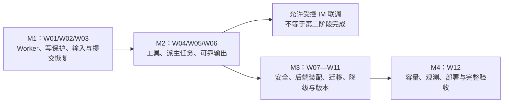

# 第二阶段补全开发方案：从存储组件到可靠双 Worker 闭环

> 后续实施记录：[双 Worker 服务运行与验收](双Worker服务运行与验收-2026-09-05.md)。下文保留原始评审基线，不能作为实施后的现状说明；完整阶段完成定义仍然有效。

> 日期：2026-09-05
> 状态：评审稿／待实施，不是完成声明。
> 对照基线：当前工作区源码、第二阶段原始开发方案、最近一次严格回归报告。
> 本次交付只补文档，不修改业务实现，不启动服务，不提交或推送代码。

## 1. 先看结论

第二阶段目前已有多后端存储适配、可靠性仓库、迁移工具及一批真实后端测试，但还没有形成可以独立部署、持续消费、故障后自动恢复的完整双 Worker 服务。

最重要的区别是：有 Inbox 表，不等于 Worker 已经消费；有 fencing 字段，不等于 SDK 的真实 Session 写入已经受到保护；有 Summary/Memory 任务，不等于业务处理器已经持续执行；有 Outbox，不等于消息已经可靠送达。

建议先补以下主线，再开始真实 IM 联调：

1. 固定版本的运行时装配、可信测试入口、Worker 持续领取及续租。
2. Session 底层原子写保护、稳定消息幂等、工具副作用账本接线。
3. 最终结果、Outbox、Summary/Memory 任务之间的提交和恢复闭环。
4. 双独立进程、真实后端、关键提交点故障验收。

这只是“允许开始 IM 联调”的门槛。在线迁移、完整降级、审计、容量和运维等原有要求仍需继续完成，不能因为开始下一阶段就从第二阶段清单中删除。

### 阅读路径

- 想知道哪里没做好：先看第 3、5 节。
- 想知道先开发什么：看第 6 节的 W01—W12 和第 9 节里程碑。
- 想判断是否真的完成：看第 7 节故障矩阵、第 8 节证据要求、第 11 节完成清单。
- 想复核依据：看第 12 节源码与报告索引。

## 2. 基线、证据等级与范围

### 2.1 最新已有证据

最近一次已有回归结果，不是编写本文时重新运行：

| 运行方式 | 结果 | 能证明什么 |
|---|---|---|
| 本地完整回归 | 117 passed、4 skipped，无 xfail | 本地单元／组件回归通过；4 项需要网络服务 |
| 新建测试镜像，real 模式完整严格回归 | 121 passed，无 skip/xfail | 被收集的全部断言通过；其中 E2E 使用真实四后端，但部分仓库测试仍使用 SQLite |
| 原运维故障用例 | 6 项全部通过，包含在 121 项内 | SQL/Redis 断连、领取后进程退出、模型错误和只读工具失败等限定场景 |
| 新增错误恢复用例 | 6 项全部通过，包含在 121 项内 | 普通执行、已有 Outbox、已有提交事件下的错误状态一致 |
| 容量样本 | 两种 Session 后端、8 档、384 条有效消息 | 单进程有限突发样本；不是固定资源生产容量，也未实际投递 IM |

原始证据：[严格回归 XML](../reports/known-fixes-real.xml)、[修复验收说明](已知缺陷修复与验收-2026-09-05.md)、[容量报告](容量基准报告-2026-09-05.md)。远端 CI 尚未执行本地最新变更。

本文状态统一使用：

- **已验证（限定范围）**：存在已运行测试，只对测试覆盖边界负责。
- **部分完成**：模块、接口或测试存在，但业务链路没有闭合。
- **待实施／待验收**：尚无完整实现或对应证据。
- **代码审查风险**：从代码发现的缺口，尚未专门编写故障复现；不得伪装成已经失败的测试。

不使用完成百分比：121 个测试不能换算成原始需求的覆盖百分比。

### 2.2 已修复，不应重复列为未完成的事项

原五项迁移失败及一项模型状态失败已修复：旧源回填先写坏目标、历史 delta 覆盖最终状态、同 chunk ID 跨租户覆盖、跨索引版本覆盖、只数数量即允许切换、模型错误被记录为成功。

修复后的 Session 复制要求目标停写。向量切换前重读校验不等于分布式原子发布。上述限制属于还需补全的能力边界，不是原用例重新失败。

### 2.3 不扩张，也不缩减原范围

第二阶段应完成可靠双 Worker、模拟 Channel 的完整输入输出、共享后端、可靠派生任务、迁移／回滚、基础降级及容量证据。

真实企业微信生产账号联调、完整 Admin UI、完整 Helm/Kubernetes 生产清单、跨地域双活、自动化灾备切换，仍按原方案属于后续工作。本文不把这些全部变成第二阶段阻断项。生产拓扑、部署约束和风险说明仍须交付。

遵守项目开发原则：复用 tRPC 公共接口，不复制执行内核，不新增通用 Saga 框架，不以 fallback 掩盖错误。必要的租户授权降级与兼容性兜底是两回事。新能力依赖 SDK 扩展时，须独立评审、在上游／固定 fork 实现公开接口；本文不授权修改其他仓库。

## 3. 原始要求逐项对照

| 要求 | 当前状态 | 还缺什么 | 补全任务 |
|---|---|---|---|
| 固定 tRPC 依赖 | 已验证（镜像） | 本地 editable 环境可能与固定 commit 不同；保留可复现安装证据 | W01、W12 |
| 租户与配置精确路由 | 已验证（测试链路） | 服务启动装配、版本分发、配置失效处理 | W01、W11 |
| Storage Resolver／多后端 | 部分完成 | Artifact/Knowledge/Audit 的统一运行时装配，不只是测试直接构造 | W01、W09 |
| InMemory/Redis/SQL Session | 已验证（契约及迁移样本） | 并发底层写入、摘要压缩后回放、完整跨节点执行 | W02、W05 |
| 双 Worker 持续消费 | 待实施 | CLI Worker 目前为等待停止信号的进程外壳 | W01 |
| 同 Session 串行与写保护 | 部分完成 | 实际 SDK 写路径未原子执行 fencing/CAS；缺续租 | W02 |
| Inbox 幂等 | 部分完成 | 传输字段或新路由版本变化下的重复回调；并发领取恢复 | W03 |
| 工具 effectively-once | 部分完成 | 真实 Tool 包装、稳定业务键、结果引用、未知结果对账 | W04 |
| Outbox 可靠投递 | 部分完成 | Dispatcher、顺序、重试上限、死信、发送成功但确认丢失 | W06 |
| Memory 跨 Session 可见 | 已验证（显式 SQL 重建等） | 自动处理、水位、重启追平和延迟监控 | W05 |
| Summary 可靠生成 | 部分完成 | SDK 摘要与平台水位接线、真实生成及重启恢复 | W05 |
| Artifact 多版本与隔离 | 已验证（顺序用例） | 并发版本分配、条件创建、孤儿对象与失败恢复 | W08 |
| Knowledge 隔离与内容校验 | 已验证（单节点后端样本） | RAG 运行时接线、持久索引版本发布、服务不可用策略 | W09、W10 |
| Audit Log | 部分完成 | 全链路审计、租户查询范围、深层脱敏、可靠失败策略 | W07 |
| Session／向量迁移 | 部分完成 | 真实持久 checkpoint、增量同步、写屏障、配置切换及自动恢复 | W10 |
| 基础故障降级 | 部分完成 | 超时约束、错误映射、有限重试、熔断与租户策略接线 | W11 |
| 灰度与租户回滚 | 部分完成 | 稳定分桶、版本发布、指标闸门、配置与存储回滚分离 | W11 |
| 容量、指标和 Trace | 部分完成 | 固定资源持续负载、实际消费者、真实 token 或明确模拟口径、端到端观测 | W12 |
| 最小 Compose | 部分完成 | 后端可启动；两个 Worker 容器存活不等于两个 Worker 在工作 | W01、W12 |
| 架构／模型／风险文档 | 已有 | 与最终代码同步，清除过时完成声明 | W12 |

## 4. 六类数据应如何收敛

| 数据 | 现有放置 | 必须建立的业务保证 | 当前不能声称的能力 |
|---|---|---|---|
| Session | tRPC InMemory/Redis/SQL；另有平台 SQL 执行账本 | 同会话受控写入、原子拒绝旧 owner/旧版本、事件与状态可回放 | 平台账本有 CAS 就等于真实 SDK Session 有 CAS |
| Memory | tRPC InMemory/Redis/SQL，当前主要为事件内容关键词检索 | Session 事实先提交，派生任务可重放、可追平；搜索只在可信用户／租户范围 | 已完成向量语义 Memory，或后台一定自动生成 |
| Summary | 与 Session 共用 SDK 后端；另有 SQL 版本／水位仓库 | 摘要对应明确原生事件边界，旧任务不得覆盖新版本；压缩后上下文仍可恢复 | 跟随同一后端就自然与平台水位原子一致 |
| Artifact | MinIO/S3，租户路径、应用层整数版本及 hash | 同名文件并发不覆盖，发布版本可读且 hash 正确，失败版本不暴露 | 当前按最大版本加一已经是不可变的并发安全版本 |
| Knowledge | 本地向量及 Qdrant，版本化索引和隔离 ID | 源文件可追溯，增删改最终进入目标索引；切换基于有效校验及持久配置 | wait=True 代表集群级强一致，内存中的版本指针代表生产路由 |
| Audit | SQL audit_logs | 关键决策有持久记录，查询按租户授权，敏感值不落库，故障不能静默丢日志 | 一个 write 方法等于完整审计覆盖或防篡改合规存储 |

整体目标不是把六类数据放进跨库大事务，而是：事实写入有明确提交边界；派生数据有可靠任务和水位；外部副作用有稳定幂等键及结果对账；失败不会被误记成成功。

后端取舍仍按运维文档执行：Redis 偏低延迟热数据，但单命令原子不覆盖读改写；SQL 适合事务性事实和账本，但不同事务／数据库仍有间隙；向量库偏检索而非事实账本；对象存储适合大文件，但对象与平台记录之间仍需协调。本文不提供未经实测的固定毫秒数或云成本报价。

## 5. 需要特别关注的未闭合边界

### 5.1 平台事件与 SDK 原生事件不是一回事

当前 Pipeline 在 Runner 产生通道事件后，把部分通道投影写入平台事件账本。SDK 的原生事件及状态已经通过另一套存储接口写入。平台 `seq_no` 不能未经映射直接作为 SDK Summary 的 `covered_event_seq`：一条原生事件可能投影成多条通道事件，部分内部事件又不对外投影。

补全时必须定义“谁是可恢复的事实来源”，记录 execution、原生 event ID/序号、平台事件、输出分片之间的关系。不允许把脱敏后的通道文本当作完整工具结果或原生会话历史来恢复。

### 5.2 成功结果恢复不应遗漏派生任务

现有正常路径会创建 Summary/Memory 任务；已有 Outbox 或已提交事件的恢复路径会提前返回，没有补齐这些任务。若进程在最终回复提交后、派生任务入队前退出，重启后可能只恢复回复，Memory/Summary 永久落后。

修复方向是统一完成／恢复例程，并以稳定原生事件水位幂等补齐任务；不是在每个异常分支临时加一次 enqueue。

### 5.3 “过期锁被拒绝”要在真实写入处成立

SQL Coordinator 的旧 token 拒绝测试已存在，但 GuardedSessionService 当前主要进行租户校验。先在 SQL 检查 token、再向 Redis/SDK 写入，中间仍可能失去租约，不能作为原子 fencing。

### 5.4 新审查风险，不冒充已失败测试

| 风险 | 代码依据 | 需要新增的测试 |
|---|---|---|
| Artifact 同名并发覆盖 | 列出现有版本后 `max + 1` 写入，没有原子版本占用 | 两独立进程同时保存同名不同内容 |
| Audit 深层敏感数据遗漏 | 仅扫描 metadata 顶层键 | 嵌套对象、数组、非敏感键下的受限正文 |
| Audit 查询缺少租户参数 | `get(audit_id)` 仅按 ID 查询 | 另一租户使用已知 ID 不得读到记录 |
| 重复回调摘要包含易变字段 | Pipeline 序列化完整 message 和 route 后计算摘要 | request_id、接收时间及配置版本变化仍识别原消息 |
| 同步 I/O 阻塞事件循环 | 平台 repository 为同步 SQL，部分网络客户端在 async 方法中同步调用 | 有界并发下 event-loop lag 与请求尾延迟 |
| 指标样本无界增长 | MetricsRegistry 把每次样本追加到进程内列表 | 长时间采集后内存仍有界 |

这些事项应先写针对性失败测试，再修实现。此前 121 项通过不覆盖上述全部风险。

## 6. 补全工作包

### W01：运行时装配与真实 Worker 循环

**现状与影响**：测试可以直接构造 Runner 并调用 Pipeline；Compose Worker 还不能自己完成同样的事情。

**实施内容**：

- 服务启动时从可信配置源装配租户、Channel Binding、精确版本 Runner、Storage Bundle 和 Secret Resolver；缺配置就拒绝启动或拒绝该租户，不能回退默认租户。
- 先复用 SQL Inbox 作为可靠任务来源，不为第一版额外引入队列中间件。领取、空闲等待、失败退避、最大活跃数、停止领取及 drain 都要明确。
- 两个进程拥有独立 worker ID、进程内 Runner 和连接池，共用持久后端。
- 并发上限可配置；同 Session 的竞争交给 W02，不靠进程内字典锁解决跨进程问题。
- 增加只在测试环境开放的模拟通道入口或独立注入进程，经过可信 Binding 和标准化消息契约；不能暴露允许外部任意填写 tenant 的生产接口。

**验收**：两个独立进程交替处理同一会话两轮消息，第二轮模型实际读到第一轮上下文；100 条入站任务全部进入明确状态；SIGTERM 后不领取新任务，已完成结果可恢复；异常配置零执行。

**边界**：W01 可以先用只读工具和确定性模型调通；W02 未通过前不得作为安全多 Worker 发布版本。

### W02：Session 写保护、租约与版本语义

**实施内容**：

- 定义 Inbox 领取租约、Session 执行租约、attempt 的关系，提供按 owner/token 的续租和失效处理；同一 worker 内两个协程也不能同时持有同会话执行权。
- 明确独立 State 更新也推进版本；禁止继续把事件数量当作完整状态版本。
- SDK 每个实际状态／事件写入在存储侧原子检查 fencing 和 expected revision。SQL 可在同事务执行条件更新；Redis 需要同一原子操作域内的校验和写入，不能分两次请求假装原子。
- 在现有公共接口不足时，先提交最小 SDK 扩展设计及契约测试，再更新固定 fork commit；不在服务层导入私有模块或 monkey patch。
- 租约丢失后停止继续发起模型／工具工作，并使迟到的底层写入被拒绝。取消协程不等于外部副作用已撤销，仍需 W04。

**验收**：两个独立进程基于同一版本竞争，只有合法写入生效；100 次受控竞争后原生 Event 不重不漏、State 与回放一致；旧 Worker 暂停超过租约、另一 Worker 接管、旧 Worker 恢复后真实 Redis/SQL 均拒绝其写入；长期执行续租成功；首次创建会话的竞争也要覆盖。

**出口证据**：不能只断言 Coordinator 返回 ConflictError，必须独立读取 SDK 后端，证明旧数据没有落入真实 Session。

### W03：稳定 Inbox 幂等与结果提交恢复

**实施内容**：

- 幂等身份保持 `(tenant, channel_binding, external_message_id)`；业务摘要只包含经验证的稳定业务字段，排除 request_id、接收时间、trace 和重新解析的当前版本。
- 首次接受固定 config/storage/policy 版本；重复消息返回既有执行，不改成最新版本。当前租户停用／安全撤销仍需独立授权判断，不能因幂等查询绕过安全政策。
- 同消息 ID 但正文、附件身份或发送者等关键字段不同，明确报冲突。
- 统一最终结果、Outbox、Post-turn 和 Inbox 状态的完成例程。能处于同一平台 SQL 事务的变更合并；SDK 后端与平台 SQL 之间通过稳定事件身份和恢复扫描补偿。
- 持久化区分处理中、成功、可重试、最终失败、结果未知。通道 ERROR 不是成功；无法证明安全时不自动重跑 Runner。

**验收**：100 个并发重复回调只产生一个 execution；变 request_id/trace/接收时间仍复用原执行；不同内容冲突；各关键提交点退出后恢复到正确状态，模型和工具次数符合策略。

### W04：工具幂等账本接入真实调用

**现状**：当前账本保存参数／结果 hash 和外部 operation ID，没有接入实际 Tool 执行，也不能单靠结果 hash 重构工具返回值。

**实施内容**：

- 通过受支持的工具包装／钩子在真实调用前登记，绑定可信 tenant、execution、稳定 tool call ID、参数摘要及工具策略。
- 对并发 begin 使用数据库唯一约束及确定的冲突处理；不能两个调用都看到不存在后一起执行。
- 工具分为只读、具备外部幂等支持的写操作、不可保证幂等的写操作。明确是否可查询外部结果。
- 对已成功调用，使用受控结果引用或外部查询恢复必要结果；正文不能未经授权落入 Audit/Channel。
- 外部执行成功但本地确认丢失时，优先查结果或使用同一幂等键；不能生成新 execution/tool ID 重新执行。
- 不能确认结果的写操作进入 unknown_outcome，停止自动重放并输出待对账状态。

**验收**：独立模拟工具服务持久记录业务操作次数；在工具成功后杀 Worker，恢复后业务操作仍只有一次；带同键的并发调用只执行一次；不同参数复用同键被拒绝；不可查询的未知结果不会再次调用工具。

### W05：Summary/Memory 的持久派生闭环

**实施内容**：

- 明确原生 Session 事实水位及其与平台事件的映射；接通真实摘要生成与 Memory 存储 processor。
- 禁用或协调 SDK 非持久后台处理，避免同一份派生数据同时由两套调度器生成。
- 任务键固定 tenant、session、类型和源水位；成功执行与恢复执行均幂等补齐任务。
- Summary 必须基于指定输入范围生成；提交时检查覆盖水位，旧任务不得覆盖新摘要。同一水位不同内容应有明确冲突处理。
- Memory 旧任务不能覆盖新材料；重复事件身份不得产生重复内容。跨用户权限与跨租户权限分别验证。
- 实现任务租约、重试上限、失败可见性及恢复扫描；达到最大次数后不能无日志地消失。

**验收**：摘要真实写入 SDK 会话并影响下一轮上下文；Memory 在新 Session 和新 Worker 中可见；processor 提交前后退出可恢复；乱序任务不倒退；回复已提交但任务未入队时可补齐；记录派生延迟。

**暂定实验门槛**：在声明的固定负载下，测试用派生任务 P95 在 5 秒内可见。这个值是待压测确认的测试目标，不是现有实测或生产 SLA；真实模型摘要延迟需单独设定预算。

### W06：Outbox Dispatcher 与模拟通道可靠投递

**实施内容**：

- 接入独立 Dispatcher 循环，固定 delivery key，按会话／消息分片顺序投递；只有外部投递确认后才标记 delivered。
- 重试遵守可配置次数、总预算、退避和 Retry-After；不可恢复请求进入死信，保存脱敏失败原因。
- 使用能记录投递身份和模拟确认丢失的测试通道服务，而不是只断言 Outbox 有行。
- 在适配层声明接收方是否支持幂等键或查询发送结果。不支持时明确重复回复风险，不能声称绝对只发一次。
- 恢复要处理“Outbox 只有部分分片，但平台已有最终事件”的情况；流式 TEXT_DELTA 与持久最终回复需有明确重建策略。

**验收**：发送超时／429／5xx 不重跑 Agent；发送成功后确认丢失能按能力恢复；分片有序；死信可查询；重复投递不产生重复业务执行。

### W07：Audit 安全与故障策略

**实施内容**：

- 审计读取接口强制可信 tenant scope；管理员跨租户查询使用明确授权和独立审计，不能仅知道 audit_id 就可查询。
- 定义允许写入的结构化字段，递归处理对象与数组；避免仅用顶层关键字扫描实现“脱敏”。受限正文、Secret 和工具原始结果不能因为换个键名就放行。
- 关键输入接受、策略决策、工具执行、降级、配置变更、迁移及错误状态进入审计；以稳定事件身份支持重试去重。
- 合规租户 Audit 不可用时，在副作用之前 fail closed。允许延迟审计的租户必须先有独立可靠任务／持久缓冲，不能把同一个不可用 SQL 当作备用落点。
- 区分普通可追溯日志与防篡改／WORM 合规能力，后者没有实现不能宣称已有。

**验收**：跨租户读取被拒绝；嵌套敏感值不落库；审计重试不重复；Audit 后端故障时分别验证拒绝执行和可靠延迟补写；恢复后能够对账，而不是只检查日志里出现一句错误。

### W08：Artifact 并发版本及生命周期

**实施内容**：

- 替换“列目录后最大版本加一”为并发安全版本预留／条件创建机制；优先复用既有平台 SQL 与对象存储能力，不增加独立服务。
- 明确版本从预留、上传到可读发布的状态；只返回已确认存在且完整的版本 URI。
- 相同业务上传键重试应复用原版本或确定返回已有结果；不同上传不能覆盖同一已发布版本。
- 对象与版本记录之间故障留有可恢复状态；实现有范围的孤儿检查及保留策略，不自动删除不明业务对象。

**验收**：两个独立进程同时写同名不同内容均可读回；上传后确认丢失不覆盖／重复发布；读到错误 hash 必须失败；未发布版本不可见；其他租户不受清理影响。

### W09：六类后端的统一运行时装配

**实施内容**：

- 现有通用工厂主要负责 Session/Memory/Summary；补齐 Artifact、Knowledge、Audit 的可信构造与生命周期，不停留在测试直接实例化。
- 以能力矩阵拒绝未实现的组合。pgvector、语义 Memory、外部 Memory 等未实际接通的可选项不得仅凭配置类型宣称支持。
- Session 与 Summary 继续同源；配置确需拆分前，先有独立水位及恢复契约。
- 所有选择只引用平台 Profile 和 Secret Reference；不得允许租户提供任意 DSN 或跨租户 namespace。
- 将配置校验、运行时授权和后端查询范围分别测试，不能把外层校验当作唯一防线。

**验收**：两个租户选择不同合法组合，经过完整 Worker 路径实际使用各自后端；不支持组合启动／发布失败；同字面 user/session/chunk/file ID 无跨租户读写。

### W10：真实持久迁移与配置回滚

**实施内容**：

- 把现有真实 Session 复制和向量复制接入持久 Migration Job/Checkpoint；不能只在内存 SessionStore 上验证协调器状态机。
- 用稳定目录／分区键扫描，checkpoint 只在目标确认后前进；目标已提交但 checkpoint 未写入时允许同键重放。
- 为 Session 独立 State 更新、事件、Summary 水位和删除标记定义迁移策略；Memory 明确选择复制还是从事实重建，并记录可见性窗口。
- 选择可恢复的增量同步方式：持久变更日志／事务任务驱动，不把顺序写两个后端当作可靠双写。
- 源写屏障、增量追平、有效校验、持久路由切换分开建模；进程重启后从数据库恢复真实阶段。
- 向量索引切换持久化并与配置发布协调；校验包含内容和当前版本，重建时保留旧索引供回滚。
- 回滚窗口内追踪目标新增数据。必须反向追平后再切源；没有追平能力时应明确禁止无损回滚承诺。

**验收**：持续受控写入时回填及追平；各阶段杀迁移进程后恢复；目标部分故障可补偿；变更或损坏阻止切换；切换后新增记录在回滚后仍存在；未选租户完全不变。

**现有工具限制继续有效**：在 W02/W10 完成前，`target_writes_paused=True` 只是调用前提声明，不会替调用者停 Worker。现有停写复制测试不能代替在线迁移验收。

### W11：故障策略、版本发布与租户回滚

**实施内容**：

- SDK/客户端异常映射到统一可重试／永久失败／冲突类别；DSN、Token 等不进入外部错误和审计正文。
- 区分连接超时、单次调用超时和执行总 deadline。现有 retry 只限制失败后的等待，不能约束永不返回的 operation，需补真正的调用期限。
- 熔断按资源／租户策略隔离，恢复时限制探测数量；不能冷却到期让全部流量一起冲击后端。
- Session 不可用时禁止用空会话继续。Memory/Knowledge 可选降级必须有授权配置、degraded 标记和可观测原因。模型 fallback 仅在策略允许且能证明安全的边界执行。
- 稳定灰度用明确的稳定哈希分桶，不用进程随机化的语言内置 hash；进行中的执行固定 config/storage/policy 版本。
- 配置回滚与数据回滚分开；旧 Bundle 保留到在途执行结束，禁用／撤销策略有明确语义。

**验收**：真正挂起的模型连接也能在预算内结束；数据库恢复后不形成重试洪峰；租户降级互不影响；灰度桶跨进程稳定；同一执行中途不切配置；阈值触发后停止放量而不破坏在途任务。

### W12：部署、可观测性、容量与最终证据

**实施内容**：

- Compose 中实际运行 Gateway/模拟入口、两个业务 Worker、Dispatcher、Post-turn 和四类后端；迁移任务按需独立运行。
- 启动、存活、就绪和 drain 分开验证。依赖暂时失败时 readiness 可以停止接流量，liveness 不应造成集体重启。
- 建表只在受控初始化执行；记录 schema 基线和版本，拒绝不兼容数据库。项目“不保留兼容层／不写历史 migration”的原则与已有持久数据升级需求若发生冲突，须单独形成决策，不擅自引入兼容框架，也不自动清库重建。
- 接通实际 SQL/Redis/对象/向量操作、队列、工具、任务和 Outbox 的 Span/指标；指标采样必须有界，禁止无限保留原始样本。
- 每个测试记录固定 CPU/内存、worker 数、连接池、模型参数、数据集大小、代码及 SDK commit、镜像标识。
- 先测固定并发阶梯，再测 10—30 分钟稳态、突发和故障恢复；热点 Session 与均匀 Session 分开。
- 采集入站至真实测试通道确认的 P50/P95/P99、积压/最老年龄、event-loop lag、DB 操作量、连接池、token、错误和派生可见延迟。

**验收**：完整链路同 trace 可关联；增加 Worker 后容量及数据库连接预算可解释；没有持续增长的积压或进程内存；故障恢复的延迟和处理结果有原始证据。

已有 17.74/12.46 消息每秒等短测数字只能作为旧样本，不作为生产容量目标。模拟 token 必须明确标注；真实模型评测需要显式配置和费用授权，不能自动调用付费服务。

## 7. 必须补齐的关键故障验收矩阵

以下均是待新增或补强的验收要求，不表示已经通过。退出进程用可控故障点或进程间屏障，不能仅靠碰运气的 sleep。

| 注入位置 | 恢复后的必需断言 | 主任务 |
|---|---|---|
| Inbox 未提交即断 SQL | 无成功接受确认、无 Runner、恢复后可重新接受 | W01/W03 |
| Inbox 已提交但调用方未收到确认 | 新 request_id 重投仍是同 execution | W03 |
| 两 Worker 同时领取／执行同 Session | 原生历史不乱序、不覆盖；竞争者安全等待／重排 | W02 |
| Worker 租约过期后恢复 | 旧 token 对真实存储写入失败，不能再触发新副作用 | W02/W04 |
| 工具成功、账本确认前退出 | 依靠稳定键／查询恢复，外部业务操作次数为 1 | W04 |
| SDK Session 已写、平台事件未写 | 能定位既有原生事件，不盲重跑模型／工具 | W02/W03 |
| 平台最终事件已写、Outbox 仅部分写入 | 恢复输出完整且顺序正确，不直接卡在部分状态 | W03/W06 |
| 最终输出已写、Post-turn 未入队 | 补齐两类任务，不永久落后 | W05 |
| IM 模拟端已接收、投递确认丢失 | 按适配器能力去重／对账；不重跑 Agent | W06 |
| 派生数据已写、任务 complete 前退出 | 重投幂等，水位不倒退 | W05 |
| Audit 不可用 | 合规请求在副作用前拒绝；授权延迟审计有独立持久证据 | W07/W11 |
| 文件写成功、版本发布前退出 | 不暴露损坏版本，重试和清理均不误删其他文件 | W08 |
| Qdrant/MinIO 短暂不可用 | 明确失败／授权降级，不能伪造命中或 URI | W08/W09/W11 |
| 迁移目标提交、checkpoint 未推进 | 重启可续传，计数／内容正确，不重复覆盖 | W10 |
| 切换完成后有新写入再回滚 | 新写入经追平保留，或明确拒绝不安全回滚 | W10 |
| 模型永不返回／Collector 不可用 | deadline 有效；遥测失败不改变业务正确性、不无限缓存 | W11/W12 |

## 8. 测试数据、方法及交付证据

### 8.1 什么可以模拟，什么必须真实

- 模拟：模型输出、模型延迟／错误、通道响应、测试工具业务。模拟工具和通道应是独立可记录状态的服务，用于检验进程退出后的外部效果。
- 真实：Redis、PostgreSQL、Qdrant、MinIO，公开 SDK Session/Memory 接口，两个独立 Worker 进程，实际网络断连和状态读回。
- 不允许用 Fake Repository 替代核心持久化来证明一致性；SQLite 单元测试继续保留，但不得冒充 PostgreSQL 并发行为。
- 进程重建、数据库重启、主从故障切换是三种不同实验，报告必须分别命名；完整高可用演练可后续补，不能提前宣称。

### 8.2 固定数据集

复用现有合成数据，保留双租户、相同字面 user/session ID、中文、emoji、嵌套 State、稳定 Event/Invocation ID。新增：

- 同消息多次重投：业务内容相同，传输字段不同。
- 同 Event ID 内容不同、仅 State 更新、摘要压缩前后历史。
- 同用户跨 Session、不同用户同关键词、不同租户同关键词。
- 同名文件并发上传、内容损坏、未发布版本。
- 同 chunk ID 跨租户／知识库／版本、删除及重新嵌入。
- 工具查询成功、幂等写成功、结果未知三类业务。

每次运行用独立 namespace/schema/collection/bucket；清理只针对本次已验证范围。无需真实客户数据，不读取生产 Secret。

### 8.3 必需断言与证据

测试结束后，使用独立客户端读取 SDK Session、平台账本、Memory/Summary、对象、索引和模拟外部服务。断言业务事实及事件内容，不仅断言 HTTP 200、状态字符串或记录数量。

每个工作包至少交付：关联缺口 ID、先失败后通过的测试、后端与进程模型、期望／实际行为、原始 JUnit/日志、代码位置和剩余边界。未知差异必须报告，不能通过宽泛捕获异常或新增 xfail 放行验收。

完整回归沿用现有 `--backend-mode=real --strict-acceptance`。新增端到端服务测试入口只有在实现且实际运行后才能写入 README；本文不预先杜撰可运行命令或测试数量。

## 9. 实施顺序与阶段闸门

### M1：后端真正跑起来

退出条件：两个独立 Worker 持续工作；新旧进程竞争时真实 Session 不覆盖；重复回调稳定复用 execution；失败状态清晰。W01 的开发可先行，但 M1 必须同时满足 W02/W03。

### M2：允许开始受控 IM 联调

退出条件：真实工具包装和持久派生处理接线；模拟通道实际收到 Outbox；关键中断后安全恢复；高风险写工具在未验收前禁用；基础审计及脱敏不可省略。

M2 后可以用测试企业微信账号验证协议、回调时限、限频与回复方式。未通过 W08 前不开放并发文件功能；未通过完整审计策略前不承接合规生产租户。联调不是上线授权。

### M3：完成第二阶段数据与治理能力

退出条件：六类存储统一装配、安全缺口关闭、原要求内的迁移与回滚可恢复、租户降级和版本固定生效。跨库原子性做不到的地方必须有明确补偿及测试，不允许只写一句“最终一致”。

### M4：正式第二阶段验收

退出条件：W12 完成，第 11 节清单全部有对应证据。若决定延期某个原需求，必须显式修改阶段范围并由用户确认，不能标记“全部完成”后把欠项移到后续。

不在尚未完成 SDK 写接口评审前承诺日历工期。以工作包退出条件追踪进展，每包独立提交和复验，避免同时改租户身份、执行语义、迁移和部署。

## 10. 需要先形成明确决策的事项

| 决策 | 建议方向 | 为什么需要先定 |
|---|---|---|
| 原生会话与平台账本的事实关系 | 保留 SDK 原生历史，平台显式保存恢复映射与可靠任务 | 否则版本、水位和重放会使用不同事件语义 |
| SDK 原子写保护扩展 | 公开可测试接口，在存储端验证 fencing/version | 服务层先检查再写不能消除竞争 |
| 工具结果恢复 | 最小受控结果引用或外部操作查询；日志只留摘要 | 只有 hash 无法向 Runner 重放必要结果 |
| Artifact 版本身份 | 平台原子预留＋不可覆盖对象发布，或经验证的等价方案 | 先列目录再加一不安全 |
| 无法可靠审计时是否可继续 | 缺少独立可靠缓冲时默认拒绝受限操作 | 不能以 fail-open 为名静默丢审计 |
| 数据库 schema 演进 | 明确本项目原则下的基线／拒绝策略及数据保留要求 | create_all 不升级旧表，重建又可能破坏持久数据 |
| 灰度／回滚控制入口 | 先实现可审计服务接口或 CLI，不要求 Admin UI | 避免界面建设阻塞核心版本语义 |

这些是补全设计的待决项，不代表本轮已获得外部系统修改、数据删除或付费服务调用授权。

## 11. 第二阶段最终完成清单

以下全部为整体阶段待签收项；已有局部证据不等于整项满足：

- [ ] 固定依赖与干净镜像可复现，第一阶段回归保持通过。
- [ ] 两个真实 Worker 通过可信版本装配持续处理任务，关闭与恢复行为明确。
- [ ] Redis/SQL 原生 Session 在并发、旧 token 和独立 State 更新下均正确。
- [ ] 重复消息只对应一个 execution，传输字段变化不误报冲突。
- [ ] 工具实际调用受到幂等账本约束，未知副作用不会盲重放。
- [ ] Session、执行账本、Outbox、Post-turn 所有关键提交间隙可恢复。
- [ ] Summary 实际生成、版本／水位／压缩回放正确，重启和乱序不会倒退。
- [ ] Memory 自动生成、跨 Session/进程可见，跨用户／租户隔离，可观测追平。
- [ ] Dispatcher 实际投递，独立重试、顺序、确认丢失及死信策略通过。
- [ ] Artifact 并发版本、失败发布、hash 与清理隔离通过。
- [ ] Knowledge 经过业务检索接线，隔离、删除、索引版本与故障策略通过。
- [ ] Audit 查询授权、深层脱敏、持久完整性及不可用策略通过。
- [ ] 真实迁移任务可暂停／重启／追平／校验／切换／安全回滚。
- [ ] 租户降级、执行 deadline、稳定灰度和版本回滚经过验证。
- [ ] 运行中的指标和 Trace 完整、有界，容量数据包含实际输出及派生消费者。
- [ ] Compose 是可工作的多进程系统，而非仅健康的空服务；生产拓扑和约束说明齐全。
- [ ] 全量本地与真实后端严格验收、lint、diff check 通过，证据可复现。
- [ ] README、架构／数据模型／同步幂等／风险文档与真实能力一致。
- [ ] GitHub 交付使用经授权的提交／推送；不能把本地工作区当成已发布远端实现。

## 12. 代码与文档索引

| 主题 | 主要依据 |
|---|---|
| 原始范围和完成定义 | [第二阶段开发方案](第二阶段开发方案.md)，重点第 4、21—25 节 |
| 当前修复边界 | [已知缺陷修复与验收](已知缺陷修复与验收-2026-09-05.md) |
| 当前存储与运维设计 | [运维架构与容量评估](运维架构与容量评估.md) |
| Worker 与健康入口 | [_cli.py](../trpc_service/_cli.py)、[web/app.py](../trpc_service/web/app.py) |
| 装配与写保护 | [factory.py](../trpc_service/storage/factory.py)、[resolver.py](../trpc_service/storage/resolver.py)、[session.py](../trpc_service/storage/session.py) |
| 执行与幂等 | [pipeline.py](../trpc_service/reliability/pipeline.py)、[inbox.py](../trpc_service/reliability/inbox.py)、[execution.py](../trpc_service/reliability/execution.py) |
| 工具与输出 | [tool_invocation.py](../trpc_service/reliability/tool_invocation.py)、[outbox.py](../trpc_service/reliability/outbox.py) |
| 派生数据 | [post_turn.py](../trpc_service/reliability/post_turn.py)、[summary.py](../trpc_service/reliability/summary.py)、[memory.py](../trpc_service/storage/memory.py) |
| 对象／索引／审计 | [artifact.py](../trpc_service/storage/artifact.py)、[knowledge.py](../trpc_service/storage/knowledge.py)、[audit.py](../trpc_service/storage/audit.py) |
| 迁移 | [session_migration.py](../trpc_service/migration/session_migration.py)、[vector_migration.py](../trpc_service/migration/vector_migration.py) |
| 故障与观测 | [retry.py](../trpc_service/reliability/retry.py)、[telemetry/storage.py](../trpc_service/telemetry/storage.py) |
| 已运行测试与容量 | [E2E 测试目录](../tests/e2e)、[最新 JUnit](../reports/known-fixes-real.xml)、[容量报告](容量基准报告-2026-09-05.md) |

后续每完成一个工作包，应在本文对应段落新增“完成日期、提交、测试命令、原始证据、剩余边界”，而不是直接删除缺口描述。保留原验收报告的历史结果，明确新旧报告时间与范围。
