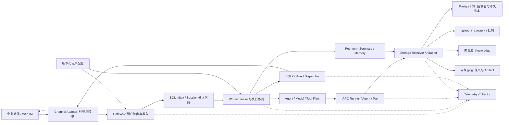
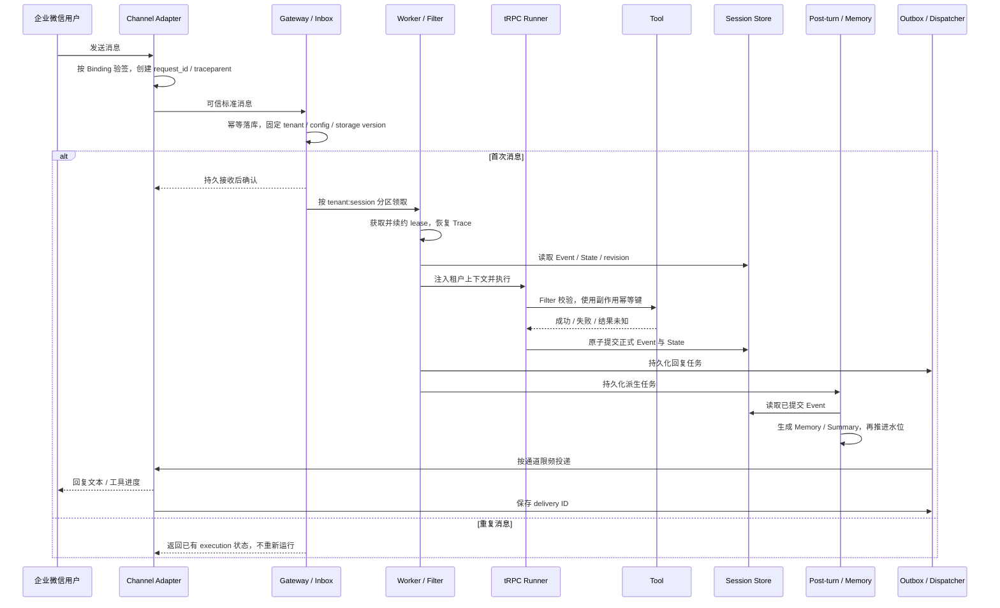

# 多租户 Agent 平台：运维架构与容量评估

日期：2026-09-05。本文补齐故障、灰度、容量和部署交付；图中为目标架构，实测能力与未完成项在文末区分。原始需求见[项目方案书](./项目方案书-2026-08-27.md)，存储细节见[第二阶段开发方案](./第二阶段开发方案.md)。

## 1. 架构与数据流

平台复用 tRPC Runner、Agent、Tool、Session/Memory 公共接口，不复制执行内核。Gateway 根据服务端 Channel Binding 验签并解析租户，外部请求不得自行指定 tenant。一次执行固定 config/storage revision；Worker 从共享存储恢复上下文，不依赖 sticky session。

Trace 目标是跨 callback、Inbox、Worker、Runner、Tool、Storage、Post-turn、send 传播同一个上下文。仅在 metadata 写 trace_id 不等于完成分布式 Trace；队列必须传播 traceparent，消费者恢复上下文。

## 2. 数据模型、同步与后端适配

实际 Schema 位于 `trpc_service/persistence/models.py`。核心关系与约束如下：

| 表/资源 | 关键字段与约束 |
|---|---|
| tenants/config_versions/agent_apps | tenant、app、不可变 config_version；配置仅引用 Secret |
| channel_bindings/backend_bindings | Binding→租户/app；后端按 profile_revision、namespace、storage_revision 解析 |
| sessions/session_events | tenant/app/user/session；revision、fencing、seq；Event ID 与 seq 唯一 |
| session_summaries/memories | covered_event_seq、summary version；Memory 关联 source_event_id |
| inbound_messages/execution_attempts | tenant+binding+external_message_id 唯一；固定 execution ID、attempt、状态 |
| outbox_messages/tool_invocations | inbound+part_no、execution+tool_call_id 幂等；保存投递或外部操作结果 |
| post_turn_tasks/migration_jobs | 持久任务、水位、checkpoint、迁移阶段与回滚期限 |
| artifacts/knowledge/audit | 对象版本/hash、索引版本/tombstone、tenant/request/trace/policy 审计关联 |

SQL 是控制面、审计、Inbox/Outbox 和可靠任务的事实源，也可存 Session/Memory；平台 SQL 与 tRPC runtime DB 分离，避免同名表冲突。Redis 适合低延迟 Session、队列和缓存，必须启用持久化；Redis 存 Session 不代表并发安全自动成立。向量库保存索引、embedding 与强制租户过滤，适合检索而非事务账本；对象存储保存原文、文件和 Artifact，元数据需记录版本/hash，并处理 orphan。

语义为至少一次投递加幂等，不承诺跨系统 exactly-once。正式 Event 与 State 同后端原子提交；跨 Redis/SQL 的提交间隙必须有持久化 reconciliation。复制保留业务 ID、顺序和水位；目标校验必须比较内容，不能只比数量。迁移缺陷与实测另见[迁移 E2E 报告](./第二阶段迁移E2E测试说明.md)。

## 3. 故障降级策略

| 故障 | 设计决策与恢复条件 |
|---|---|
| 节点故障 | 停止领取；在途任务 drain；崩溃后 lease 到期接管并沿用 execution ID。先查提交记录/工具账本，不能盲重放 |
| IM 重试 | 相同业务消息返回原 execution；业务内容变化拒绝并审计。request_id、接收时间等投递字段不应进入业务 hash |
| 平台 SQL 不可用 | 不 ACK 未持久化消息；HTTP 入口应返回可重试失败；readiness=503、liveness 保持正常。已接收任务暂停领取，恢复后重新检查租约和状态 |
| Session DB 不可用 | 有限重试读操作；无法加载或提交上下文时停止模型与副作用工具，不以空 Session 继续。工具已成功则先查账本 |
| Memory / Knowledge 不可用 | 仅在租户允许时进入 Session-only / 无 RAG，显式标记 degraded；强依赖检索的应用拒绝回答。写入交给持久派生任务重试 |
| Artifact 不可用 | 纯文本可继续；文件请求失败或排队，不返回未实际写入的 URI |
| 模型超时 | 执行 deadline；无输出、无副作用且租户允许时有限重试或选已批准备用模型；已有流式/副作用则停止整轮重放，记录失败或 unknown_outcome |
| 工具执行失败 | 只读调用有限重试；带业务幂等键的写调用先查询结果；无幂等保证的写调用禁止自动重试，未知结果进入对账/人工处理 |
| Outbox 发送失败 | Dispatcher 独立退避，遵守 Retry-After，超限 dead-letter；不能因发送失败重跑 Agent |
| Audit 不可用 | 合规租户 fail closed；其他租户仅在独立可靠审计队列可写时允许继续。平台 SQL 同时不可用时不能用同一 SQL 队列宣称 fail-open |
| Telemetry 不可用 | 有界缓冲/丢弃遥测并计数，不阻塞业务；不可把业务审计一并丢弃 |

建议初始预算：幂等操作最多 3 次、总预算 5 秒、指数退避加抖动；连接/单次调用另设 timeout。连续失败打开熔断器，冷却后受限探测，成功再放量。以上为待压测调整的策略值。现有 retry 工具尚未全链路接线，也不能保证一个挂起调用受总预算约束，部署前需要补验收。

## 4. 灰度发布与租户回滚

发布前验证引用、能力矩阵、Secret 可解析性及新旧版本可共存；先指定测试租户，再按 SHA-256(tenant+session) 稳定分桶逐步放量，不能使用 Python 进程随机 hash。Inbox 固定 config/storage version，在途请求不跟随 latest。新旧 Runner/Bundle 共存，旧引用归零后关闭。

小流量阶段先采够样本，再按错误率、P95/P99、token/成本、Outbox 积压、派生水位和存储冲突比较同类租户基线；任一数据差异或租户越界立即停止。阈值应由业务 SLO 给定，不能把本地短测数值当生产门禁。

Agent 回滚只改变新请求选择的不可变配置，稳定 app namespace 保留会话。存储回滚独立执行：暂停新写，确认目标新增数据反向同步到源，校验并发布新的 storage revision，再恢复流量。仅切回旧配置会丢失切换后数据。当前测试验证显式同步/选择，自动灰度控制面尚未完成。

## 5. 容量评估方法

设峰值有效消息率为 λ、平均执行耗时 W、P95 耗时 W95、每节点经压测确认的安全并发 C、目标利用率 u：平均在途量约 λW；λW95 只用于尾延迟余量估算。节点预算取 ceil(λW95/(C×u))，再与 CPU、内存、连接和模型配额共同校验，不能仅凭这个公式保证 SLO。

每条消息总 token T 必须累计所有模型调用，TPM=60λT；若每消息模型调用数为 M，RPM=60λM。已累计的 T 不再乘 M。Redis/SQL 预算为 λ×每消息操作数，再加重投、续租、后台任务、迁移和健康检查。副本数×每副本池上限不得超过数据库连接预算。

IM 原始回调峰值要包含重复投递，先测入口验签/落库能力，再测消费能力；积压增长约为有效入站率减消费率。热门 Session 自身串行吞吐约 1/W，增节点不能直接提高它的吞吐。

本轮实测及原始 JSON 见[容量基准报告](./容量基准报告-2026-09-05.md)。平均 token 为模拟 usage，不是在线模型统计。下一轮需固定 CPU/内存配额，按目标模型延迟、会话历史长度、工具轮次和租户分布做持续压测，逐步升压、突发、单节点退出，观察 backlog 是否收敛；再确定每节点 C 与告警阈值。

## 6. 部署与生产风险

最小开发环境采用现有 Docker Compose：PostgreSQL、Redis AOF、Qdrant、MinIO、OTel、migration、Gateway、两个 Worker 和测试入口。`sh ops.sh` 使用独立项目执行故障/容量测试并输出 reports，退出清理容器和网络，保留卷。当前 CLI Worker 仍是待接线进程壳，测试通过不表示 HTTP/企业微信产品链路已上线。

生产目标拆分 Gateway/Channel、Worker、Dispatcher、Post-turn、Migration、Admin、Collector；数据库使用高可用服务与定期恢复演练，Secret 只读注入。Gateway/Worker 跨故障域，设置资源预算、终止宽限期、PDB 和网络隔离。Worker 以积压、最老消息年龄和 active runs 扩缩容；扩容仍受 DB 连接和模型 RPM/TPM 限制。readiness 失败停止接流量，liveness 只检测进程自恢复必要性，避免数据库抖动触发全体重启。依据：[Kubernetes 探针](https://kubernetes.io/docs/tasks/configure-pod-container/configure-liveness-readiness-startup-probes/)、[HPA](https://kubernetes.io/docs/concepts/workloads/autoscaling/horizontal-pod-autoscale/)。

生产风险清单：重复回调→Inbox 幂等；旧 Worker 写入→实际存储 fencing/CAS；提交间隙→持久对账；工具重复副作用→幂等键及结果查询；迁移覆盖→写屏障/版本检查；跨租户索引覆盖→包含 scope 的物理 ID；配置漂移→版本固定；连接耗尽→全局池预算；热 Session→分区背压；Secret 泄漏→日志/Trace/审计脱敏；遥测积压→有界缓冲；备份不可恢复→定期恢复与 RPO/RTO 演练。相关措施中尚未接通的部分应作为上线阻断项。

## 7. 证据与交付索引

首轮真实运维故障测试 6 项：5 通过、1 失败，原始记录保留在 reports/operations.xml。首轮已通过 SQL 断连后 readiness/liveness 与恢复、Inbox 拒收/恢复去重、Redis Session 断连前置阻断、领取任务的独立进程被杀后接管、真实只读工具失败不盲重试且对外不泄漏细节。首轮发现模型错误被记录为 succeeded；此缺陷已修改正常和恢复路径，最新结果见[已知缺陷修复与验收](已知缺陷修复与验收-2026-09-05.md)。上游 OTel context detach 日志不在此修复范围。

这里的进程崩溃发生在 claim 后、执行前；模型测试注入的是提供方错误响应，不是挂起连接。因此不能据此声明所有提交点崩溃和执行 deadline 都已覆盖。

- 架构图、核心时序、数据模型、同步/幂等、多后端、风险：本文及第二阶段开发方案。
- 实现仓库：本地 `trpc_service/`；Git remote 为 `https://github.com/k0mondor/trpc-agent-service`。本轮工作区变更尚未提交/推送，不能把远端旧版本当最新交付。
- 数据库故障/进程崩溃/模型和工具失败：`tests/e2e/test_operations.py`，原始结果 `reports/operations.xml`。
- 容量脚本：`tests/benchmarks/capacity.py`；运维入口：`ops.sh`。
- 仍未完成：生产 Worker 消费和续租、完整 HTTP/IM 入口、自动降级/备用模型、工具账本接线、租户自动灰度、完整 Trace 与生产部署清单。已发现的迁移及模型错误状态缺陷不得从验收中隐藏。
