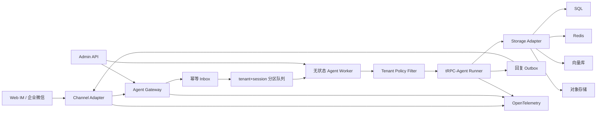

# 基于 tRPC-Agent-Python 的多租户节点化 Agent 部署平台项目方案书

> 方案日期：2026-08-27
> 结果提交：2026-09-11
> 详细技术附件：[方案设计-2026-08-27.md](./方案设计-2026-08-27.md)

## 一、项目背景与目标

tRPC-Agent-Python 已提供 Agent 编排、模型适配、Tool/MCP、Session、Memory、Summary、Knowledge、Filter、FastAPI 服务化和 OpenTelemetry 等能力，但它主要解决“一个 Agent 应用如何运行”。企业实际需要多个部门或客户共享平台，并独立配置 Agent、模型、工具、知识库、IM 账号和数据后端，同时满足会话隔离、水平扩容、成本控制和审计合规。本项目将在原框架之上增加多租户平台层，把单体 Agent 示例扩展为可部署、可路由、可治理、可观测的服务。

项目最终实现至少两种 IM：自研 Web IM 和企业微信。Web IM 使用 FastAPI + SSE，可在没有外部账号时独立验证问答、流式输出和工具调用；企业微信优先复用 tRPC-Agent-Python OpenClaw 所使用的企业微信 SDK 与事件处理思路，完成账号绑定、回调验证、消息转换和回复。若真实企业微信环境在开发期受限，则提供完整 Adapter、模拟回调测试和可复现实验，同时准备 Telegram 作为公开账号备用验证通道。

## 二、对原 tRPC-Agent-Python 的理解

本项目不重新实现 Agent 循环。原框架的 `Runner` 注入 Agent、SessionService、MemoryService 和 ArtifactService，`run_async()` 接收 `user_id`、`session_id` 和 `Content`，连续输出 `Event`。`partial=True` 表示流式增量，正式 Event 可携带文本、`function_call` 和 `function_response`；Runner 会持久化非 partial Event，并在轮次结束后处理 Summary 和 Memory。平台 Worker 只负责建立租户上下文、选择服务后端、调用 Runner 和转换 Event。

原框架可直接复用 LlmAgent、Tool/MCP/Skill、Runner、Content/Part/Event、Session/Memory/Summary、Filter 和 Runner/Agent/LLM/Tool Trace；平台新增 Tenant/Admin API、Channel Binding、可信用户和 Session 路由、Inbox/Outbox、跨节点并发控制、多后端迁移、成本账本、灰度回滚和 IM/Gateway/Storage Trace。OpenClaw 的 WeCom/Telegram 通道是单应用运行时，适合复用 SDK 接法，但不能直接替代多租户控制面。

## 三、总体设计

系统分为控制面和数据面。Admin API 管理租户、Agent 版本、模型引用、工具策略、Channel Binding、后端和审计策略；Channel Adapter 负责 IM 验签、解密、标准化、文件处理和回复；Gateway 根据不可猜测的 webhook binding 查询可信 `tenant_id` 和 `agent_app_id`，生成内部用户及 Session；Worker 从共享后端加载状态并运行 tRPC-Agent Runner。

Worker 不依赖 sticky session。单次流式执行由同一 Worker 完成，但下一轮消息可以由任意 Worker 从 Redis/SQL 恢复 Session 和 Memory。为避免两个 Worker 覆盖同一 Session，队列按 `tenant_id:session_id` 分区，写入同时使用 version CAS 或带 fencing token 的分布式锁。

## 四、重点技术

1. **多租户模型与隔离**：Tenant 包含应用、模型、工具权限、IM、后端和审计配置；配置采用不可变 `config_version`。SQL 主键、Redis key、向量 metadata 和对象 prefix 均包含 tenant namespace。模型 API Key、IM Secret 和数据库密码只保存 Secret Reference。
2. **Session 路由**：单聊由 `tenant + binding + app + external_user` 生成，群聊由 `tenant + binding + app + external_chat + thread` 生成，使用租户 HMAC 隐藏外部身份。同一用户跨群 Session 隔离，跨租户 user/session/memory 全部隔离。
3. **多后端与数据同步策略**：SQL 保存配置、Event、Audit、Inbox/Outbox；Redis 保存热 Session、锁、限流和缓存；向量库保存 Knowledge 与语义 Memory；对象存储保存原文、图片和 Artifact。Summary 使用 `covered_event_seq`，Memory 使用 `source_event_id` 保证异步幂等。
4. **IM 转换**：外部消息统一为 `NormalizedInboundMessage`，文本转换为 tRPC `Content/Part`，图片和文件先校验并存对象存储。Runner Event 转为文本、节流后的流式增量、工具进度或卡片；超长消息按通道能力分片，回复通过 Outbox 重试。
5. **治理与可观测**：Ingress 检查 IM 用户、限流和幂等；AgentFilter 控制应用和预算；ModelFilter 控制模型、token 和脱敏；ToolFilter 执行默认拒绝、白名单和危险工具二次确认。Trace 从 IM callback 创建，经过 Gateway、Runner、LLM、Tool、Session/Memory 到 IM send；审计记录 tenant、channel、user、session、agent、tool、decision、latency、error、cost 和 trace_id。

## 五、数据关系与消息链路

数据模型表达 `tenant -> agent app/revision -> channel binding -> session -> event/summary`，长期 Memory 通过 `source_event_id` 关联 Event，Audit Log 通过 `tenant_id/session_id/trace_id` 关联整条链路。入站消息唯一键为 `(tenant_id, binding_id, external_message_id)`，只有首次插入成功才运行 Agent；有副作用工具使用 `(invocation_id, tool_call_id)` 幂等；出站回复使用 `(inbound_message_id, part_no)` 幂等。

完整时序为：IM callback 创建 `trace_id/request_id`并验签；Gateway 查 Binding、租户、用户和 Session；Inbox 去重后把 `traceparent` 写入队列；Worker 恢复 Trace，读取 Session/Memory 并调用 Runner；ToolFilter 处理权限，Event/State 原子提交，Summary/Memory 依据水位异步更新；最终回复写 Outbox，Channel Adapter 投递并记录结果。由此可从一次 IM 回调追踪到模型、工具、存储和最终回复。

## 六、预期效果

最终演示可创建至少两个租户，为其配置不同 Agent、工具和后端；通过 Web IM 与企业微信发送消息，展示流式回复、一次工具调用、单聊/群聊 Session 隔离和跨 Worker 会话恢复；重复回调只执行一次，危险工具要求确认，Trace 能覆盖完整链路，日志和错误报告中不出现密钥明文。项目提供 Docker Compose、样例配置、自动化测试、架构图、时序图、数据模型、风险清单和运行说明。

## 七、故障恢复、主要风险与应对

| 风险 | 应对 |
|---|---|
| IM 重复消息 | SQL Inbox 唯一键、工具和回复幂等键 |
| 同 Session 并发覆盖 | 队列分区、锁/fencing、version CAS |
| Worker 崩溃 | 队列确认、Event 持久化、Outbox |
| Redis/SQL 不可用 | 超时、重试、熔断；禁止未持久化副作用 |
| 模型超时/限流 | 退避、备用模型、避免流式后整轮重放 |
| 工具重复副作用 | tool_call 幂等、确认状态机、补偿流程 |
| 跨租户泄漏 | 全链路 tenant namespace 与隔离测试 |
| 密钥泄漏 | Secret Reference、双层脱敏和密钥扫描 |
| IM 长度/频率限制 | Capability、分片、节流、Retry-After |
| 配置节点不一致 | config_version、版本缓存、灰度和回滚 |

## 八、时间规划

| 日期 | 工作与产物 |
|---|---|
| 8/27 | 方案书；租户模型、通道契约、HMAC Session 路由和原生 tRPC Event 桥接 |
| 8/28–8/29 | Admin API、SQL Schema、Storage Factory |
| 8/30–9/01 | Web IM、FastAPI/SSE、Runner 纵向链路 |
| 9/02–9/04 | 企业微信 Adapter、账号绑定、回调/模拟测试、回复与文件 |
| 9/05–9/06 | Redis/SQL Session、锁/CAS、Inbox/Outbox |
| 9/07–9/08 | Filter、预算、二次确认、OTel、指标和审计 |
| 9/09 | 重复消息、节点/后端故障和迁移演练 |
| 9/10 | Compose、文档、两通道验收彩排 |
| 9/11 | GitHub 代码、测试报告、演示记录和最终结果 |

## 九、当前进展

第一阶段代码已实现完整 Tenant/Agent/Model/Tool/Channel/Backend/Audit 配置模型，拒绝明文 Secret 并校验跨引用；实现 Channel Binding 可信路由、单聊/群聊 HMAC Session ID 和跨租户隔离；定义通道中立消息与 Adapter 协议；直接使用原框架 `Content`、`Part`、`Runner.run_async()`、`Event.partial/function_call/function_response` 实现 IM/Runner 桥接。当前自动化测试全部通过。
